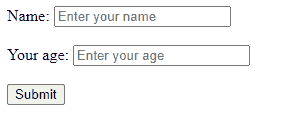
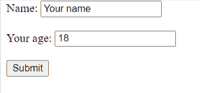
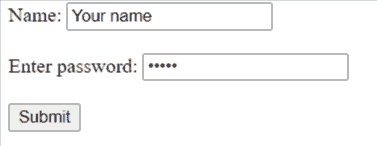

# HTML 中占位符与值属性

> 原文:[https://www . geesforgeks . org/placeholder-vs-value-attributes-in-html/](https://www.geeksforgeeks.org/placeholder-vs-value-attributes-in-html/)

[**占位符属性:**](https://www.geeksforgeeks.org/html-placeholder-attribute/) 占位符属性指定描述输入字段/文本区域的预期值的简短提示。在用户输入值之前，字段中会显示简短提示。这只是一个临时提示，与后端的逻辑执行无关。

**语法:**

```html
<input placeholder = "text"> 
<textarea placeholder = "text"> </textarea>

```

**示例:**

## 超文本标记语言

```html
<!DOCTYPE html>
<html>

<head>
    <title>Input Placeholder</title>
</head>

<body>
    <form>
        <label for="Name">Name:</label>
        <input name="Name" placeholder="Enter your name" />
        <br><br>

        <label for="Age">Your age:</label>
        <input name="Age" placeholder="Enter your age" />
        <br><br>

        <button type="button">Submit</button>
    </form>
</body>

</html>
```

**输出:**



[**值属性:**](https://www.geeksforgeeks.org/html-value-attribute/) 值属性用于将默认值设置为<输入>元素。它表示与输入相关的值，值集中的内容在表单提交时被发送到服务器。如果没有手动值被插入，那么默认值将在提交时被传递。

**语法:**

```html
<input value = "text">
```

**值属性的用法:**

**1。按钮中文本的定义:**对于“按钮”、“重置”和“提交”类型的输入标签，按钮中给出的文本看起来是按钮上的文本。

**示例:**

## 超文本标记语言

```html
<!DOCTYPE html>
<html>

<head>
    <title>Page Title</title>
</head>

<body>
    <form>
        <label for="Name">Name:</label>
        <input name="Name" value="Your name" />
        <br><br>

        <label for="Age">Your age:</label>
        <input name="Age" value="18" />
        <br><br>

        <input type="button" value="Submit" />
    </form>
</body>

</html>
```

**输出:**



**2。定义默认值:**对于“文本”、“密码”和“隐藏”类型的输入标签，文本作为默认值给出。如果没有给出手动文本，提交时将考虑默认值。

**示例:**

## 超文本标记语言

```html
<!DOCTYPE html>
<html>

<head>
    <title>Page Title</title>
</head>

<body>
    <form>
        <label for="Name">Name:</label>
        <input name="Name" type="text" 
            value="Your name" /><br><br>

        <label for="Password">Enter password:</label>
        <input name="Password" type="password" 
            value="12345" /><br><br>

        <input type="button" value="Submit" />
    </form>
</body>

</html>
```

**输出:**



**占位符与值属性的区别:**

<figure class="table">

| **占位符属性** | **值属性** |
| The placeholder attribute specifies a brief hint describing the expected value (type of value) of the input field. | The value specifies the default value of the input field. If no value is specified, the default value will be used in the form submission process. |
| A brief prompt is displayed in the field before the user enters a value. | The value needs to be erased before adding a new value. |
| It is only a temporary prompt and has nothing to do with the logic execution of the back end. | Is the default value, which is closely related to the logic execution of the back end. This means that if this value is not specified, the default value will be used during the form submission. |
| If no manual value is inserted, the null value will be passed on submission. | If no manual value is inserted, the default value will be passed on submission. |
| The actual value of the placeholder is empty. Once the user does enter something, the placeholder is no longer needed. | Therefore, if you pre-populate the value through the HTML attribute and then submit the form, the value will be submitted back to your server. |

</figure>