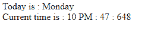

# 使用 HTML 和 JavaScript 打印当前日期和时间

> 原文:[https://www . geesforgeks . org/print-当前日期和时间-使用 html 和 javascript/](https://www.geeksforgeeks.org/print-current-day-and-time-using-html-and-javascript/)

任务是**以如下格式(时间单位:小时、分钟、毫秒)打印** *系统当前的日期和时间。*

## 方法:

使用 **getDay()** 函数创建一周中的天数数组。它返回一天中的**数字**，比如 0 代表周日，1 代表周一，以此类推)。使用三元运算符将其转换为 **AM** 或 **PM** 。

使用 **getHours()** 方法获取 0 到 23 之间的小时值。它返回一个整数值。

**分钟**和**毫秒**分别使用 **getMinutes()** 和**get 毫秒()**功能打印。

**示例:**

```html
<!DOCTYPE html>
<html>

<head>
    <title>
        print current day and time
    </title>
</head>

<body>
    <script type="text/javascript">
        var myDate = new Date();
        var myDay = myDate.getDay();

        // Array of days.
        var weekday = ['Sunday', 'Monday', 'Tuesday',
            'Wednesday', 'Thursday', 'Friday', 'Saturday'
        ];
        document.write("Today is : " + weekday[myDay]);
        document.write("<br/>");

        // get hour value.
        var hours = myDate.getHours();
        var ampm = hours >= 12 ? 'PM' : 'AM';
        hours = hours % 12;
        hours = hours ? hours : 12;
        var minutes = myDate.getMinutes();
        minutes = minutes < 10 ? '0' + minutes : minutes;
        var myTime = hours + " " + ampm + " : " + minutes + 
            " : " + myDate.getMilliseconds();
        document.write("\tCurrent time is : " + myTime);
    </script>
</body>

</html>
```

## 输出:

