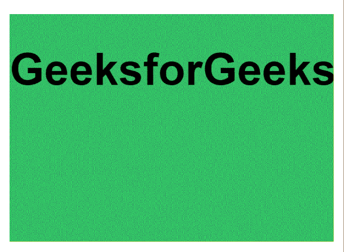

# 使用 HTML 和 CSS 编程幻灯片

> 原文:[https://www . geesforgeks . org/programming-a-slide-with-html-and-CSS/](https://www.geeksforgeeks.org/programming-a-slideshow-with-html-and-css/)

在这篇文章中，我们将知道如何使用 HTML 和 CSS 构建幻灯片。幻灯片显示可用于显示文本或图像，这些文本或图像从一张幻灯片连续滚动到另一张幻灯片以显示其内容。本文展示了一种仅使用 [**HTML**](https://www.geeksforgeeks.org/html-tutorials/) 和 [**CSS**](https://www.geeksforgeeks.org/css-tutorials/) 构建幻灯片的方法。它消耗更少的浏览器内存，并且由于不涉及 JavaScript，占用更少的计算能力。基于 JavaScript 的滑块会降低网页的速度，如果用户在浏览器中禁用了 JavaScript，滑块也不起作用。

它使用使用动画关键帧的方法，通过在动画期间修改每张幻灯片的左边距属性来滚动每张幻灯片。可以指定动画类型，以便根据所需的持续时间和效果制作幻灯片动画。我们将把这项任务分成两部分。，在第一节中，我们将只使用 HTML 来装饰结构，在第二节中，我们将使用 CSS 来装饰结构。

**方法:**为了构建幻灯片或转盘，我们将遵循以下方法。

*   为了在每张幻灯片上显示文本内容，我们定义了一个单独的 div 部分，用于承载每张幻灯片的内容。
*   我们有*幻灯片包装*类来承载所有的幻灯片框架，便于将相同的动画效果以及其他 CSS 属性应用于每张幻灯片。
*   我们已经使用了 [*溢出*](https://www.geeksforgeeks.org/css-overflow/) 属性，这样它将剪辑额外的内容，如果元素的内容太大而无法放入指定的区域，其余的内容将是不可见的。使用 [*浮动*](https://www.geeksforgeeks.org/what-is-float-property-in-css/) 属性将内容向左对齐。
*   我们使用了 [*:第 n 个子()*](https://www.geeksforgeeks.org/css-nth-child-selector/#:~:text=The%20%3Anth%2Dchild()%20selector,that%20is%20the%20nth%20child.&text=Where%20number%20is%20the%20argument,or%20in%20a%20functional%20notation.) 选择器，以便根据元素在一组兄弟中的位置来应用匹配元素的背景颜色。它匹配第 n 个子元素的每个元素。
*   为了定义幻灯片显示的[动画](https://www.geeksforgeeks.org/css-animations/)，将使用 [*关键帧*](https://www.geeksforgeeks.org/css-keyframes-rule/) 属性在动画期间通过修改每张幻灯片的*左边距*属性来滚动每张幻灯片。

**第一部分:**该部分包含页面的 HTML 部分。必须显示的幻灯片用相应的文本定义。

**HTML 代码:**

## 超文本标记语言

```html
<html>
<head>
    <title>HTML and CSS Slideshow</title>
</head>

<body>

    <!-- Define the slideshow container -->
    <div id="slideshow">
        <div class="slide-wrapper">

        <!-- Define each of the slides
         and write the content -->

            <div class="slide">
                <h1 class="slide-number">
                    GeeksforGeeks
                </h1>
            </div>
            <div class="slide">
                <h1 class="slide-number">
                    A computer science portal
                </h1>
            </div>
            <div class="slide">
                <h1 class="slide-number">
                    This is an example of
                </h1>
            </div>
            <div class="slide">
                <h1 class="slide-number">
                    Slideshow with HTML and CSS only
                </h1>
            </div>
        </div>
    </div>
</body>
</html>
```

**第二部分:**该部分包括所有用于制作幻灯片的样式。用于移动每张幻灯片的动画是通过根据每张幻灯片的需要设置**左边距**属性来定义的。这使它看起来像是在每张幻灯片之间平滑过渡。

**CSS 代码:**

## 半铸钢ˌ钢性铸铁(Cast Semi-Steel)

```html
body {
  font-family: Helvetica, sans-serif;
  padding: 5%;
  text-align: center;
  font-size: 50;
}

/* Styling the area of the slides */
#slideshow {
  overflow: hidden;
  height: 510px;
  width: 728px;
  margin: 0 auto;
}

/* Style each of the sides
with a fixed width and height */
.slide {
  float: left;
  height: 510px;
  width: 728px;
}

/* Add animation to the slides */
.slide-wrapper {

/* Calculate the total width on the
  basis of number of slides */
  width: calc(728px * 4);

/* Specify the animation with the
  duration and speed */
  animation: slide 10s ease infinite;
}

/* Set the background color
of each of the slides */
.slide:nth-child(1) {
  background: green;
}

.slide:nth-child(2) {
  background: pink;
}

.slide:nth-child(3) {
  background: red;
}

.slide:nth-child(4) {
  background: yellow;
}

/* Define the animation
for the slideshow */
@keyframes slide {

/* Calculate the margin-left for
  each of the slides */
  20% {
    margin-left: 0px;
  }

  40% {
    margin-left: calc(-728px * 1);
  }

  60% {
    margin-left: calc(-728px * 2);
  }

  80% {
    margin-left: calc(-728px * 3);
  }
}
```

**完成代码:**在这里，我们将上述两个部分合并为一个，以实现上述任务。

## 超文本标记语言

```html
<!DOCTYPE html>
<html>
<head>
    <title>HTML and CSS Slideshow</title>
    <style>
    body {
        font-family: Helvetica, sans-serif;
        padding: 5%;
        text-align: center;
        font-size: 50;
    }

    /* Styling the area of the slides */

    #slideshow {
        overflow: hidden;
        height: 510px;
        width: 728px;
        margin: 0 auto;
    }

    /* Style each of the sides
    with a fixed width and height */

    .slide {
        float: left;
        height: 510px;
        width: 728px;
    }

    /* Add animation to the slides */

    .slide-wrapper {

        /* Calculate the total width on the
      basis of number of slides */
        width: calc(728px * 4);

        /* Specify the animation with the
      duration and speed */
        animation: slide 10s ease infinite;
    }

    /* Set the background color
    of each of the slides */

    .slide:nth-child(1) {
        background: green;
    }

    .slide:nth-child(2) {
        background: pink;
    }

    .slide:nth-child(3) {
        background: red;
    }

    .slide:nth-child(4) {
        background: yellow;
    }

    /* Define the animation
    for the slideshow */

    @keyframes slide {

        /* Calculate the margin-left for
      each of the slides */
        20% {
            margin-left: 0px;
        }
        40% {
            margin-left: calc(-728px * 1);
        }
        60% {
            margin-left: calc(-728px * 2);
        }
        80% {
            margin-left: calc(-728px * 3);
        }
    }
    </style>
</head>

<body>

    <!-- Define the slideshow container -->
    <div id="slideshow">
        <div class="slide-wrapper">

            <!-- Define each of the slides
         and write the content -->
            <div class="slide">
                <h1 class="slide-number">
                    GeeksforGeeks
                </h1>
            </div>
            <div class="slide">
                <h1 class="slide-number">
                    A computer science portal
                </h1>
            </div>
            <div class="slide">
                <h1 class="slide-number">
                    This is an example of
                </h1>
            </div>
            <div class="slide">
                <h1 class="slide-number">
                    Slideshow with HTML and CSS only
                </h1>
            </div>
        </div>
    </div>
</body>
</html>
```

**输出:**

