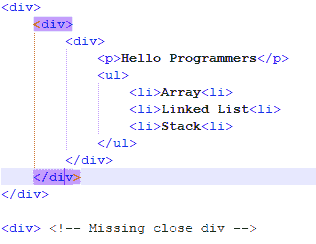

# 初学者编程:你必须知道的 10 个最佳 HTML 编码实践

> 原文:[https://www . geesforgeks . org/programming-for-初学者-10-best-html-coding-practices-you-know/](https://www.geeksforgeeks.org/programming-for-beginners-10-best-html-coding-practices-you-must-know/)

**HTML……**最容易学的东西之一就是编程。大多数新手，甚至孩子都是通过学习[超文本标记语言](https://www.geeksforgeeks.org/html-tutorials/)进入编程的。他们学习，他们构建一些网页，但是很多开发人员甚至在为前端编写代码时犯了一些愚蠢的错误。犯这些愚蠢的错误不仅会惹恼其他开发人员(当他们需要做出一些改变时)，还会伤害你的主网站，并赶走最终用户。我们将提到一些常见的最佳实践，您应该遵循这些实践来编写一个干净清晰的 HTML 代码。


遵循一些常见的做法可以使调试更容易，并节省大量时间。它也有助于搜索引擎优化。

### 1.对文档类型使用正确的文档结构

HTML 有一个本质，就是即使你忘记提到一些元素，比如**<HTML>****<头>****<体>****<！DOCTYPE html >** 。您将在浏览器中看到您想要的正确结果，但这并不意味着您将在每个浏览器中找到相同的结果。为了避免这个问题，使用正确的文档类型遵循正确的文档结构是一个好习惯。Doctype 是 HTML 文档中首先要提到的东西。您可以从链接 https://www.w3.org/wiki/Doctypes_and_markup_styles 中选择正确的文档类型

**示例:**

## 超文本标记语言

```html
<!DOCTYPE html>
<html>
  <head>
    <title>Hello World</title>
  </head>
  <body>
    <h1>Welcome Programmers</h1>

<p>This website is GeeksforGeeks.</p>

  </body>
</html>
```

### 2.关闭标签

为了避免验证和兼容性问题，不要忘记关闭代码中的所有标签。如今，大多数文本编辑器都有自动关闭 HTML 标签的功能，这是一个很好的做法(肯定是为了最终检查)，以确保您不会错过任何未关闭的父标签或嵌套标签。在 HTML5 中，关闭 HTML 标签是可选的，但是根据 W3C 规范，您应该关闭所有的 HTML 标签，以避免将来出现任何验证错误。



### 3.用小写写标签

养成在 HTML 代码中所有标签、属性和值都使用小写的习惯。这是一个行业标准实践，它也使您的代码可读性更强。将标签大写不会影响浏览器中的结果，但是用小写形式编写元素是一个很好的做法。用小写写代码很容易，看起来也更干净。

**示例:**

## 超文本标记语言

```html
<!-- Bad code-->
<SECTION>

<p>This is a paragraph.</p>

</SECTION>

<!-- Good code-->
<section>

<p>This is a paragraph.</p>

</section>
```