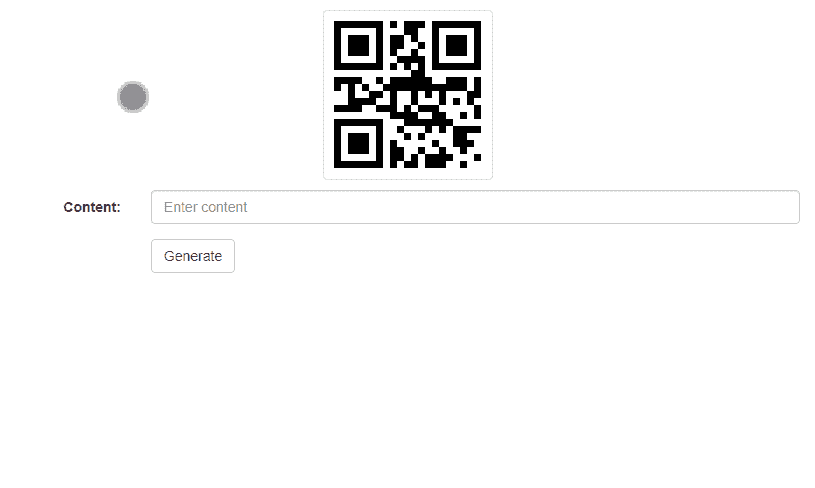

# 使用 HTML、CSS 和 jQuery 的二维码生成器

> 原文:[https://www . geesforgeks . org/QR-code-generator-use-html-CSS-and-jquery/](https://www.geeksforgeeks.org/qr-code-generator-using-html-css-and-jquery/)

二维码生成器是一种将任何所需的文本数据存储到二维码中的应用程序，该二维码稍后可以用二维码扫描仪扫描以显示存储的信息。这个二维码可以在任何地方使用，例如，在海报或网站上，以允许用户获得额外的信息。该应用程序将允许用户输入所需的数据，并将其保存为二维码的 PNG 或 SVG 图像。

**方法:**要生成二维码，我们将使用[谷歌图表应用编程接口](https://developers.google.com/chart/infographics/docs/overview)。使用 jQuery，根据 API 返回的图像更新要显示的二维码图像。

下面给出了将要使用的应用编程接口端点。

> https://chart.googleapis.com/chart?chs=150×150&cht=qr&chl=Hello%20world

**网址说明:**

*   谷歌图表信息图的**根网址**是**https://chart.googleapis.com/chart**。这可以通过所需的参数来指定，以获得所需的输出。
*   **chs** 参数以像素为单位表示二维码图像的大小。
*   **cht** 参数表示要创建的图像类型。“二维码”值将用于生成二维码。
*   **chl** 参数表示要编码在二维码中的文本或网址数据。

**示例:**

## 超文本标记语言

```html
<!DOCTYPE html>
<html>

<head>
  <!-- Include Bootstrap for styling -->
  <link rel="stylesheet" href=
"https://cdnjs.cloudflare.com/ajax/libs/twitter-bootstrap/3.3.7/css/bootstrap.min.css" />

  <style>
    .qr-code {
      max-width: 200px;
      margin: 10px;
    }
  </style>

  <title>QR Code Generator</title>
</head>

<body>
  <div class="container-fluid">
    <div class="text-center">

      <!-- Get a Placeholder image initially,
       this will change according to the
       data entered later -->
      
    </div>

    <div class="form-horizontal">
      <div class="form-group">
        <label class="control-label col-sm-2"
          for="content">
          Content:
        </label>
        <div class="col-sm-10">

          <!-- Input box to enter the 
              required data -->
          <input type="text" size="60" 
            maxlength="60" class="form-control"
            id="content" placeholder="Enter content" />
        </div>
      </div>
      <div class="form-group">
        <div class="col-sm-offset-2 col-sm-10">

          <!-- Button to generate QR Code for
           the entered data -->
          <button type="button" class=
            "btn btn-default" id="generate">
            Generate
          </button>
        </div>
      </div>
    </div>
  </div>
  <script src=
    "https://code.jquery.com/jquery-3.5.1.js">
  </script>

  <script>
    // Function to HTML encode the text
    // This creates a new hidden element,
    // inserts the given text into it 
    // and outputs it out as HTML
    function htmlEncode(value) {
      return $('<div/>').text(value)
        .html();
    }

    $(function () {

      // Specify an onclick function
      // for the generate button
      $('#generate').click(function () {

        // Generate the link that would be
        // used to generate the QR Code
        // with the given data 
        let finalURL =
'https://chart.googleapis.com/chart?cht=qr&chl=' +
          htmlEncode($('#content').val()) +
          '&chs=160x160&chld=L|0'

        // Replace the src of the image with
        // the QR code image
        $('.qr-code').attr('src', finalURL);
      });
    });
  </script>
</body>

</html>
```

**输出:**



jQuery 是一个开源的 JavaScript 库，它简化了 HTML/CSS 文档之间的交互，它以其“少写多做”的理念而闻名。
跟随本 [jQuery 教程](https://www.geeksforgeeks.org/jquery-tutorials/)和 [jQuery 示例](https://www.geeksforgeeks.org/jquery-examples/)可以从头开始学习 jQuery。