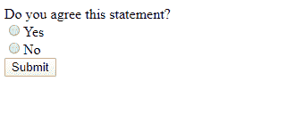

# 单选按钮 Vs HTML 中的复选框

> 原文:[https://www . geesforgeks . org/单选按钮-vs-checkbox-in-html/](https://www.geeksforgeeks.org/radio-button-vs-checkbox-in-html/)

**单选按钮:**一般用于 HTML 表单。当您需要从网站访问者那里收集一些数据时，需要 HTML 表单。当您只想从几个可用选项中选择一个选项时，可以使用单选按钮。

**示例:**

```html
<html>

<head>
    <title>
        Radio Button
    <title>
</head>

<body>
    <form>
        Do you agree this statement?
        <br>
        <input type="radio"
               name="agree" 
               value="yes">Yes
        <br>
        <input type="radio"
               name="agree" 
               value="no">No
        <br>
        <input type="Submit">
    </form>
</body>

</html>
```

**输出:**


**复选框:**复选框也多用于 HTML 表单。复选框允许您从选项列表中选择一个或多个选项。

**示例:**

```html
<html>

<head>
    <title>
        HTML Checkbox
    <title>
</head>

<body>
    <form>
        Choose languages you know:
        <br>
        <input type="checkbox" 
               name="C" 
               value="yes">C
        <br>
        <input type="checkbox" 
               name="C++" 
               value="yes">C++
        <br>
        <input type="checkbox" 
               name="Java" 
               value="yes">Java
        <br>
        <input type="checkbox" 
               name="Python" 
               value="yes">Python
        <br>
        <input type="Submit">
    </form>
</body>

</html>
```

**输出:**


**单选按钮和复选框的区别**

| 单选按钮 | 检验盒 |
| 当从几个可用选项中只能选择一个选项时使用。 | 复选框允许选择一个或多个选项。 |
| 使用 HTML <input>标签创建，但类型属性设置为单选。 | 它也是使用 HTML <input>标签创建的，但是类型属性被设置为复选框。 |
| 它是一个单一的控制单元。 | 它是一个多控制单元。 |
| 单选按钮在屏幕上显示为一个小圆圈。 | 复选框在屏幕上显示为一个小方块。 |
| 单选按钮只有两种状态，即“真”和“假”。 | 复选框有三种状态，即选中、未选中和不确定。 |
| 当您希望将用户的选择限制在所提供范围内的一个选项时，可以使用它。 | 当您希望允许用户选择多个选项时，可以使用它。 |