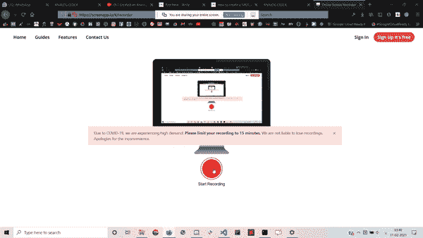

# 使用 HTML、CSS 和香草 JavaScript 的响应模拟时钟

> 原文:[https://www . geesforgeks . org/responsive-analog-clock-use-html-CSS-and-vanilla-JavaScript/](https://www.geeksforgeeks.org/responsive-analog-clock-using-html-css-and-vanilla-javascript/)

在本文中，我们将创建一个**模拟时钟**。这主要是基于 HTML，CSS &香草 JavaScript。

**进场:**

1.  创建一个 HTML 文件，我们将在其中添加主 div，接下来我们将添加 4 个 div 标签，分别用于小时、分钟、秒针和 pin。
2.  创建一个 CSS 文件来设计我们的网页，并为不同的手指定不同的长度。
3.  创建一个 JavaScript 文件，为不同时钟指针的旋转创建一个简短的逻辑。

**时钟指针旋转逻辑:**

**1。时针**

```html
For Achieving 12hrs,
hour hand moves 360deg.

i.e.  12hrs   ⇢   360degs

so,    1hr    ⇢   30degs

and, 60mins   ⇢   30degs

so,    1min   ⇢   0.5degs

Total Rotation of hour hand:
    (30deg * hrs) + (0.5deg * mins)
```

**2。分针**

```html
For Achieving 60mins,
hour hand moves 360deg.

i.e.  60mins   ⇢   360degs

so,    1min    ⇢   6degs

Total Rotation of minute hand:
        6deg * mins
```

**3。二手**

```html
For Achieving 60secs,
hour hand moves 360deg.

i.e.  60secs   ⇢   360degs

so,    1sec    ⇢   6degs

Total Rotation of minute hand:
        6deg * secs
```

**HTML 代码:**

## 超文本标记语言

```html
<!DOCTYPE html>
<html lang="en">

<head>
    <title>Analog Clock</title>
    <link rel="stylesheet" href="style.css">
</head>

<body>
    <div class="clock">
        <div class="hr"></div>
        <div class="min"></div>
        <div class="sec"></div>
        <div class="pin"></div>
    </div>

    <script src="index.js"></script>
</body>

</html>
```

**代码说明:**

*   首先，创建一个 HTML 文件(index.html)。
*   现在，在我们的 HTML 文件创建之后，我们将使用<title>标签给我们的网页一个标题。应放在段内。</title>
*   然后我们将提供所有样式的 CSS 文件链接到我们的 HTML。这也放在标签之间。
*   来到我们的 HTML 代码的主体部分。
    *   首先，创建一个主 div 作为时钟。
    *   在那个分区中，为一个小时、一分钟、秒针和大头针加上 4 个 div。
    *   在我们的正文末尾添加

**CSS 代码:**

```html
/* Restoring browser effects */
* {
    margin: 0;
    padding: 0;
    box-sizing: border-box;
    ;
}

/* All of the same styling to the body */
body {
    height: 100vh;
    display: flex;
    justify-content: center;
    align-items: center;
    background-color: #000;
    background-image: linear-gradient(
            70deg, black, white);
}

/* Sizing, positioning of main 
    dial of the clock */
.clock {
    width: 40vw;
    height: 40vw;
    background-image: linear-gradient(
                70deg, black, white);
    background-size: cover;
    box-shadow: 0 3em 5.8em;
    border-radius: 50%;
    position: relative;
}

.hr,
.min,
.sec {
    width: 1%;
    position: absolute;
    top: 50%;
    left: 50%;
    transform: translate(-50%, -100%);
    transform-origin: bottom;
    z-index: 2;
    border-radius: 2em;
}

.pin {
    position: absolute;
    top: 0;
    left: 0;
    right: 0;
    bottom: 0;
    width: 1em;
    height: 1em;
    background: rgb(38, 0, 255);
    border: 2px solid #ffffff;
    border-radius: 10em;
    margin: auto;
    z-index: 10;
}

/* Different length of different hands of clock */
.hr {
    height: 25%;
    background-color: #ff0000;
}

.min {
    height: 30%;
    background-color: #ff9900;
}

.sec {
    height: 40%;
    background-color: #99ff00;
    transform-origin: 50% 85%;
}
```

**代码说明:** CSS 用来给我们的 HTML 页面赋予不同类型的动画和效果，让所有用户看起来都是交互式的。在 CSS 中，我们必须包括以下几点:

1.  恢复所有浏览器效果。
2.  使用类和 id 给 HTML 元素赋予效果。

**JS 代码:**

## java 描述语言

```html
// Selecting all of the css classes on which
// we want to apply functionalities
const hr = document.querySelector('.hr')
const min = document.querySelector('.min')
const sec = document.querySelector('.sec')

// Setting up the period of working
setInterval(() => {

    // Extracting the current time 
    // from DATE() function
    let day = new Date()
    let hour = day.getHours()
    let minutes = day.getMinutes()
    let seconds = day.getSeconds()

    // Formula that is explained above for 
    // the rotation of different hands
    let hrrotation = (30 * hour) + (0.5 * minutes);
    let minrotation = 6 * minutes;
    let secrotation = 6 * seconds;

    hr.style.transform =
        `translate(-50%,-100%) rotate(${hrrotation}deg)`
    min.style.transform =
        `translate(-50%,-100%) rotate(${minrotation}deg)`
    sec.style.transform =
        `translate(-50%,-85%) rotate(${secrotation}deg)`
});
```

**代码说明:**

*   setInterval()函数用于在特定时间段内执行函数。更多详情[点击此处](https://www.geeksforgeeks.org/java-script-settimeout-setinterval-method/)。
*   Date()函数用于返回今天的日期、当前时间(小时、分钟、秒)。

**完整代码:**

## 超文本标记语言

```html
<!DOCTYPE html>
<html lang="en">

<head>
    <style>

        /* Restoring browser effects */        
        * {
            margin: 0;
            padding: 0;
            box-sizing: border-box;
        }

        /* All of the same styling to the body */        
        body {
            height: 100vh;
            display: flex;
            justify-content: center;
            align-items: center;
            background-color: #000;
            background-image: linear-gradient(
                70deg, black, white);
        }

        /* Sizing, positioning of main dial of the clock */        
        .clock {
            width: 40vw;
            height: 40vw;
            background-image: linear-gradient(
                70deg, black, white);
            background-size: cover;
            box-shadow: 0 3em 5.8em;
            border-radius: 50%;
            position: relative;
        }

        .hr,
        .min,
        .sec {
            width: 1%;
            position: absolute;
            top: 50%;
            left: 50%;
            transform: translate(-50%, -100%);
            transform-origin: bottom;
            z-index: 2;
            border-radius: 2em;
        }

        .pin {
            position: absolute;
            top: 0;
            left: 0;
            right: 0;
            bottom: 0;
            width: 1em;
            height: 1em;
            background: rgb(38, 0, 255);
            border: 2px solid #ffffff;
            border-radius: 10em;
            margin: auto;
            z-index: 10;
        }

        /* Different length of different hands of clock */        
        .hr {
            height: 25%;
            background-color: #ff0000;
        }

        .min {
            height: 30%;
            background-color: #ff9900;
        }

        .sec {
            height: 40%;
            background-color: #99ff00;
            transform-origin: 50% 85%;
        }
    </style>
</head>

<body>
    <div class="clock">
        <div class="hr"></div>
        <div class="min"></div>
        <div class="sec"></div>
        <div class="pin"></div>
    </div>

    <script>

        // Selecting all of the css classes 
        // on which we want to apply functionalities
        const hr = document.querySelector('.hr')
        const min = document.querySelector('.min')
        const sec = document.querySelector('.sec')

        // Setting up the period of working
        setInterval(() => {

            // Extracting the current time 
            // from DATE() function
            let day = new Date()
            let hour = day.getHours()
            let minutes = day.getMinutes()
            let seconds = day.getSeconds()

            // Formula that is explained above for 
            // the rotation of different hands
            let hrrotation = (30 * hour) + (0.5 * minutes);
            let minrotation = 6 * minutes;
            let secrotation = 6 * seconds;

            hr.style.transform =
                `translate(-50%,-100%) rotate(${hrrotation}deg)`
            min.style.transform =
                `translate(-50%,-100%) rotate(${minrotation}deg)`
            sec.style.transform =
                `translate(-50%,-85%) rotate(${secrotation}deg)`
        });
    </script>
</body>

</html>
```

**输出:**

