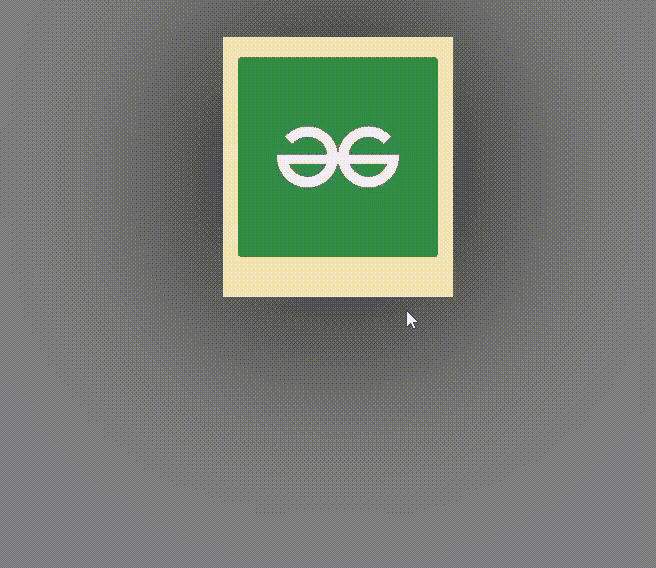

# 使用 HTML 和 CSS 的具有悬停效果的响应式卡片

> 原文:[https://www . geesforgeks . org/responsive-card-with-hover-effect-use-html-and-CSS/](https://www.geeksforgeeks.org/responsive-card-with-hover-effect-using-html-and-css/)

卡片对任何网站来说都是非常重要的一部分。它用于向观众简短地显示一些重要信息。因此，在本文中，我们将使用 HTML 和 CSS 创建一个具有惊人悬停效果的响应卡。通过使用[**HTML**](https://www.geeksforgeeks.org/html-tutorials/) 我们将设计卡片的基本结构，然后通过使用 [**CSS**](https://www.geeksforgeeks.org/css-tutorials/) 的属性，我们可以创建悬停动画效果。

提供了一个示例 gif 来更清楚地理解今天的任务。



### 逐步实施:

**第一步:**首先，上网下载一张卡的图片保存在**图片文件夹**中。我们将在稍后的实现中使用这个图像。

**第二步:**现在我们在 **HTML** 中设计一个简单的卡片结构。注释已经在代码中，以供您参考。

## 超文本标记语言

```html
<!DOCTYPE html>
<html>

<body>

    <!--creating a class container which will hold card class and again card will hold imgbox class-->
    <div class="container">

        <div class="card">

            <div class="imgbox">

                <!--extractig image naed gfg.jpg from images folder-->
                

            </div>

            <div class="content">

                <!--heading of the card-->
                <h1>GFG</h1>

                <!--content of the card-->

<p>
                    A Computer Science portal for geeks.
                   It contains well written, well thought and well
                   explained computer science and programming articles, quizzes.
                </p>

            </div>
        </div>
    </div>

</body>

</html>
```

**第三步:**接下来，我们将使用一些 **CSS** 属性来设计卡片，并使用悬停类来获得鼠标悬停在卡片上时的动画效果。

## 超文本标记语言

```html
* {
      padding: 0;
      margin: 0;
      font-family: Arial, Helvetica, sans-serif;
  }
  /*Apply css properties to body*/

  body {
      display: flex;
      justify-content: center;
      align-items: center;
      background-color: gray;
  }
  /*Apply css properties to container class*/

  .container {
      position: relative;
      width: 1000px;
      display: flex;
      justify-content: center;
      align-items: center;
      flex-wrap: wrap;
      padding: 35px;
  }
  /*Apply css properties to card class*/

  .container .card {
      height: 220px;
      max-width: 200px;
      position: relative;
      margin: 30px 10px;
      padding: 20px 15px;
      background: wheat;
      display: flex;
      flex-direction: column;
      box-shadow: 0 5px 202px black;
      transition: 0.3s ease-in-out;
  }
  /*Apply css properties to card class when it get pointed by cursor*/

  .container .card:hover {
      height: 420px;
  }
  /*Apply css properties to imgbox class*/

  .containe .card .imgbox {
      position: relative;
      width: 260px;
      height: 260px;
      top: -60px;
      left: 20px;
  }
  /*Apply css properties to img tag*/

  .container .card .imgbox img {
      max-width: 100%;
      border-radius: 4px;
  }
  /*Apply css properties to content class*/

  .container .card .content {
      position: relative;
      margin-top: -100px;
      padding: 10px 15px;
      text-align: center;
      color: #111;
      visibility: hidden;
      opacity: 0;
      transition: 0.3s ease-in-out;
  }
  /*Apply css properties to content when card gets hovered*/

  .container .card:hover .content {
      visibility: visible;
      opacity: 1;
      margin-top: -10px;
      transition-delay: 0.3s;
  }
  /* Css part completed*/
```

**完整代码:**在本节中，我们将结合以上三个部分，使用 HTML 和 CSS 创建一个悬停卡。

## 超文本标记语言

```html
<!DOCTYPE html>
<html>

<head>

    <style>
        * {
            padding: 0;
            margin: 0;
            font-family: Arial, Helvetica, sans-serif;
        }
        /*apply css properties to body*/

        body {
            display: flex;
            justify-content: center;
            align-items: center;
            background-color: gray;
        }
        /*apply css properties to container class*/

        .container {
            position: relative;
            width: 1000px;
            display: flex;
            justify-content: center;
            align-items: center;
            flex-wrap: wrap;
            padding: 35px;
        }
        /*apply css properties to card class*/

        .container .card {
            height: 220px;
            max-width: 200px;
            position: relative;
            margin: 30px 10px;
            padding: 20px 15px;
            background: wheat;
            display: flex;
            flex-direction: column;
            box-shadow: 0 5px 202px black;
            transition: 0.3s ease-in-out;
        }
        /*apply css properties to card class when it get pointed by cursor*/

        .container .card:hover {
            height: 420px;
        }
        /*apply css properties to imgbox class*/

        .containe .card .imgbox {
            position: relative;
            width: 260px;
            height: 260px;
            top: -60px;
            left: 20px;
        }
        /*apply css properties to img tag*/

        .container .card .imgbox img {
            max-width: 100%;
            border-radius: 4px;
        }
        /*apply css properties to content class*/

        .container .card .content {
            position: relative;
            margin-top: -100px;
            padding: 10px 15px;
            text-align: center;
            color: #111;
            visibility: hidden;
            opacity: 0;
            transition: 0.3s ease-in-out;
        }
        /*apply css properties to content when card gets hovered*/

        .container .card:hover .content {
            visibility: visible;
            opacity: 1;
            margin-top: -10px;
            transition-delay: 0.3s;
        }
        /* css part completed*/
    </style>

</head>

<body>

    <!--creating a class container which will hold card class and again card will hold imgbox class-->
    <div class="container">

        <div class="card">

            <div class="imgbox">

                <!--extractig image naed gfg.jpg from images folder-->
                

            </div>

            <div class="content">

                <!--heading of the card-->
                <h1>GFG</h1>

                <!--content of the card-->

<p>
                    A Computer Science portal for geeks.
                    It contains well written, well thought and well explained
                    computer science and programming articles, quizzes.
                </p>

            </div>
        </div>
    </div>

</body>

</html>
```

### 输出:

