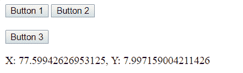
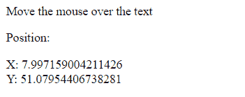

# 使用 HTML 检索元素的位置(X，Y)

> 原文:[https://www . geeksforgeeks . org/retrieve-position-xy-of-element-use-html/](https://www.geeksforgeeks.org/retrieve-the-position-xy-of-an-element-using-html/)

(X，Y)的位置表示文档中左上角元素的坐标。x 代表水平位置，Y 代表垂直位置。使用 element.getBoundingClientRect()属性获取元素的位置。

**例 1:**

```
<!-- HTML program to get (x, y) coordinate 
of an element relative to the viewport -->
<!DOCTYPE html>
<html>
    <head>
        <title>
            position of an element
        </title>

        <!-- JavaScript code to display position -->
        <script type="text/javascript">

            function getPositionXY(element) {
                var rect = element.getBoundingClientRect();
                document.getElementById('gfg').innerHTML = 
                'X: ' + rect.x + ', ' + 'Y: ' + rect.y
            }
        </script>
    </head>

    <body>

        <!-- Click on button to get its co-ordinate -->
        <button id = 'button1' onclick = "getPositionXY(this)">
            Button 1
        </button>

        <button id = 'button1' onclick = "getPositionXY(this)">
            Button 2
        </button>

        <br><br>
        <button id = 'button1' onclick = "getPositionXY(this)">
            Button 3
        </button>

        <p id = 'gfg'></p>

    </body>
</html>                    
```

**输出:**


**示例 2:** 在本例中，将指针移动到文档上以获取元素的位置。

```
<!-- HTML program to show (x, y) of an 
element by dragging mouse over it -->
<!DOCTYPE html>
<html>
    <head>
        <title>
            position of an element
        </title>

        <!-- scropt to get position -->
        <script type = "text/javascript">
            function getPositionXY(element) {
                var rect = element.getBoundingClientRect();
                document.getElementById('text').innerHTML 
                = 'X: ' + rect.x + '<br>' + 'Y: ' + rect.y;
            }
        </script>
    </head>

    <body>
        <p>Move the mouse over the text</p>

        <div onmouseover = "getPositionXY(this)">
            Position:
            <p id = 'text'></p>
        </div>

    </body>
</html>                    
```

**输出:**
