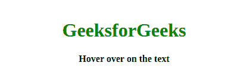
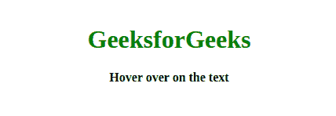

# 使用 HTML 和 CSS 的橡皮筋文字动画

> 原文:[https://www . geesforgeks . org/橡皮筋-文本-动画-使用-html-and-css/](https://www.geeksforgeeks.org/rubber-band-text-animation-using-html-and-css/)



橡皮筋效果很受欢迎，当文本字符串明显变得可拉伸时，它看起来很有吸引力，这看起来很酷。橡皮筋文字动画可以使用 CSS 动画轻松生成，我们将使用**@关键帧**规则来获得所需的输出。因此，我们将文章分成两部分，在第一部分中，我们将创建文本字符串，当用户将鼠标悬停在文本字符串上时，它将是橡胶状的。我们将在第二部分中添加这个效果。
**创建结构:**在本节中，我们将只使用 HTML 来创建文本字符串。

*   **HTML 代码:**在本节中，我们将使用 **h1** 标签创建一个基本文本。

## 超文本标记语言

```html
<!DOCTYPE html>
<html lang="en" dir="ltr">
    <head>
        <meta charset="utf-8" />
        <title>Rubber Band Text Animation</title>

    </head>
    <body>
        <div id="text">
            <h1>GeeksforGeeks</h1>
            <b>Hover over on the text</b>
        </div>
    </body>
</html>
```

**设计结构:**在本节中，我们将设计结构，使创建的文本字符串具有弹性。

*   **CSS 代码:**在本节中我们将使用 CSS 动画来创建动画效果，我们将使用**@关键帧**规则来指定动画代码。我们将使用**变换**属性来制作动画

## 半铸钢ˌ钢性铸铁(Cast Semi-Steel)

```html
<style>
    body {
        margin: 0;
        padding: 0;
        font-family: serif;
    }

    #text {
        position: relative;
        margin-top: 100px;
        text-align: center;
    }

    h1 {
        color: green;
    }

    #text:hover {
        animation: effect linear 1s;
    }

    @keyframes effect {
        0% {
            transform: scale(1, 1);
        }
        25% {
            transform: scale(1.3, 0.6);
        }

        50% {
            transform: scale(1.1, 0.9);
        }
        100% {
            transform: scale(1, 1);
        }
    }
</style>
```

**最终解:**是以上两个代码段的组合。

## 超文本标记语言

```html
<!DOCTYPE html>
<html lang="en" dir="ltr">
    <head>
        <meta charset="utf-8" />
        <title>Rubber Band Text Animation</title>
        <style>
            body {
                margin: 0;
                padding: 0;
                font-family: serif;
            }

            #text {
                position: relative;
                margin-top: 100px;
                text-align: center;
            }

            h1 {
                color: green;
            }

            #text:hover {
                animation: effect linear 1s;
            }

            @keyframes effect {
                0% {
                    transform: scale(1, 1);
                }
                25% {
                    transform: scale(1.3, 0.6);
                }

                50% {
                    transform: scale(1.1, 0.9);
                }
                100% {
                    transform: scale(1, 1);
                }
            }
        </style>
    </head>
    <body>
        <div id="text">
            <h1>GeeksforGeeks</h1>
            <b>Hover over on the text</b>
        </div>
    </body>
</html>
```

**输出:**

