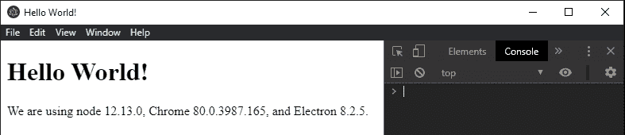

# 在电子表格

中将页面另存为 HTML

> 原文:[https://www . geesforgeks . org/save-pages-as-html-in-electronijs/](https://www.geeksforgeeks.org/save-pages-as-html-in-electronjs/)

[**electronijs**](https://www.geeksforgeeks.org/introduction-to-electronjs/)是一个开源框架，用于使用能够在**Windows****macOS**和 **Linux** 操作系统上运行的 HTML、CSS 和 JavaScript 等 web 技术构建跨平台原生桌面应用。它将 Chromium 引擎和 [**NodeJS**](https://www.geeksforgeeks.org/introduction-to-nodejs/) 结合成一个单一的运行时。

所有 Chromium 浏览器都支持将**网页**保存为 **HTML** 文件到原生系统。通常，该功能由铬浏览器中任何**网页**上的简单 **Ctrl+S** 键盘快捷键触发。电子也表现出这种行为，并允许我们使用**浏览器窗口**对象和**网络内容**属性的实例方法将**浏览器窗口**实例保存为本机系统上的 HTML 文件。每个**浏览器窗口**实例在其各自的**渲染器进程**中运行。每个渲染器进程都是独立的，并且有自己相关的 HTML、CSS 和 JavaScript 文件。我们可以只保存 HTML 文件，也可以分别保存 HTML 及其关联的 CSS 和 JS 文件，具体取决于 **webContents** 属性的实例方法提供的选项。本教程将演示如何将**浏览器窗口**实例保存为电子版原生系统上的 HTML 文件。

我们假设您熟悉上述链接中介绍的先决条件。电子要工作， [**节点**](https://www.geeksforgeeks.org/introduction-to-nodejs/) 和 [**npm**](https://www.geeksforgeeks.org/node-js-npm-node-package-manager/) 需要预装在系统中。

*   **项目结构:**


**示例:**按照 [**电子表格**](https://www.geeksforgeeks.org/desktop-operations-in-electronjs/) 中的桌面操作步骤设置基本的电子应用程序。复制文章中提供的 **main.js** 文件和**index.html**文件的样板代码。还要对**包. json** 文件进行必要的更改，以启动电子应用程序。我们将继续使用相同的代码库构建我们的应用程序。设置电子应用程序所需的基本步骤保持不变。

**package.json:**

```html
{
  "name": "electron-html",
  "version": "1.0.0",
  "description": "Save HTML Page in Electron",
  "main": "main.js",
  "scripts": {
    "start": "electron ."
  },
  "keywords": [
    "electron"
  ],
  "author": "Radhesh Khanna",
  "license": "ISC",
  "dependencies": {
    "electron": "^8.3.0"
  }
}

```

根据项目结构创建**资产**文件夹。我们将使用**资源**文件夹作为默认路径来保存应用程序生成的 HTML 及其相关文件。根据项目结构创建**索引. css** 文件。该文件仅用于演示目的，我们将保留该文件为空。
**输出:**此时，我们的基本电子应用程序就设置好了。启动应用程序后，我们应该会看到以下结果。

[](https://media.geeksforgeeks.org/wp-content/uploads/20200512225834/Output-1105.png)

**在电子中保存 HTML 文件:****浏览器窗口**实例和**网站内容**属性是**主进程**的一部分。要在**渲染器进程**中导入和使用**浏览器窗口**，我们将使用电子**远程**模块。

*   **index.html**:在该文件中添加以下片段。“将此页面另存为 HTML”和“将极客页面另存为 HTML”按钮还没有任何相关功能。

## 超文本标记语言

```html
<head>
    <link rel="stylesheet" href="index.css">
</head>

<body>
  <h3>Save Pages as HTML file</h3>
    <button id="save">
      Save This Page as HTML
    </button>
    <button id="load">
      Save GeeksForGeeks Page as HTML
    </button>
</body>
```

*   **index.js** :在该文件中添加以下代码片段。

## java 描述语言

```html
const electron = require('electron');
const path = require('path');
// Importing BrowserWindow using Electron remote
const BrowserWindow = electron.remote.BrowserWindow;

let win = BrowserWindow.getFocusedWindow();
// let win = BrowserWindow.getAllWindows()[0];

// Specifying the assets folder as the default path
const filepathlocal = path.join(__dirname, '../assets/page.html');
const filepathload = path.join(__dirname, '../assets/geeksforgeeks.html');

var save = document.getElementById('save');
save.addEventListener('click', () => {
    // Works for the Local Page
    win.webContents.savePage(filepathlocal, 'HTMLComplete').then(() => {
        console.log('Page was saved successfully.')
    }).catch(err => {
        console.log(err);
    });
});

var load = document.getElementById('load');
load.addEventListener('click', (event) => {
    // Creating a New BrowserWindow Instance, Loading GeeksForGeeks.org
    // And Saving it as an External Page
    let window = new BrowserWindow({
        width: 800,
        height: 600,
        webPreferences: {
            nodeIntegration: true
        }
    });
    window.loadURL('https://www.geeksforgeeks.org/');
    window.webContents.openDevTools();
    window.webContents.on('did-finish-load', async () => {
        window.webContents.savePage(filepathload, 'HTMLOnly').then(() => {
            console.log('Page was saved successfully.')
        }).catch(err => {
            console.log(err)
        });
    });
});
```

**win.webContents.savePage(文件路径，保存类型)**实例方法用于根据**保存类型**参数将当前**浏览器窗口**实例保存为 HTML 文件。返回**承诺**，网页保存成功后解析。它接受以下参数。

*   **文件路径:字符串**该参数不能为空。它指定了我们希望在本机系统上保存生成的 HTML 和相关文件的文件路径。在我们的代码中，我们使用**路径**模块指定了**资产**文件夹的文件路径以及文件名称。
*   **保存类型:字符串**该参数不能为空。它指定了需要在**浏览器窗口**实例上执行的保存操作的类型。它可以接受以下任何一个值。
    *   **HTMLOnly:** 这个 **saveType** 属性的值只保存当前**浏览器窗口**实例的 HTML 文件，没有任何关联的文件。
    *   **HTMLComplete:** 这个 **saveType** 属性的值保存当前**浏览器窗口**实例的完整网页，包括分别在指定的**文件路径**的 HTML 文件和相关的 JavaScript 和 CSS 文件。该值在指定的文件路径内创建一个新文件夹 **page_files** 。该文件夹包含保存网页的附加 CSS 和 JS 文件。
    *   **MHTML:****保存类型**属性的该值将**浏览器窗口**实例的 HTML 文件保存为 **MHTML** 。它代表 **MIME HTML** ，是聚合 HTML 文档的 MIME 封装。它是一种网页格式，用于将由代码中的外部超链接表示的 HTML 代码及其资源(如图像、音频、视频文件等)组合成一个 HTML 文件。使用 MIME 内容类型**多部分/相关**对 **MHTML** 文件的内容进行编码。

**完成加载**实例事件属于**网站内容**属性。当完成网页的导航(由 [**window.loadURL()**](https://www.electronjs.org/docs/api/browser-window#winloadurlurl-options) 实例方法指定)并完全加载页面时发出。当页面的微调器停止旋转，并且 **onload** 事件已经调度时，就会发生这种情况。在我们的代码中，我们使用这个实例事件来等待**GeeksForGeeks.org**网站完全加载到我们的**浏览器窗口**实例中，然后我们才能将 HTML 文件保存到我们的系统中。
要在**渲染器进程**中获取当前**浏览器窗口**实例，我们可以使用**浏览器窗口**对象提供的一些*静态*方法。

*   **BrowserWindow . getallwindow():**此方法返回一个活动/打开的 BrowserWindow 实例数组。在这个应用程序中，我们只有一个活动的**浏览器窗口**实例，它可以直接从数组中引用，如代码所示。
*   **浏览器窗口. getFocusedWindow():** 此方法返回在应用程序中聚焦的**浏览器窗口**实例。如果没有找到当前浏览器窗口实例，则返回**空值**。在这个应用程序中，我们只有一个活动的**浏览器窗口**实例，可以使用这个方法直接引用它，如代码所示。

**输出:**通过指定**保存当前**浏览器窗口**实例，生成的 MHTML 输出文件。** 

[](https://media.geeksforgeeks.org/wp-content/uploads/20200607003949/Output-2105.png)