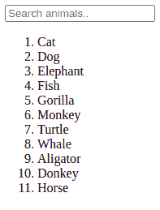
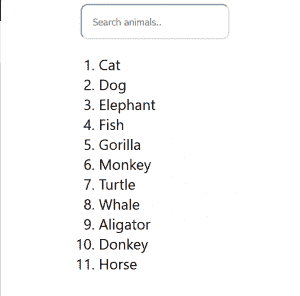
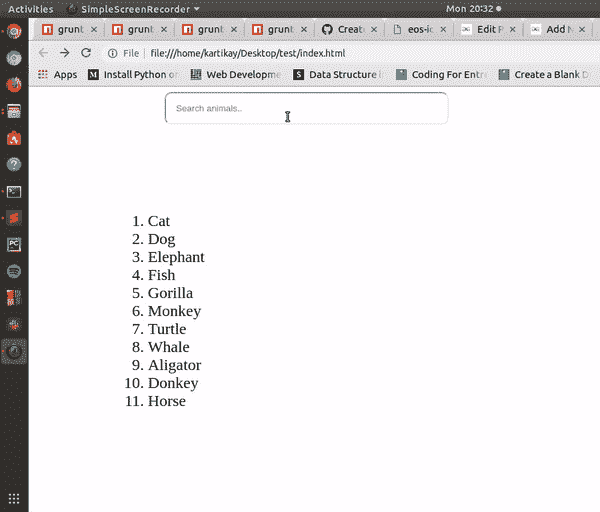

# 使用 HTML、CSS 和 JavaScript 的搜索栏

> 原文:[https://www . geesforgeks . org/search-bar-use-html-CSS-and-JavaScript/](https://www.geeksforgeeks.org/search-bar-using-html-css-and-javascript/)

每个网站都需要一个搜索栏，用户可以通过它在该页面上搜索他们关注的内容。一个基本的搜索栏只能用 HTML、CSS 和 JavaScript 来制作。高级搜索算法寻找许多东西，比如相关内容，然后显示结果。我们要做的是在字符串中寻找子字符串。

**HTML**

在本节中，我们将编写代码的 HTML 部分。在 HTML 中，我们将只链接样式表和 JavaScript 文件。输入标签用于创建搜索栏，它包括几个属性，如*类型、占位符、名称*。我们还需要一份物品清单，上面有不同的动物名称，这样我们就可以通过它来寻找动物。标签中使用的类和标识将在下面的样式表中定义。

## 超文本标记语言

```html
<!DOCTYPE html>
<html>

<head>
    <title>
        Creating Search Bar using HTML
        CSS and Javascript
    </title>

    <!-- linking the stylesheet(CSS) -->
    <link rel="stylesheet" type="text/css" href="./style.css">
</head>

<body>

    <!-- input tag -->
    <input id="searchbar" onkeyup="search_animal()" type="text"
        name="search" placeholder="Search animals..">

    <!-- ordered list -->
    <ol id='list'>
        <li class="animals">Cat</li>
        <li class="animals">Dog</li>
        <li class="animals">Elephant</li>
        <li class="animals">Fish</li>
        <li class="animals">Gorilla</li>
        <li class="animals">Monkey</li>
        <li class="animals">Turtle</li>
        <li class="animals">Whale</li>
        <li class="animals">Aligator</li>
        <li class="animals">Donkey</li>
        <li class="animals">Horse</li>
    </ol>

    <!-- linking javascript -->
    <script src="./animals.js"></script>
</body>

</html>
```

**输出:**



CSS

虽然上面的输入标签和有序列表看起来不错，但它仍然需要一些样式。对于搜索栏样式，添加了一些边距和填充，使其看起来干净。测量值以百分比表示，以便在任何尺寸的屏幕(移动、桌面等)中使用时可以自行调整。Webkit 过渡用于在单击时更改搜索栏的宽度。搜索栏的初始宽度是 30%，但是当它被点击时，它会变成 70%，有一个 0.15 秒的由易到难的过渡。

## 半铸钢ˌ钢性铸铁(Cast Semi-Steel)

```html
  #searchbar{
     margin-left: 15%;
     padding:15px;
     border-radius: 10px;
   }

   input[type=text] {
      width: 30%;
      -webkit-transition: width 0.15s ease-in-out;
      transition: width 0.15s ease-in-out;
   }

   /* When the input field gets focus,
        change its width to 100% */
   input[type=text]:focus {
     width: 70%;
   }

  #list{
    font-size:  1.5em;
    margin-left: 90px;
   }

.animals{
   display: list-item;    
  } 
```

**输出**
添加 Styling 后，我们的页面应该是这样的。



**注意:**如果页面的样式没有改变，请确保 style.css 文件与 index.html 在同一个文件夹中。
它仍然是不完整的，因为我们仍然需要 JavaScript 来完成这个搜索栏的功能。

**JavaScript**

在搜索栏的 HTML 代码中，我们给了输入一个 id="searchbar "和我们调用的 onkeyup，函数" search_animal "。每次在键盘上释放一个键时，onkeyup 都会调用该函数。

我们首先使用 [getElementById](https://www.geeksforgeeks.org/html-dom-getelementbyid-method/) 获得我们的输入。确保将其转换为小写，以避免搜索时区分大小写。一组文档存储在 x 中。这包含了 id=“动物”的所有列表。之后，运行一个循环来检查每个文档的内部 HTML 是否包含输入子字符串，如果不包含，则显示属性设置为“无”，这样它在前端就不可见了。

## java 描述语言

```html
// JavaScript code
function search_animal() {
    let input = document.getElementById('searchbar').value
    input=input.toLowerCase();
    let x = document.getElementsByClassName('animals');

    for (i = 0; i < x.length; i++) { 
        if (!x[i].innerHTML.toLowerCase().includes(input)) {
            x[i].style.display="none";
        }
        else {
            x[i].style.display="list-item";                 
        }
    }
}
```

**输出:**



JavaScript 最出名的是网页开发，但它也用于各种非浏览器环境。您可以通过以下 [JavaScript 教程](https://www.geeksforgeeks.org/javascript-tutorial/)和 [JavaScript 示例](https://www.geeksforgeeks.org/javascript-examples/)从头开始学习 JavaScript。

HTML 是网页的基础，通过构建网站和网络应用程序用于网页开发。您可以通过以下 [HTML 教程](https://www.geeksforgeeks.org/html-tutorials/)和 [HTML 示例](https://www.geeksforgeeks.org/html-examples/)从头开始学习 HTML。

CSS 是网页的基础，通过设计网站和网络应用程序用于网页开发。你可以通过以下 [CSS 教程](https://www.geeksforgeeks.org/css-tutorials/)和 [CSS 示例](https://www.geeksforgeeks.org/css-examples/)从头开始学习 CSS。