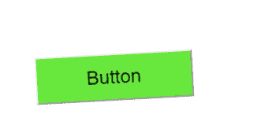

# 使用 HTML 和 CSS 在悬停时摇动按钮

> 原文:[https://www . geesforgeks . org/shake-a-button-on-hover-using-html-and-CSS/](https://www.geeksforgeeks.org/shake-a-button-on-hover-using-html-and-css/)

摇动按钮效果也称为摆动效果，可用于使网站看起来更具响应性和动态性。这是理解 CSS 中**@关键帧**规则概念的最佳效果之一。

**方法:**抖动按钮效果或动画可以使用 HTML 和 CSS 创建，首先我们将使用 HTML 创建一个基本按钮，然后我们将使用**@关键帧**规则来指定动画代码。以下部分将指导您如何创建效果。

**HTML 代码:**在本节中，我们将使用**按钮标签**创建一个基本按钮。

```html
<!DOCTYPE html>
<html lang="en" dir="ltr">

<head>
    <meta charset="utf-8">
    <title>Shake Button on Hover</title>
</head>

<body>
    <div>
        <button id="btn">Button</button>
    </div>
</body>

</html>
```

**CSS 代码:**在本节中，首先我们将使用 CSS 基本属性设计按钮，然后为了创建抖动效果或动画，我们将使用**@关键帧**规则，我们将使用 **translateX()** 和 **rotate()** 功能在 x 轴上重新定位按钮元素，当我们悬停在其上时，创建所需的效果。

```html
<style>
    body {
        margin: 0;
        padding: 0;
    }

    div {
        position: absolute;
        top: 50%;
        left: 50%;
        transform: translate(-50%, -50%);
    }

    #btn {
        text-align: center;
        height: 60px;
        width: 200px;
        display: block;
        font-size: 1.5em;
        background: #68E73C;
    }

    #btn:hover {
        animation: effect 0.4s infinite;
    }

    @keyframes effect {
        0% {
            transform: translateX(0px) rotate(0deg);
        }

        20% {
            transform: translateX(-4px) rotate(-4deg);
        }

        40% {
            transform: translateX(-2px) rotate(-2deg);
        }

        60% {
            transform: translateX(4px) rotate(4deg);
        }

        80% {
            transform: translateX(2px) rotate(2deg);
        }

        100% {
            transform: translateX(0px) rotate(0deg);
        }
    }
</style>
```

**完整代码:**是以上两个代码段的组合。

```html
<!DOCTYPE html>
<html lang="en" dir="ltr">

<head>
    <meta charset="utf-8">
    <title>Shake Button on Hover</title>
    <style>
        body {
            margin: 0;
            padding: 0;
        }

        div {
            position: absolute;
            top: 50%;
            left: 50%;
            transform: translate(-50%, -50%);
        }

        #btn {
            text-align: center;
            height: 60px;
            width: 200px;
            display: block;
            font-size: 1.5em;
            background: #68E73C;
        }

        #btn:hover {
            animation: effect 0.4s infinite;
        }

        @keyframes effect {
            0% {
                transform: translateX(0px) rotate(0deg);
            }

            20% {
                transform: translateX(-4px) rotate(-4deg);
            }

            40% {
                transform: translateX(-2px) rotate(-2deg);
            }

            60% {
                transform: translateX(4px) rotate(4deg);
            }

            80% {
                transform: translateX(2px) rotate(2deg);
            }

            100% {
                transform: translateX(0px) rotate(0deg);
            }
        }
    </style>
</head>

<body>
    <div>
        <button id="btn">Button</button>
    </div>
</body>

</html>
```

**输出:**
