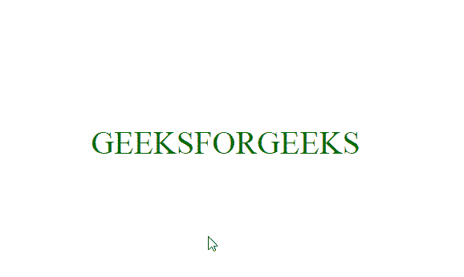

# 使用 HTML 和 CSS 缩小悬停文本

> 原文:[https://www . geesforgeks . org/shrink-text-on-hover-using-html-and-CSS/](https://www.geeksforgeeks.org/shrink-text-on-hover-using-html-and-css/)

文本可以使用一些 HTML 和 CSS 属性进行收缩或压缩，您可以在您的网站中使用此动画作为标题或子标题，以下部分将指导您如何创建所需的效果。

**HTML 代码:**在本节中，我们有一个简单的 *div* 元素，其中包含用 *span* 标签分隔的文本。

```html
<!DOCTYPE html>
<html lang="en">
<head>
  <meta charset="UTF-8">
  <meta name="viewport" 
        content="width=device-width, initial-scale=1.0">
  <title>Shrink Text</title>
</head>

<body>
  <div>
    <span>G</span><span>EEKS</span>
    <span>F</span><span>OR</span>
    <span>G</span><span>EEKS</span>
  </div>      
</body>
</html>
```

**CSS 代码:**在这个代码 fisr 中，我们使用基本的 CSS 属性设计了 *div* 元素，然后为了创建收缩效果，我们使用了*第 n 个子()*选择器，当我们悬停在文本上时，将字母间距设置为 *-1em* 。

```html
<style>
  *{
    margin: 0;
    padding: 0;
  }
  /* designing the text*/
  div{
    position: absolute;
    top: 50%;
    left: 50%;
    transform: translate(-50%, -50%);
    display: flex;
    font-size: 2.5em;
    color: rgb(4, 110, 4);
  }
  /*creating the shrink animation*/
  span:nth-child(even){
    overflow: hidden;
    letter-spacing: 0;
    transition:  1s;
  }

  div:hover span:nth-child(even){
    letter-spacing: -1em;
  }
 </style>
```

**最终代码:**是以上两个代码段的组合。

```html
<!DOCTYPE html>
<html lang="en">
<head>
  <meta charset="UTF-8">
  <meta name="viewport" 
        content="width=device-width, initial-scale=1.0">
  <title>Shrink Text</title>
</head>
<style>
  *{
    margin: 0;
    padding: 0;
  }
  /* designing the text*/
  div{
    position: absolute;
    top: 50%;
    left: 50%;
    transform: translate(-50%, -50%);
    display: flex;
    font-size: 2.5em;
    color: rgb(4, 110, 4);
  }
  /*creating the shrink animation*/
  span:nth-child(even){
    overflow: hidden;
    letter-spacing: 0;
    transition:  1s;
  }

  div:hover span:nth-child(even){
    letter-spacing: -1em;
  }
 </style>

<body>
  <div>
    <span>G</span><span>EEKS</span>
    <span>F</span><span>OR</span>
    <span>G</span><span>EEKS</span>
  </div>  
</body>
</html>
```

**输出:**

