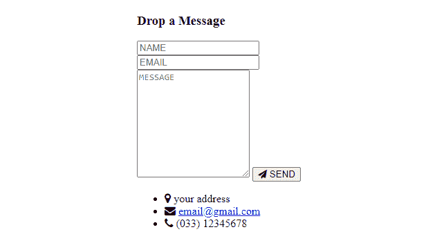
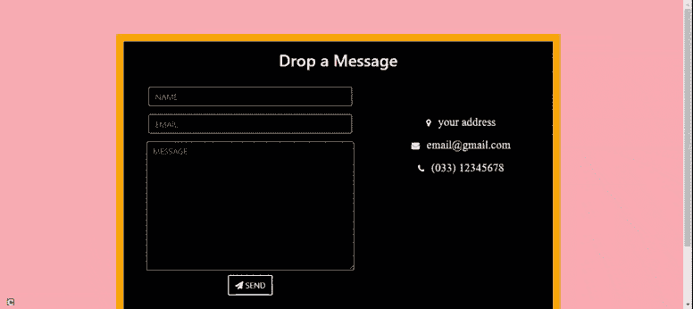

# Simple Contact Form using HTML CSS and PHP

> 原文：[https://www.geeksforgeeks.org/simple-contact-form-using-html-css-and-php/](https://www.geeksforgeeks.org/simple-contact-form-using-html-css-and-php/)

In this article, we will learn to create a basic contact form using HTML, CSS, and PHP.

We are creating a simple HTML form that has three fields name, email address, and a message. The design part is implemented using CSS. Any functionality is added to the form using PHP. We can add our own details, such as an address, phone number, email address, etc as per the application’s need. We can create the form in multiple sections and [HTML idivs](https://www.geeksforgeeks.org/div-tag-html/) so that it will be easier to add the styles later. 

**Example:** In the example below, several [Font Awesome](https://fontawesome.com/v5.15/icons?d=gallery&p=2) icons are used.  We have created a different section with a heading. In addition to the modified form, we have added the icons and other contact information.

**HTML Code:**

## HTML

```html
<!DOCTYPE html>
<html>
  <head>
    <link
      rel="stylesheet"
      href=
"https://maxcdn.bootstrapcdn.com/bootstrap/4.4.1/css/bootstrap.min.css"
    />
    <link
      rel="stylesheet"
      href=
"https://cdnjs.cloudflare.com/ajax/libs/font-awesome/4.7.0/css/font-awesome.min.css"
    />
    <link rel="stylesheet" href="style.css" />
  </head>
  <body>
    <section id="last">
      <!-- heading -->
      <div class="full">
        <h3>Drop a Message</h3>

        <div class="lt">

          <!-- form starting  -->
          <form class="form-horizontal"
                method="post" action="contact.php">
            <div class="form-group">
              <div class="col-sm-12">
                <!-- name  -->
                <input
                  type="text"
                  class="form-control"
                  id="name"
                  placeholder="NAME"
                  name="name"
                  value=""
                />
              </div>
            </div>

            <div class="form-group">
              <div class="col-sm-12">
                <!-- email  -->
                <input
                  type="email"
                  class="form-control"
                  id="email"
                  placeholder="EMAIL"
                  name="email"
                  value=""
                />
              </div>
            </div>

            <!-- message  -->
            <textarea
              class="form-control"
              rows="10"
              placeholder="MESSAGE"
              name="message">
            </textarea>

            <button
              class="btn btn-primary send-button"
              id="submit"
              type="submit"
              value="SEND">
              <i class="fa fa-paper-plane"></i>
              <span class="send-text">SEND</span>
            </button>
          </form>
          <!-- end of form -->
        </div>

        <!-- Contact information -->
        <div class="rt">
          <ul class="contact-list">
            <li class="list-item">
              <i class="fa fa-map-marker fa-1x">
                <span class="contact-text place">
                  your address
                </span>
             </i>
            </li>

            <li class="list-item">
              <i class="fa fa-envelope fa-1x">
                <span class="contact-text gmail">
                  <a href="mailto:yourmail@gmail.com" title="Send me an email">
                    email@gmail.com</a>
                </span>
              </i>
            </li>

            <li class="list-item">
              <i class="fa fa-phone fa-1x">
                <span class="contact-text phone">
                  (033) 12345678
                </span>
              </i>
            </li>
          </ul>
        </div>
      </div>
    </section>
  </body>
</html>
```

**Output:**



**CSS Code:** After creating the HTML file, we have to add CSS to improve its appearance. Once we add the styles to the code, we have to take care of another thing. Our website should be able to adapt to different screen sizes and resolutions. So we have to add media queries. The following CSS code is the content for the file “style.css” used in the above HTML code.

style.css

## HTML

```html
#last{
width: 100%;
height: auto;
justify-content: center;
background-color: #ffb3b3;
}
.full{
width: 80%;
display: inline-block;
margin:2%;
margin-left: 10%;
text-align: center;
background-color: black;
color: white;
border:15px solid orange;
border-radius: 5px;
margin-bottom: 8%;
margin-top: 8%;
}
.full h3{
font-size: 2rem;
display:block;
margin: 2%;
margin-bottom: 0;
}
.lt{
padding: 2%;
margin: 2%;
}
.rt{
padding: 2%;
margin: 2%;
}
.lt textarea{
width: 94%;
margin-left: 2.8%;
}
button{
margin: 2%;
}
.btn-primary{
background-color: black;
border: 2px solid white;
border-radius: 5%;
}
.list-item{
margin-bottom: 2%;
list-style-type: none;
}
.list-item span{
margin-left: 10px;
font-size: 1.4rem;
}
.list-item a{
color: white;
display: inline-block;
}
.list-item a:hover{
text-decoration: underline;
}
.form-control{
background-color: black;
}

@media screen and (min-width: 770px){
.full{
    width: 70%;
    margin-left: 15%;
}
.lt textarea{
width: 95%;
margin-left: 2.4%;
}
}

@media screen and (min-width: 1100px){
.full{
    width: 65%;
    margin-left: 17%;
    margin-top: 5%;
}
.lt{
    width: 55%;
    display: inline-block;
    float: left;
    margin-right: 0;
}
.rt{
    width: 35%;
    display: inline-block;
    margin-left: 0;
}
.list-item{
margin-bottom: 10%;
}
.contact-list{
    margin-top: 22%;
    padding-right: 8%;
}
.fa-envelope, .gmail{
    display: inline-block;
    width: auto;
}
}
```

**PHP code:** To add functionality to the form, we are using [phpmailer.](https://www.geeksforgeeks.org/how-to-send-an-email-using-phpmailer/)  A separate php file “contact.php” is created and the name of the file is added in the HTML file in the form action field. 

```html
<form class="form-horizontal" method="post" action="contact.php">
```

In the following code, we are getting the name, email, and message from the contact form. When “SEND” button is clicked, an email is sent from the website to the email address specified in the PHP code, with the subject line  “This is the subject line”.

## PHP

```html
<?php
// Get data from form 
$name = $_POST['name'];
$email= $_POST['email'];
$message= $_POST['message'];

$to = "yourEmail@gmail.com";
$subject = "This is the subject line";

// The following text will be sent
// Name = user entered name
// Email = user entered email
// Message = user entered message
$txt ="Name = ". $name . "\r\n  Email = "
    . $email . "\r\n Message =" . $message;

$headers = "From: noreply@demosite.com" . "\r\n" .
            "CC: somebodyelse@example.com";
if($email != NULL) {
    mail($to, $subject, $txt, $headers);
}

// Redirect to
header("Location:last.html");
?>
```

In the above example, the redirection location is given as “last.html”.  We can redirect to any file name. The above code cannot be tested in the web browser or live server. To test the working of the emails, paid host server is needed.

**Output:**



contact form example