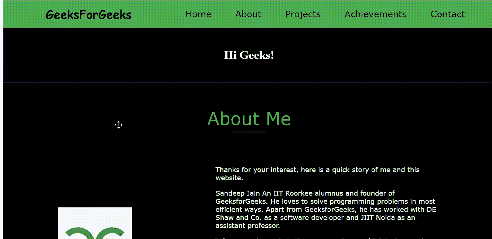

# 使用 HTML 的简单作品集网站设计

> 原文:[https://www . geesforgeks . org/simple-portfolio-网站-设计-使用-html/](https://www.geeksforgeeks.org/simple-portfolio-website-design-using-html/)

作为一名网络开发人员，拥有一个投资组合在申请机会时会有很大的帮助，并成为我们才华的展示，因此在本文中，我们将学习如何仅使用 HTML 制作一个简单的单页投资组合。这个投资组合可能包含您的一些非常重要的信息，例如:

*   关于美国部分
*   你的项目
*   你的成就
*   您的联系方式

你甚至可以在你的投资组合中加入其他细节，让它变得更漂亮。但是本文关注的是希望学习使用简单的 HTML 来构建投资组合的初学者。

**先决条件:**HTML 的基本概念，如标签、属性、表单、表格、行、列、超链接等。

**代码实现:**

## 超文本标记语言

```html
<!DOCTYPE html>
<html lang="en">

<head>
    <meta charset="UTF-8">
    <meta name="viewport" content=
        "width=device-width, initial-scale=1.0">
    <title>HTML Project</title>
</head>

<body>
    <!--Header(start)-->
    <table id="header" border="0" width="100%"
        cellpadding="0" cellspacing="0" bgcolor="#4CAF50">
        <tr>
            <td>
                <table border="0" cellpadding="15"
                    cellspacing="0" width="90%" align="center">
                    <tr>
                        <td>

                        </td>

                        <td>
                            <font face="Comic sans MS" size="6">
                                <b>GeeksForGeeks</b>
                            </font>
                        </td>

                        <td width="15%">

                        </td>

                        <td>
                            <a href="#home" style="text-decoration:none">
                                <font face="Verdana" size="5" color=black>
                                    Home
                                </font>
                            </a>
                        </td>

                        <td>
                            |
                        </td>

                        <td>
                            <a href="#about" style="text-decoration:none">
                                <font face="Verdana" size="5" color=black>
                                    About
                                </font>
                            </a>
                        </td>

                        <td>
                            |
                        </td>

                        <td>
                            <a href="#projects" style="text-decoration:none">
                                <font face="Verdana" size="5" color=black>
                                    Projects
                                </font>
                            </a>
                        </td>

                        <td>
                            |
                        </td>

                        <td>
                            <a href="#achievements" style="text-decoration:none">
                                <font face="Verdana" size="5" color=black>
                                    Achievements
                                </font>
                            </a>
                        </td>

                        <td>
                            |
                        </td>

                        <td>
                            <a href="#contact" style="text-decoration:none">
                                <font face="Verdana" size="5" color=black>
                                    Contact
                                </font>
                            </a>
                        </td>
                    </tr>
                </table>
            </td>
        </tr>
    </table>
    <!--Header(end)-->

    <!--Home(start)-->
    <table id="home" border="1" width="100%"
        cellpadding="20" cellspacing="0" bgcolor="black">
        <tr>
            <td>
                <table border="0" cellpadding="15"
                    cellspacing="0" width="90%" align="center">
                    <tr>
                        <td align="center" valign="middle">
                            <h3>
                                <font face="Times New Roman"
                                    size="6" color="#ffffff">
                                    Hi Geeks!
                                </font>
                            </h3>

                            <h2>
                                <font face="Verdana" size="6"
                                    color="#4CAF50">
                                    <!-- Freelance Programmer -->
                                </font>
                            </h2>
                        </td>
                    </tr>
                </table>
            </td>
        </tr>
    </table>
    <!--Home(end)-->

    <!--About(start)-->
    <table id="about" border="0" width="100%"
        cellpadding="0" cellspacing="0" bgcolor="black">
        <tr>
            <td>
                <table border="0" cellpadding="15"
                    cellspacing="0" width="80%" align="center">
                    <tr>
                        <td height="180" align="center"
                            valign="middle" colspan="2">
                            <font face="Verdana" size="7"
                                color="#4CAF50">
                                About Me
                            </font>
                            <hr color="#4CAF50" width="90">
                        </td>
                    </tr>

                    <tr>
                        <td width="40%">
                            
                        </td>

                        <td width="60%">
                            <font face="Verdana" size="4"
                                color="white">
                                Thanks for your interest, here
                                is a quick story of me and this
                                website.
                                <hr color="black">
                                Sandeep Jain An IIT Roorkee alumnus
                                and founder of GeeksforGeeks. He
                                loves to solve programming problems
                                in most efficient ways. Apart from
                                GeeksforGeeks, he has worked with
                                DE Shaw and Co. as a software
                                developer and JIIT Noida as an
                                assistant professor.
                                <hr color="black">

                                I do my work mainly in C-Language,
                                C++ and JAVA. C++ and Data Structure
                                & Algorithm are my stronger section.
                                Besides these I know Web Development,
                                LINUX and database as well.
                                <hr color="black">

                                This website is basically one of my
                                Web Development project which is
                                built using HTML only.
                                Here one can also find ideas for
                                projects in different languages.

                                Thanks again for reading this,
                                because of people like you, it
                                exists and prospers!
                                <hr color="black">
                                Cheers,
                                <br>
                                <b>GeeksForGeeks.</b>
                            </font>
                        </td>
                    </tr>
                </table>
                <hr color="black">
                <hr color="black">
                <hr color="black">
            </td>
        </tr>
    </table>
    <!--About(end)-->

    <!--Projects(start)-->
    <table id="projects" border="0" width="100%"
        cellpadding="0" cellspacing="0" bgcolor="#c2c0c3">
        <tr>
            <td>
                <table border="0" cellpadding="15"
                    cellspacing="0" width="80%" align="center">
                    <tr>
                        <td height="180" align="center"
                            valign="middle" colspan="2">
                            <font face="Verdana" size="7"
                                color="black">
                                Projects
                            </font>
                            <hr color="black" width="90">
                        </td>
                    </tr>

                    <tr>
                        <td height="10">
                            <font face="Times New Roman"
                                size="5" color="black">
                                <ul>
                                    <li>
                                        BMI Calculator
                                        <a href="#" style="text-decoration:none">
                                              ➲
                                        </a>
                                    </li>

                                    <li>
                                        <hr color="#c2c0c3">
                                        Calculator
                                        <a href="#" style="text-decoration:none"
                                            color="#c2c0c3">
                                              ➲
                                        </a>
                                    </li>

                                    <li>
                                        <hr color="#c2c0c3">
                                        Calendar
                                        <a href="#" style="text-decoration:none">
                                              ➲
                                        </a>
                                    </li>

                                    <li>
                                        <hr color="#c2c0c3">
                                        ChatBot
                                        <a href="#" style="text-decoration:none">
                                              ➲
                                        </a>
                                    </li>

                                    <li>
                                        <hr color="#c2c0c3">
                                        Contact Saver
                                        <a href="#" style="text-decoration:none">
                                              ➲
                                        </a>
                                    </li>

                                    <li>
                                        <hr color="#c2c0c3">
                                        Daily Quiz
                                        <a href="#" style="text-decoration:none">
                                              ➲
                                        </a>
                                    </li>

                                    <li>
                                        <hr color="#c2c0c3">
                                        Emplyoyee Record System
                                        <a href="#" style="text-decoration:none">
                                              ➲
                                        </a>
                                    </li>

                                    <li>
                                        <hr color="#c2c0c3">
                                        Guess the Number-Game
                                        <a href="#" style="text-decoration:none">
                                              ➲
                                        </a>
                                    </li>

                                    <li>
                                        <hr color="#c2c0c3">
                                        Random Password Generator
                                        <a href="#" style="text-decoration:none">
                                             ➲
                                        </a>
                                    </li>

                                    <li>
                                        <hr color="#c2c0c3">
                                        Stone Paper Scissor
                                        <a href="#" style="text-decoration:none">
                                             ➲
                                        </a>
                                    </li>

                                    <li>
                                        <hr color="#c2c0c3">
                                        Tic Tac Toe
                                        <a href="#" style="text-decoration:none">
                                             ➲
                                        </a>
                                    </li>

                                    <li>
                                        <hr color="#c2c0c3">
                                        Tic Tac Toe(GUI)
                                        <a href="#" style="text-decoration:none">
                                             ➲
                                        </a>
                                    </li>

                                    <li>
                                        <hr color="#c2c0c3">
                                        ToDo App
                                        <a href="#" style="text-decoration:none">
                                             ➲ </a>
                                    </li>

                                    <li>
                                        <hr color="#c2c0c3">
                                        Travel Management System
                                        <a href="#" style=
                                            "text-decoration:none">  ➲
                                        </a>
                                    </li>
                                </ul>
                                <hr color="#c2c0c3">
                                <hr color="#c2c0c3">
                                <hr color="#c2c0c3">
                                <hr color="#c2c0c3">
                            </font>
                        </td>

                        <td width="45%">
                            
                        </td>
                    </tr>
                </table>
            </td>
        </tr>
    </table>
    <!--Projects(end)-->

    <!--Achievement(start)-->
    <table id="achievements" border="0" width="100%"
        cellpadding="0" cellspacing="0" bgcolor="black">
        <tr>
            <td>
                <table border="0" cellpadding="15"
                    cellspacing="0" width="80%" align="center">
                    <tr>
                        <td height="180" align="center" valign="middle">
                            <font face="Verdana" size="7" color="#4CAF50">
                                Achievements
                                <hr color="#4CAF50" width="100">
                            </font>
                        </td>
                    </tr>

                    <tr>
                        <td>
                            <font face="Verdana" size="4" color="white">
                                <ul>
                                    <li>
                                        <b>Intern at GeeksforGeeks.</b>
                                        <ul>
                                            <li>
                                                December,2020 - Present.
                                            </li>
                                            <li>
                                                Write technical articles
                                                on programming related topics.
                                            </li>
                                        </ul>
                                    </li>

                                    <li>
                                        <hr color="black">
                                        <hr color="black">
                                        <hr color="black">
                                        <b>Microsoft Learn Student Ambassador.</b>
                                        <ul>
                                            <li>
                                                August,2020 - Present.
                                            </li>
                                            <li>
                                                Conducted events and workshops on
                                                different technologies.
                                            </li>
                                        </ul>
                                    </li>

                                    <li>
                                        <hr color="black">
                                        <hr color="black">
                                        <hr color="black">
                                        <b>Mentored HackTX.</b>
                                        <ul>
                                            <li>
                                                October,2020.
                                            </li>
                                            <li>
                                                Selected from Microsoft as Student
                                                ambassador where I mentored students
                                                in their projects.
                                            </li>
                                            <hr color="black">
                                            <hr color="black">
                                            <hr color="black">
                                            <hr color="black">
                                            <hr color="black">
                                        </ul>
                                    </li>

                                </ul>

                            </font>
                        </td>
                    </tr>
                </table>
            </td>
        </tr>
    </table>
    <!--Achievement(end)-->

    <!--Contact(start)-->
    <table id="contact" border="0" width="100%"
        cellpadding="0" cellspacing="0" bgcolor="#c2c0c3">
        <tr>
            <td>
                <table border="0" cellpadding="15"
                    cellspacing="0" width="80%" align="center">
                    <tr>
                        <td height="180" align="center"
                            valign="middle" colspan="2">
                            <font face="Verdana" size="7"
                                color="black">
                                Contact
                            </font>
                            <hr color="black" width="90">
                        </td>
                    </tr>

                    <tr>
                        <td align="center" valign="top">
                            <table border="0" width="50%" cellpadding="15"
                                cellspacing="0" align="center" bgcolor="black">
                                <tr>
                                    <td width="30%">
                                        <hr color="black">
                                        <font face="Verdana" size="4"
                                            color="#ffffff">
                                            Name
                                        </font>
                                    </td>
                                    <td width="70%">
                                        <font face="Verdana" size="4"
                                            color="#ffffff">
                                            <input type="text" size="40">
                                        </font>
                                    </td>
                                </tr>
                                <tr>
                                    <td width="30%">
                                        <font face="Verdana" size="4"
                                            color="#ffffff">
                                            Email
                                        </font>
                                    </td>
                                    <td width="70%">
                                        <font face="Verdana" size="4"
                                            color="#ffffff">
                                            <input type="email" size="40">
                                        </font>
                                    </td>
                                </tr>
                                <tr>
                                    <td width="30%">
                                        <font face="Verdana" size="4"
                                            color="#ffffff">
                                            Number
                                        </font>
                                    </td>
                                    <td width="70%">
                                        <font face="Verdana" size="4"
                                            color="#ffffff">
                                            <input type="number" size="12">
                                        </font>
                                    </td>
                                </tr>
                                <tr>
                                    <td width="30%">
                                        <font face="Verdana" size="4"
                                            color="#ffffff">
                                            Message
                                        </font>
                                    </td>
                                    <td width="70%">
                                        <font face="Verdana" size="4"
                                            color="#ffffff">
                                            <textarea rows="5"
                                                cols="37">
                                            </textarea>
                                        </font>
                                    </td>
                                </tr>
                                <tr>
                                    <td width="30%">

                                    </td>
                                    <td width="70%">
                                        <button type="Submit">
                                            <font face="Verdana"
                                                size="4" color="black">
                                                <b>Submit</b>
                                            </font>
                                        </button>
                                        <hr color="black">
                                        <hr color="black">
                                    </td>
                                </tr>
                            </table>
                        </td>

                    </tr>
                    <tr>
                        <td colspan="2">

                        </td>
                    </tr>
                </table>
            </td>
        </tr>
    </table>
    <!--Contact(end)-->

    <!--Footer1(start)-->
    <table id="footer" border="0" width="100%"
        cellpadding="0" cellspacing="0" bgcolor="#4CAF50">
        <tr>
            <td>
                <table border="0" cellpadding="15"
                    cellspacing="0" width="90%" align="center">
                    <tr>
                        <td width="13%" valign="top">
                            <b>LinkedIn</b>
                            <a href="#" style="text-decoration:none">
                                ➲
                            </a>
                        </td>

                        <td>
                            |
                        </td>

                        <td width="13%" valign="top">
                            <b>GitHub</b>
                            <a href="#" style="text-decoration:none">
                                ➲
                            </a>
                        </td>

                        <td>
                            |
                        </td>

                        <td width="13%" valign="top">
                            <b>HackerRank</b>
                            <a href="#" style="text-decoration:none">
                                ➲
                            </a>
                        </td>

                        <td>
                            |
                        </td>

                        <td width="13%" valign="top">
                            <b>GeeksforGeeks</b>
                            <a href="#" style="text-decoration:none">
                                ➲
                            </a>
                        </td>

                        <td>
                            |
                        </td>

                        <td width="13%" valign="top">
                            <b>Twitter</b>
                            <a href="#" style="text-decoration:none">
                                ➲
                            </a>
                        </td>

                        <td>
                            |
                        </td>

                        <td width="13%" valign="top">
                            <b>Instagram</b>
                            <a href="#" style="text-decoration:none">
                                ➲
                            </a>
                        </td>

                        <td>
                            |
                        </td>

                        <td width="13%" valign="top">
                            <b>Email</b>
                            <a href="#" style="text-decoration:none">
                                ➲
                            </a>
                        </td>

                        <td>
                            |
                        </td>

                        <td width="13%" valign="top">
                            <b>Website</b>
                            <a href="#" style="text-decoration:none">
                                ➲
                            </a>
                        </td>
                    </tr>
                </table>
            </td>
        </tr>
    </table>
    <!--Footer1(end)-->

    <!--Footer2(start)-->
    <table id="footer" border="0" width="100%"
        cellpadding="0" cellspacing="0" bgcolor="black">
        <tr>
            <td>
                <table border="0" cellpadding="15"
                    cellspacing="0" width="90%" align="center">
                    <tr>
                        <td width="80%" valign="top">
                            <font face="Verdana"
                                color="#4CAF50" size="5">
                                ©Copyright 2050 by nobody.
                                All rights reserved.
                            </font>
                        </td>

                        <td width="10%">
                            <font face="arial" color="black" size="5">
                                <a href="#header" style="text-decoration:none">
                                    <font face="Verdana" color="#4CAF50" size="6">
                                        <b>TOP ☝</b>
                                    </font>
                                </a>
                            </font>
                        </td>
                    </tr>
                </table>
            </td>
        </tr>
    </table>
    <!--Footer2(end)-->

</body>

</html>
```

**注:**我们也用了两张照片。一个在关于表中，另一个在项目部分。

**输出:**



**支持的浏览器:**

*   谷歌 Chrome
*   微软边缘
*   火狐浏览器
*   歌剧
*   旅行队