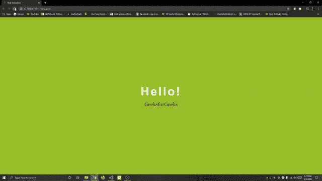

# 使用 HTML & CSS

改变文本颜色的文本动画

> 原文:[https://www . geesforgeks . org/text-animation-with-changing-the-color-text-using-html-CSS/](https://www.geeksforgeeks.org/text-animation-with-changing-the-color-of-the-text-using-html-css/)

**文字动画**是具有装饰性可移动效果的优美、多彩的字母、文字和段落的创作。运动可以在区域内或屏幕上以某种方式看到，遵循某种规律。

**HTML 代码:**在本节中，使用 HTML 设计了代码的基本结构。文本动画是通过使用一些 CSS 属性改变文本的颜色来创建的。

## 超文本标记语言

```html
<!DOCTYPE html>
<html lang="en">
<head>
    <meta charset="UTF-8">
    <meta name="viewport" content=
    "width=device-width, initial-scale=1.0">
    <title>Text Animation</title>
    <link rel="stylesheet" href="style.css">
</head>
<body>
    <div class="container">
    <div class="row">
        <span class="text1">Hello!</span>
        <span class="text2">GeeksforGeeks</span>
    </div>
    </div>
</body>
</html>
```

**CSS 代码:**在本节中，CSS 属性用于创建文本动画。
**@关键帧**用于定义动画的代码。动画是通过从一组 CSS 样式逐渐改变到另一组样式来创建的。样式或转换的变化是以百分比的形式发生的，或者通过使用关键字*“从”*、*”到”*，实际上是 0%和 100%。CSS 样式集可以多次更改。

**关键帧的语法:**

```html
@keyframes animationname {keyframes-selector {css-styles;}} 
```

## 钢性铸铁

```html
*{
    padding: 0;
    margin: 0;
    font-family: sans-serif;
}
body{
    background: yellowgreen;
}
.container{
    text-align: center;
    position: absolute;
    top: 50%;
    left: 50%;
    transform: translate(-50%, -50%);
    width: 100%;
}
.container span{
    display: block;
}
.text1{
    color: white;
    font-size: 70px;
    font-weight: 700;
    letter-spacing: 8px;
    margin-bottom: 20px;
    background: yellowgreen;
    position: relative;
    animation: text 3s 1;
}
.text2{
    font-size: 30px;
    color: darkgreen;
    font-family: Georgia, serif;
}
@keyframes text{
    0%{
        color: black;
        margin-bottom: -40px;
    }
    30%{
        letter-spacing: 25px;
        margin-bottom: -40px;
        }
    85%{
        letter-spacing: 8px;
        margin-bottom: -40px;
    }
}
```

**完整代码:**是以上两个代码段的组合。

## 超文本标记语言

```html
<!DOCTYPE html>
<html lang="en">

<head>
    <meta charset="UTF-8">
    <meta name="viewport" content=
        "width=device-width, initial-scale=1.0">
    <title>Text Animation</title>
    <style>
        * {
            padding: 0;
            margin: 0;
            font-family: sans-serif;
        }

        body {
            background: yellowgreen;
        }

        .container {
            text-align: center;
            position: absolute;
            top: 50%;
            left: 50%;
            transform: translate(-50%, -50%);
            width: 100%;
        }

        .container span {
            display: block;
        }

        .text1 {
            color: white;
            font-size: 70px;
            font-weight: 700;
            letter-spacing: 8px;
            margin-bottom: 20px;
            background: yellowgreen;
            position: relative;
            animation: text 3s 1;
        }

        .text2 {
            font-size: 30px;
            color: darkgreen;
            font-family: Georgia, serif;
        }

        @keyframes text {
            0% {
                color: black;
                margin-bottom: -40px;
            }

            30% {
                letter-spacing: 25px;
                margin-bottom: -40px;
            }

            85% {
                letter-spacing: 8px;
                margin-bottom: -40px;
            }
        }
    </style>
</head>

<body>
    <div class="container">
        <div class="row">
            <span class="text1">Hello!</span>
            <span class="text2">GeeksforGeeks</span>
        </div>
    </div>
</body>

</html>
```

**输出:**
