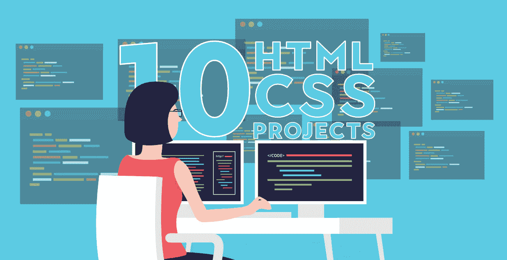

# 初学者练习 HTML 和 CSS 技巧的十大项目

> 原文:[https://www . geesforgeks . org/top-10-初学者练习项目-html 和 css-skills/](https://www.geeksforgeeks.org/top-10-projects-for-beginners-to-practice-html-and-css-skills/)

学习代码对每个人来说总是令人兴奋和有趣的，当涉及到踏入编程世界时，大多数人都会从最简单的事情开始[**【HTML】**](https://www.geeksforgeeks.org/html-tutorials/)和 [**CSS**](https://www.geeksforgeeks.org/css-tutorials/) 。每个初学者的前端编码之旅都是从这两个基本的构建模块开始的，在设计一个漂亮的应用程序时，你需要有创造力。

最初，初学者喜欢制作按钮、添加链接、添加图像、处理布局和网页设计中的许多酷东西，但当涉及到只使用 HTML 和 CSS 制作项目时，他们会陷入困惑，不知道应该制作什么来练习所有这些东西。毕竟他们的知识仅仅局限于 HTML 和 CSS。不管怎样，在某个时候学完所有东西后，你会意识到做一个项目对练习 HTML 和 CSS 技能很重要。您需要检查 HTML 和 CSS 是如何协同工作来设计一个漂亮的前端应用程序的。所以问题是，你可以构建哪些适合初学者的项目来练习你所学的一切……让我们来讨论一下。

### 1.致敬页

作为一个初学者，你能做的最简单的网站就是你生活中崇拜的人的致敬页面。它只需要基本的 HTML 和 CSS 知识。制作一个网页，写下那个人添加他/她的图片。在网页的顶部，添加图片和人名，并在下方给出其余细节的布局。你可以使用段落，列表，链接，图片和 CSS 来给它一个下降的外观。在网页上添加合适的背景颜色和字体样式。大多数你可以用 HTML 制作的部分，但是要用一点 CSS 让它看起来更好。从下面给出的链接获得帮助。

*   [我的贡品页面](https://www.codeseek.co/preview/womJzx)
*   [史蒂夫·乔布斯致敬页](https://codepen.io/coderofdark/pen/BzPArk)
*   [阿尔伯特·爱因斯坦致敬页](https://www.codeseek.co/preview/KgWxyq)

### 2.包含表单的网页

表单始终是任何项目必不可少的一部分，您将在大多数应用程序中使用大量表单，因此为什么不早点实践它并测试您的知识。一旦您熟悉了 HTML 中的输入字段或基本标签来创建表单，就可以使用所有这些标签创建一个项目。如何在单个表单中使用文本字段、复选框、单选按钮、日期和其他重要元素。您将学习如何在创建表单时为网页赋予适当的结构。HTML/ [HTML5](https://www.geeksforgeeks.org/html5-introduction/) 的知识已经足够好了，但是你可以使用一点 CSS 来让项目看起来更好。从下面给出的链接获得帮助。

*   [调查表](https://codepen.io/gregg50/pen/QWwOVKV)
*   [良好的氛围形式](https://codepen.io/laurencenairne/full/zLXRPq/)
*   [调查表](https://codepen.io/freeCodeCamp/full/VPaoNP)

### 3.视差网站

视差网站包括背景中的固定图像，您可以将它们保持在适当的位置，并且可以向下滚动页面以查看图像的不同部分。有了 HTML 和 CSS 的基础知识，就可以给一个网站赋予视差效果。在网页设计中使用[视差](https://www.w3schools.com/howto/howto_css_parallax.asp)效果真的很流行，它给网页带来了美丽的外观和感觉。试一试，把整个页面分成三到四个不同的部分。设置 3-4 个背景图像，对齐不同部分的文本，设置边距和填充，添加背景位置和其他 CSS 元素和属性来创建视差效果。您可以向 [**视差网站**](https://jolly-kalam-23776e.netlify.com/parallaxsite/) 求助。

### 4.登录页面

登陆页面是另一个很好的使用 HTML 和 CSS 的项目，但是它需要这两个构件的扎实知识。在制作登陆页面时，你会运用大量的创造力。您将练习如何添加页脚和页眉、创建列、对齐项目、划分部分等。您必须小心使用 CSS，记住不同的元素不会相互重叠。您还将注意颜色组合、填充、边距、部分、段落和框之间的间距。不同部分或背景的颜色组合应该很好。你可以从下面的链接得到帮助。

*   [全屏登陆](https://jolly-kalam-23776e.netlify.com/fullscreenlanding/)
*   [登陆页面](https://jolly-kalam-23776e.netlify.com/cssgridresponsive/)

### 5.餐厅网站

展示你扎实的 HTML 和 CSS 知识，为餐厅创建一个漂亮的网页。为餐厅做一个布局会比之前的项目例子复杂一点。您将使用 CSS 布局网格排列不同的食物和饮料。你将增加价格，图像，你需要给它一个美丽的外观和感觉，以及使用颜色，字体风格和图像的适当组合。您可以为不同的食物添加图片库，也可以添加滑动图像以获得更好的外观。添加重定向到内部页面的链接。使用媒体查询和网格设置视口，使其具有响应性。可以向 [**餐厅网站**](https://jolly-kalam-23776e.netlify.com/restaurantwebsite/) 求助。

### 6.事件或会议网页

您可以制作一个静态页面来保存事件或会议。有兴趣参加会议的人可以为他们创建一个注册按钮。在标题部分的顶部提到不同的演讲人、地点和时间表的链接。描述会议的目的或可以从这次会议中受益的人员类别。在您的网页上添加发言人的介绍和图像、会议地点的详细信息以及会议的主要目的。将页面分成几个部分，添加显示菜单的页眉和页脚。在不同的部分使用合适的背景颜色。选择符合网页主题的渐变字体样式和字体颜色。它需要深入的 HTML/HTML5 和 CSS 知识。你可以从 [**风格发布会**](https://jolly-kalam-23776e.netlify.com/styledconferences/) 获得帮助。

### 7.音乐商店页面

如果你是一个音乐爱好者，你可以为它制作一个网页。需要 HTML5/ [CSS3](https://www.geeksforgeeks.org/advantage-of-css3-over-css/) 知识。添加合适的背景图片，描述页面的目的或内容。在标题部分添加不同的菜单。添加按钮、链接、图像和一些关于可用歌曲集合的描述。在底部提到购物、商店、职业或联系方式的链接。您还可以在网页上添加其他功能，如试用选项、礼品卡或订阅。使其响应设置视口或使用媒体查询和网格。你可以从[T3【我的曲子】T5【那里得到帮助。](https://jolly-kalam-23776e.netlify.com/mytunes/)

### 8.摄影网站

如果你对 HTML5 和 CSS3 有深入的了解，可以做一个一页响应的摄影网站。使用 flexbox 和媒体查询提高响应能力。在顶部(登录页)添加带有图像(与摄影相关)的公司名称。下面展示你的作品，添加多张图片。在底部(页脚)提到摄影师的联系方式。添加按钮以查看您的工作。这个按钮将直接把你带到图像部分。您需要注意按钮的边距、填充、颜色组合、字体大小、字体样式、图像大小和样式。你可以从 [**【极致摄影】**](https://jolly-kalam-23776e.netlify.com/photographysite/#images) 获得帮助。

### 9.个人投资组合

有了 HTML5 和 CSS3 的知识，你也可以创建你的投资组合。用你的名字和图片在你的作品集里展示你的作品样本和技能。您也可以在那里添加您的简历，并在 [GitHub](https://www.geeksforgeeks.org/how-to-create-and-deploy-your-portfolio-in-under-10-minutes/) 账户上托管您的完整投资组合。在你的标题部分提到一些菜单，如关于，联系，工作或服务。在顶部添加一张你的图片，并在那里介绍你自己。在下面添加一些工作示例，最后(页脚)添加联系信息或社交媒体帐户。您可以从 [**个人作品集**](https://codepen.io/freeCodeCamp/full/zNBOYG) 中获得帮助。

### 10.技术资料

如果你有一点 Javascript 的知识，那么你可以创建一个技术文档的网页。它需要 HTML、CSS 和基本 javascript 的知识。将整个网页分成两部分。左侧创建一个菜单，从上到下列出所有主题。右侧您需要提到主题的文档或描述。这个想法是，一旦你点击了左边部分的一个主题，它就会加载右边的内容。对于单击，您可以使用 javascript 或 CSS 书签选项。你不需要把它做得太花哨，只需要给它一个简单和下降的外观，这对技术文档来说看起来很好。您可以向 [**技术文档**](https://codepen.io/freeCodeCamp/full/NdrKKL) 寻求帮助。

**有用链接:**[2019 年有效网页设计 10 招](https://www.geeksforgeeks.org/10-tips-for-effective-web-designing-in-2019/)

HTML 是网页的基础，通过构建网站和网络应用程序用于网页开发。您可以通过以下 [HTML 教程](https://www.geeksforgeeks.org/html-tutorials/)和 [HTML 示例](https://www.geeksforgeeks.org/html-examples/)从头开始学习 HTML。

CSS 是网页的基础，通过设计网站和网络应用程序用于网页开发。你可以通过以下 [CSS 教程](https://www.geeksforgeeks.org/css-tutorials/)和 [CSS 示例](https://www.geeksforgeeks.org/css-examples/)从头开始学习 CSS。