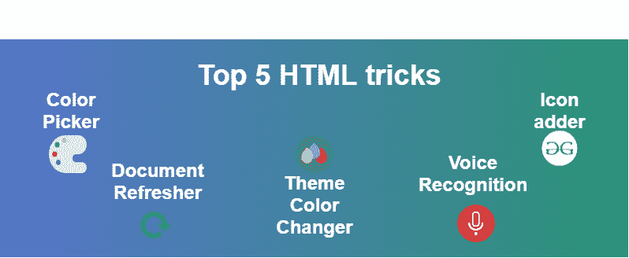
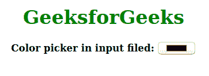
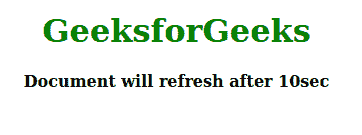
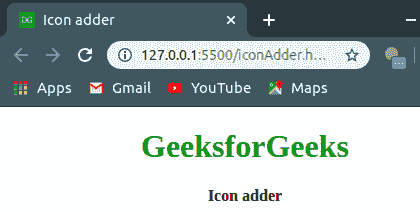

# 你应该知道的 5 大 HTML 技巧

> 原文:[https://www . geesforgeks . org/top-5-html-tricks-你应该知道的/](https://www.geeksforgeeks.org/top-5-html-tricks-that-you-should-know/)



作为一名开发人员，我们都希望向用户展示有吸引力的东西，这肯定也很有用。在本文中，我们将讨论这样的技巧，它们将使您的开发变得愉快。下面用适当的例子描述所有的技巧。
**HTML 5 大诀窍和提示:**

*   **拾色器:**这个小技巧是针对输入标签中的拾色器，你可以将**【类型】**属性放置为**【颜色】**的值，来充当输入字段的拾色器。
    *   **例:**

## 超文本标记语言

```html
<!DOCTYPE html>
<html>
    <head>
        <title>Color picker in input field</title>
        <style>
            .container {
                text-align: center;
            }

            h1 {
                color: green;
            }
        </style>
    </head>
    <body>
        <div class="container">
        <h1>GeeksforGeeks</h1>
        <b>Color picker in input filed: </b>
        <input type="color">
        </div>
    </body>
</html>
```

*   **输出:**



*   **文档刷新:**这个小技巧是在提到的时间后自动刷新文档。当你的网站不活跃时，它就会被使用。通过使用 **http-equiv= "refresh"** 属性，我们也可以在**内容**属性中定义刷新时间。
    *   **例:**

## 超文本标记语言

```html
<!DOCTYPE html>
<html>
    <head>
        <title>Document Refresher</title>
        <meta http-equiv="refresh" content="10">
        <style>
            .container {
                text-align: center;
            }

            h1 {
                color: green;
            }
        </style>
    </head>
    <body>
        <div class="container">
        <h1>GeeksforGeeks</h1>
        <b>Document will refresh after 10sec</b>
        </div>
    </body>
</html>
```

*   **输出:**



*   **主题颜色改变器:**这个小技巧是为了改变你网站的主题颜色，通过使用 **name="theme-color"** 属性，但是我们必须在 **content** 属性中定义颜色代码。这将改变安卓棒棒糖最新 Chrome 版本中标题栏和地址栏的颜色。
    **注意:**这只在移动设备(Lolipop)上有效。
    *   **例:**

## 超文本标记语言

```html
<!DOCTYPE html>
<html>
    <head>
        <title>Theme color changer</title>
        <meta name="theme-color" content="#26F809">
        <style>
            .container {
                text-align: center;
            }

            h1 {
                color: green;
            }
        </style>
    </head>
    <body>
        <div class="container">
        <h1>GeeksforGeeks</h1>
        <b>Theme color changer</b>
        </div>
    </body>
</html>
```

*   **图标添加器:**这个小技巧是用来在 favicon 的地方添加图标的。你只需要一个源文件的路径。在正文标签中包含链接标签，这将在你最喜欢的地方放置一个图标。
    *   **例:**

## 超文本标记语言

```html
<!DOCTYPE html>
<html>
    <head>
        <title>Icon adder</title>
        <meta name="theme-color" content="green;">
        <link rel="icon" href="/icon.ico"
                     type="image/x-icon"/>
        <style>
            .container {
                text-align: center;
            }

            h1 {
                color: green;
            }
        </style>
    </head>
    <body>
        <div class="container">
        <h1>GeeksforGeeks</h1>
        <b>Icon adder</b>
        </div>
    </body>
</html>                   
```

*   **输出:**



*   **语音识别:**这个小技巧是用来在输入栏中添加语音搜索的。像谷歌搜索一样，它通过语音识别进行搜索。
    **注意:**这只会在移动设备上起作用(Lolipop 只有谷歌 Chrome)。
    *   **例:**

## 超文本标记语言

```html
<!DOCTYPE html>
<html>
    <head>
        <title>Voice recognition</title>
        <style>
            .container {
                text-align: center;
            }

            h1 {
                color: green;
            }
        </style>
    </head>
    <body>
        <div class="container">
        <h1>GeeksforGeeks</h1>
        <b>Voice recognition</b>
        <input type="text" x-webkit-speech>
        </div>
    </body>
</html>                   
```