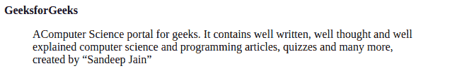
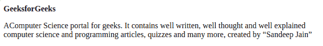
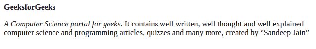

# Use of blockquote, q and cite tags in HTML

> 原文：[https://www.geeksforgeeks.org/use-of-blockquote-q-and-cite-tags-in-html/](https://www.geeksforgeeks.org/use-of-blockquote-q-and-cite-tags-in-html/)

**[HTML | blockquote Tag:](https://www.geeksforgeeks.org/html-blockquote-tag/)** The **<blockquote> tag** in HTML is used to display the long quotations (a section that is quoted from another source). It changes the alignment to make it unique from others. It contains both opening and closing tags.

**Syntax:**

```html
<blockquote>
        <p>The quote is input here.</p>
</blockquote>
```

**Example:** In this example, we will use <blockquote> inside the paragraph.

*   **Program:**

    ```html
    <!DOCTYPE html>
    <html lang="en">

    <head>
        <meta charset="UTF-8">
        <meta name="viewport"
            content="width=device-width, initial-scale=1.0">
        <title>Document</title>
    </head>

    <body>
    <b>GeeksforGeeks</b>
    <blockquote>
        <p>AComputer Science portal for geeks. 
        It contains well written, well thought 
        and well explained computer science and 
        programming articles, quizzes and many more, 
        created by <q>Sandeep Jain</q></p>
    </blockquote>
    </body>

    </html>                    
    ```

*   **Output:**

**[HTML | q Tag:](https://www.geeksforgeeks.org/html-q-tag/)** The **<q> tag** is used to provide small quotations to the HTML content, in this case, the browser simply puts a quotation around the content inside the <q>tag. This tag is also known as inline quotation which means it will not break to the next line.</q>

**Syntax:**

```html
<q> name or something else </q>
```

**Example:** In this example, we have one paragraph and in that, we are using <q> tag.

*   **Program:**

    ```html
    <!DOCTYPE html>
    <html lang="en">

    <head>
        <meta charset="UTF-8">
        <meta name="viewport" 
              content="width=device-width, initial-scale=1.0">
        <title>Document</title>
    </head>

    <body>
      <b>GeeksforGeeks</b>
       <p>
         AComputer Science portal for geeks. 
         It contains well written, well thought 
         and well explained computer science and 
         programming articles, quizzes and many more, 
         created by <q>Sandeep Jain</q>
       </p>
    </body>

    </html>
    ```

*   **Output:**

**[HTML | cite Tag:](https://www.geeksforgeeks.org/html-cite-tag/)** The **<cite> tag** in HTML is used to define the title of a work. The <cite>tag in HTML4.1 define the citation and in HTML5 define the title of work. It displays the text in italic format.</cite>

**Syntax:**

```html
<cite> Something you want </cite>
```

**Example:** In this example, we will use <cite> tag inside the paragraph.

*   **Program:**

    ```html
    <!DOCTYPE html>
    <html lang="en">

    <head>
        <meta charset="UTF-8">
        <meta name="viewport"
            content="width=device-width, initial-scale=1.0">
        <title>Document</title>
    </head>

    <body>
    <b>GeeksforGeeks</b>
    <p>
        <cite>A Computer Science portal for geeks</cite>. 
        It contains well written, well thought 
        and well explained computer science and 
        programming articles, quizzes and many more, 
        created by <q>Sandeep Jain</q>
    </p>
    </body>

    </html>                    
    ```

*   **Output:**