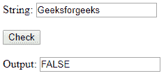
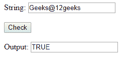

# 使用 HTML 和 JavaScript 验证密码

> 原文:[https://www . geesforgeks . org/validate-a-password-use-html-and-JavaScript/](https://www.geeksforgeeks.org/validate-a-password-using-html-and-javascript/)

任务是使用 HTML 和 JavaScript 验证密码。

如果密码包含以下内容，则该密码是正确的:

1.  至少 1 个**大写**字符。
2.  至少 1 个**小写**字符。
3.  至少 1 个**数字**。
4.  至少 1 个**特殊字符** r
5.  最少 8 个**字符**。

**示例:**

```html
<!DOCTYPE html>
<html>

<head>
    <title>validate password</title>
    <script type="text/javascript">
        function test_str() {
            var res;
            var str =
                document.getElementById("t1").value;
            if (str.match(/[a-z]/g) && str.match(
                    /[A-Z]/g) && str.match(
                    /[0-9]/g) && str.match(
                    /[^a-zA-Z\d]/g) && str.length >= 8)
                res = "TRUE";
            else
                res = "FALSE";
            document.getElementById("t2").value = res;

        }
    </script>
</head>

<body>
    <p>
        String:
        <input type="text" 
               placeholder="abc"
               id="t1" />
        <br/>
        <br/>
        <input type="button"
               value="Check" 
               onclick="test_str()" />
        <br/>
        <br/> Output:
        <input type="text" 
               id="t2"
               readonly/>
    </p>
</body>

</html>
```

## 输出:


