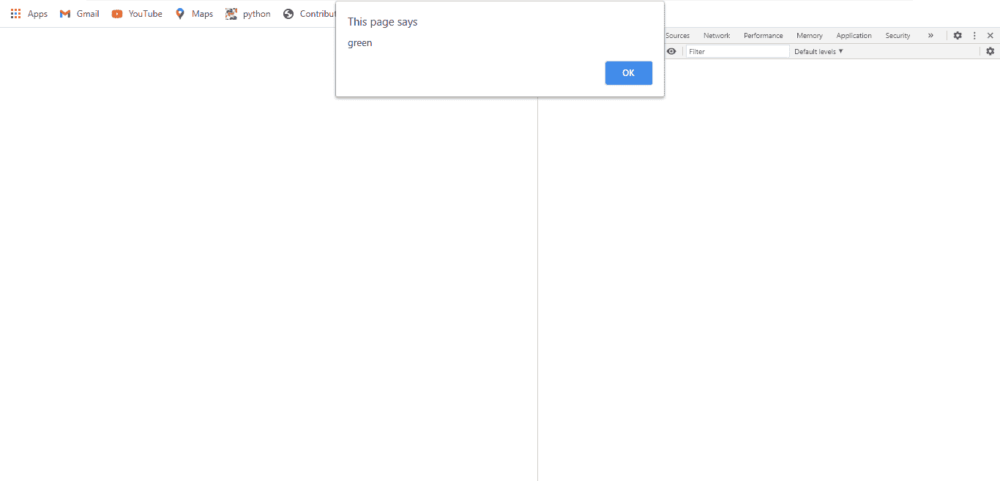

# 网页 API HTMLBodyElement.text 属性

> 原文:[https://www . geesforgeks . org/web-API-html body element-text-property/](https://www.geeksforgeeks.org/web-api-htmlbodyelement-text-property/)

属性用于返回一个表示文本颜色的字符串

**语法:**

```html
BodyElement.text
```

**返回值:**该属性返回一个表示文本颜色的多字符串。

**例 1:**

## 超文本标记语言

```html
<!DOCTYPE html> 
<html> 

<!-- body tag starts here -->
<body text="green"> 

    <center> 
        <h1>GeeksforGeeks</h1> 
        <h2>HTMLBodyElement.text Property</h2> 

    </center>  
    <script type="text/javascript">
        alert(document.body.text);
    </script>
</body>

</html>
```

**输出:**



**例 2:**

## 超文本标记语言

```html
<!DOCTYPE html> 
<html> 

<!-- body tag starts here -->
<body text="yellow">

    <center> 
        <h1>GeeksforGeeks</h1> 
        <h2>HTMLBodyElement.text Property</h2> 

    </center>  
    <script type="text/javascript">
        console.log(document.body.text);
    </script>
</body>

</html>
```

**输出:**


**支持的浏览器:**

*   谷歌 Chrome
*   微软公司出品的 web 浏览器
*   火狐浏览器
*   苹果 Safari
*   歌剧