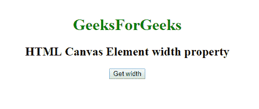
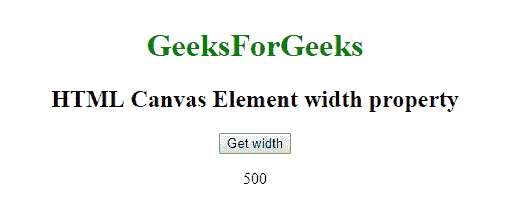
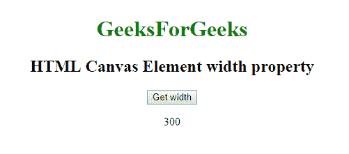

# 网页 HTMLCanvasElement API |画布元素宽度属性

> 原文:[https://www . geesforgeks . org/web-html canvaselement-API-canvas-element-width-property/](https://www.geeksforgeeks.org/web-htmlcanvaselement-api-canvas-element-width-property/)

在网络应用编程接口中有一个**画布元素**，它有一个宽度属性，以 CSS 像素表示画布的宽度。有一个 **HTMLCanvasElement.width** 属性，我们可以通过它从画布元素中获取这个 *width 属性*，它是一个*正*整数。

**语法:**

```
var widthVal = canvas.width;
canvas.width = widthVal;
```

**注意:**如果没有提供宽度属性值或者设置为未定义的值，比如负值，那么默认值设置为 300。

**示例 1:** 宽度属性设置为 500

```
<!DOCTYPE html>
<html>

<head>

    <style>
        a:focus {
            background-color: magenta;
        }
    </style>
    <canvas id="canvas" width="500" height="300"></canvas>
    <script type="text/javascript">
        function getwidth() {
            var canvas = document.getElementById('canvas');

            document.getElementById('width').innerHTML = canvas.width;
        }
    </script>

</head>

<body>
    <center>

        <h1 style="color:green;">  
                GeeksForGeeks  
            </h1>

        <h2>HTML Canvas Element width property</h2>
        <button onclick="getwidth ();">Get Width</button>
        <p id='width'></p>
    </center>
</body>

</html>
```

**输出:**
**点击按钮:**


**点击按钮时:**


**示例 2:** 未提供宽度属性

```
<!DOCTYPE html>
<html>

<head>

    <style>
        a:focus {
            background-color: magenta;
        }
    </style>
    <canvas id="canvas"></canvas>
    <script type="text/javascript">
        function getwidth() {
            var canvas = document.getElementById('canvas');

            document.getElementById('width').innerHTML = canvas.width;
        }
    </script>

</head>

<body>
    <center>

        <h1 style="color:green;">  
                GeeksForGeeks  
            </h1>

        <h2>HTML Canvas Element width property</h2>
        <button onclick="getwidth ();">Get Width</button>
        <p id='width'></p>
    </center>
</body>

</html>
```

**输出:**
**点击按钮:**


**点击按钮时:**


**支持的浏览器:**

*   谷歌 Chrome 4
*   边缘 12
*   Internet Explorer 9
*   Firefox 3.6
*   Safari 3.1
*   歌剧 9