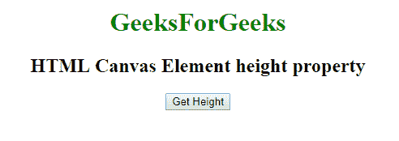

# Web html CanvasElement API | CanvasElement 高度属性

> 原文:[https://www . geesforgeks . org/web-html canvaselement-API-canvaselement-height-property/](https://www.geeksforgeeks.org/web-htmlcanvaselement-api-canvaselement-height-property/)

在 HTML 中有一个**画布元素**，它有一个高度属性，以 CSS 像素表示画布的高度。有一个 **HTMLCanvasElement.height** 属性，我们可以通过它从画布元素中获取这个 *height 属性*，它是一个*正*整数。

**语法:**

```html
var heightVal = canvas.height;
canvas.height = heightVal;
```

**注意:**如果没有提供高度属性值或者设置为未定义的值，比如负值，那么默认值设置为 150。

**示例 1:** 高度属性设置为 300

```html
<!DOCTYPE html>
<html>

<head>

    <style>
        a:focus {
            background-color: magenta;
        }
    </style>
    <canvas id="canvas" width="300" height="300"></canvas>
    <script type="text/javascript">
        function getHeight() {
            var canvas = document.getElementById('canvas');

            document.getElementById('height').innerHTML = canvas.height;
        }
    </script>

</head>

<body>
    <center>

        <h1 style="color:green;">  
                GeeksForGeeks  
            </h1>

        <h2>HTML Canvas Element height property</h2>
        <button onclick="getHeight ();">Get Height</button>
        <p id='height'></p>
    </center>
</body>

</html>
```

**输出:**
**点击按钮:**


**点击按钮时:**


**示例 2:** 未提供高度属性

```html
<!DOCTYPE html>
<html>

<head>

    <style>
        a:focus {
            background-color: magenta;
        }
    </style>
    <canvas id="canvas"></canvas>
    <script type="text/javascript">
        function getHeight() {
            var canvas = document.getElementById('canvas');

            document.getElementById('height').innerHTML = canvas.height;
        }
    </script>

</head>

<body>
    <center>

        <h1 style="color:green;">  
                GeeksForGeeks  
            </h1>

        <h2>HTML Canvas Element height property</h2>
        <button onclick="getHeight ();">Get Height</button>
        <p id='height'></p>
    </center>
</body>

</html>
```

**输出:**
**点击按钮:**


**点击按钮时:**


**支持的浏览器:**

*   谷歌 Chrome 4
*   边缘 12
*   Firefox 3.6
*   Safari 3.1
*   歌剧 9
*   Internet Explorer 9