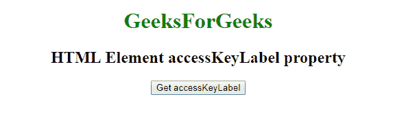
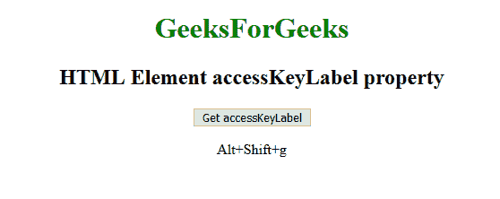

# 网页 html 元素 API |元素访问键标签属性

> 原文:[https://www . geesforgeks . org/web-htmlelement-API-element-accesskey label-property/](https://www.geeksforgeeks.org/web-htmlelement-api-element-accesskeylabel-property/)

在网络应用编程接口中，有些元素具有访问键属性。要获取这个 accesskey 属性，我们使用**htmlelement . accesskey label**属性，该属性返回一个分配给元素的 access key 属性的字符串。

**语法:**

```html
label = element.accessKeyLabel
```

**注意:**如果未提供 accesskey 属性值，则返回空字符串。

**示例:**高度属性设置为 300

```html
<!DOCTYPE html>
<html>

<head>

    <style>
        a:focus {
            background-color: magenta;
        }
    </style>
    <script type="text/javascript">
        function getaccesskey() {
            var label = document.getElementById('btn');

            document.getElementById(
              'access').innerHTML = 
              label.accessKeyLabel;
        }
    </script>

</head>

<body>
    <center>

        <h1 style="color:green;">  
                GeeksForGeeks  
            </h1>

        <h2>HTML Element accessKeyLabel property</h2>
        <button accesskey="g"
                onclick="getaccesskey();"
                id="btn">
          Get accessKeyLabel
      </button>
        <p id='access'></p>
    </center>
</body>

</html>
```

**输出:**

**点击按钮:**


**点击按钮时:**


**支持的浏览器:**

*   Firefox 8