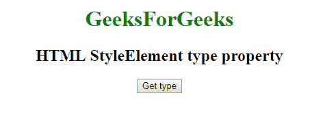
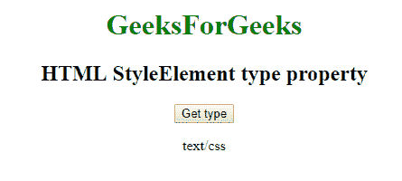

# 网页 html style element API | style element 类型属性

> 原文:[https://www . geesforgeks . org/web-html style element-API-style element-type-property/](https://www.geeksforgeeks.org/web-htmlstyleelement-api-styleelement-type-property/)

在网络应用编程接口中，有一些带有类型属性的样式元素。为了获取这个类型属性，我们使用 **HTMLStyleElement.type 属性**，它返回当前样式的类型。

**语法:**

```html
getType = style.type;
```

**示例:**获取类型属性。

```html
<!DOCTYPE html>
<html>

<head>

    <style>
        a:focus {
            background-color: magenta;
        }
    </style>
    <link id="Link"
          rel="stylesheet" 
          type="text/css" 
          media="screen" />

    <script type="text/javascript">
        function gettype() {
            var label = 
                document.getElementById('Link');

            document.getElementById('type').innerHTML = 
              label.type;

        }
    </script>

</head>

<body>
    <center>

        <h1 style="color:green;">  
                GeeksForGeeks  
            </h1>

        <h2>HTML StyleElement type property</h2>
        <button onclick="gettype ();" 
                id="btn">
          Get type
      </button>
        <p id='type'></p>
    </center>
</body>

</html>
```

**输出:**
**点击按钮:**


**点击按钮时:**


**支持的浏览器:**

*   谷歌 Chrome
*   边缘 12
*   火狐浏览器
*   旅行队
*   歌剧