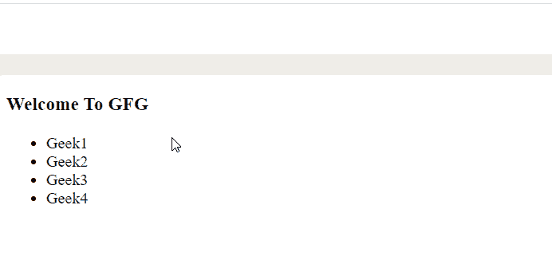
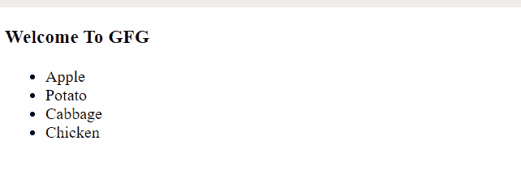
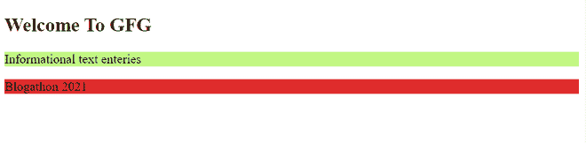

# html 5 中有哪些自定义属性？

> 原文:[https://www . geesforgeks . org/什么是 html5 中的自定义属性/](https://www.geeksforgeeks.org/what-are-custom-attributes-in-html5/)

自定义属性不是标准 HTML5 属性的一部分，而是显式创建的属性。它们允许我们将自己的信息添加到 HTML 标签中。这些不是特定的，可以用于所有的 HTML 元素。通过自定义属性存储的额外信息是不需要任何定义含义的数据。这些数据对于页面或应用程序是私有的。自定义属性也称为**数据属性**。

名称以**数据-** 开头的任何属性都是自定义属性。**数据-*** 属性允许我们在所有的 HTML 元素中嵌入自定义属性。这些都被用户代理完全忽略了。存储的数据可以在页面的 JavaScript 中使用。我们还可以使用这些数据属性来设计元素的样式。

**语法:**

```html
<element data-*="value">
```

#### 自定义属性的两个部分:

1.  **属性名称**–属性名称必须在前缀“data-”之后至少有一个字符长。它不应该包含任何大写字母。
2.  **属性值**–要存储的值可以是任何字符串。

**示例 1:** 在这个示例中，我们将用 JavaScript 读取这些属性的值是相当简单的。事实上，这样做的方法不止一种。一种更简单的方法是使用 **getAttribute()** 和 **setAttribute()。** getAttribute()可以用来从属性中获取存储的数据。如果询问的属性不存在，它将返回 null 或空字符串。setAttribute()可用于修改任何现有属性的值或添加新属性。

**文件名:index.html**

## 超文本标记语言

```html
<!DOCTYPE html>
<html>

<head>
    <title>GeeksForGeeks</title>
</head>

<body>
    <h3>Welcome To GFG</h3>
    <ul>
        <li onclick="showPosition(this)"
            id="geek1" data-position="winner">
            Geek1
        </li>

        <li onclick="showPosition(this)"
            id="geek2" data-position="runner up">
            Geek2
        </li>

        <li onclick="showPosition(this)"
            id="geek3" data-position="third">
            Geek3
        </li>

        <li onclick="showPosition(this)"
            id="geek4" data-position="lost">
            Geek4
        </li>
    </ul>

    <script src="custom_attributes.js"></script>
</body>

</html>
```

**custom_attributes.js:** 这个 JavaScript 文件将处理使用 getAttribute()访问的自定义属性。每当点击列表项时，我们将使用它来创建一个警报。JavaScript 代码如下所示:

## java 描述语言

```html
function showPosition(runner) {
    var position = runner.getAttribute("data-position");
    alert("The " + runner.innerHTML + " is " + position + ".");
}
```

**输出:**



输出屏

**示例 2:** 在本例中，我们将看到访问数据属性的另一种方式是使用**数据集**属性。此属性返回一个 DOMStringMap 对象，每个自定义数据属性有一个条目。DOMStringMap 键是自定义数据属性的转换形式。“数据”前缀从属性名中删除。名称中的任何连字符也会被删除。这样，我们就有了一个卡米凯斯的名字。然后，可以使用存储在对象中的 camelCase 名称作为关键字来访问属性，如**元素.数据集. keyname** 或**元素.数据集[keyname]** 。我们会拿食物清单。自定义属性将包含食物类型。onclick 属性将在单击项目时触发 JavaScript。

## 超文本标记语言

```html
<!DOCTYPE html>
<html>

<head>
    <title>GeeksForGeeks</title>
</head>

<body>
    <h3>Welcome To GFG</h3>
    <ul>
        <li onclick="handleFood(this)"
            data-food-type="fruit">
            Apple
        </li>

        <li onclick="handleFood(this)"
            data-food-type="vegitable">
            Potato
        </li>

        <li onclick="handleFood(this)"
            data-food-type="veg">
            Cabbage
        </li>

        <li onclick="handleFood(this)"
            data-food-type="non-veg">
            Chicken
        </li>
    </ul>

    <script src="custom_attributes.js"></script>
</body>

</html>
```

**custom_attributes.js:** 只要点击一个项目，就会触发这个代码片段。这里，我们将使用 dataset 属性提醒存储在自定义属性中的食物类型。代码片段如下所示:

## java 描述语言

```html
function handleFood(food) {
    var foodType = food.dataset.foodType;
    alert(food.innerHTML + " is " + foodType +".");
}
```

**输出:**



输出屏

**示例 3:** 在本例中，我们将使用刚才看到的 CSS 访问设置元素的背景颜色。由于自定义属性是纯 HTML 属性，因此可以从 CSS 中访问它们。例如，我们可以使用属性选择器来设置元素背景颜色的样式。

**文件名:index.html**

## 超文本标记语言

```html
<!DOCTYPE html>
<html>

<head>
    <title>Page Title</title>
    <link rel="stylesheet" href="styles.css">
</head>

<body>
    <h2>Welcome To GFG</h2>
    <p data-about="blog">Informational text entries</p>

    <p data-info="blogathon">Blogathon 2021</p>

</body>

</html>
```

**style . css:**选择 style . CSS 文件中的元素，使用标准的 CSS 属性设置元素的背景颜色。

## 半铸钢ˌ钢性铸铁(Cast Semi-Steel)

```html
p[data-about='blog'] {
  background-color: #C2F784;
}

p[data-info='blogathon'] {
  background-color: #DF2E2E;
}
```

**输出:**



输出屏