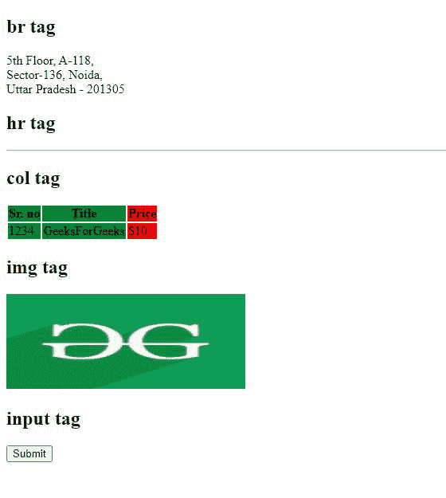

# HTML 中什么是空元素？

> 原文:[https://www . geesforgeks . org/什么是 html 中的空元素/](https://www.geeksforgeeks.org/what-are-empty-elements-in-html/)

在本文中，我们将看到 HTML 中的空标签&我们还将关注使用空标签的目的。空元素是没有任何嵌入元素或文本元素的组件。空元素没有后续节点。换句话说，不包含任何结束标记的标记是空标记。空标签仅包含开始标签，但它们在网页中执行一些操作。

**语法:**

```html
<tag_name>
```

没有封闭标签的元素称为*空元素*。向空元素添加结束标记将是无效语法。空元素没有任何子节点。简而言之，空元素是自动关闭或空的，而不是容器标签。空元素用于嵌入图像、列表、分隔符、水平线、超链接、输入、元数据、区域等。例如，< p >标签有一个结束标签，因此它不是一个空元素。

以下是在 HTML 中使用的空元素列表:

<figure class="table">标签用于为标签内的每一列设置列属性。此标记用于为每一列设置 style 属性。此标记不包含结束标记。

| 

#### element

 | 

#### Description

 |
| --- | --- |
| [<地区>](https://www.geeksforgeeks.org/html-area-tag/) | 它用于映射图像的一部分，使其可由最终用户点击。它用于在用户点击图像的映射部分后，引导用户到不同的链接。用作<map>标签的子标签。</map> |
| [T2>基地](https://www.geeksforgeeks.org/html-base-tag/) | 对于文档中的所有相对网址，基本网址被指定与元素一起使用。一个文档中只能使用一个元素。 |
| [<【br】>](https://www.geeksforgeeks.org/html-brgt-tag/#:~:text=25%20Jun%2C%202021-,Tag,or%20break%20in%20the%20document.) | 
元素用于文本中的换行符(也可以称为回车)。这在写地址、故事、博客等需要打断长句以清晰可见的情况下很有用。 |
| [<山坳>](https://www.geeksforgeeks.org/html-col-tag/) | HTML 中的 |<colgroup><col></colgroup>
| [<嵌入>](https://www.geeksforgeeks.org/html-embed-tag/) | HTML 中的<embed>标记用于将外部应用程序嵌入到 HTML 文档中，这些外部应用程序通常是音频或视频等多媒体内容。它被用作嵌入插件(如 flash 动画)的容器。 |
| [< hr >](https://www.geeksforgeeks.org/html-hr-tag/) | 段落级组件之间的主题分隔符由

* * *

元素表示。例如，一节中主题的变化。 |
| <【img】> | 元素用于在文档中嵌入图像。 |
| [<输入>](https://www.geeksforgeeks.org/html-input-tag/) | 这个空元素用于为基于 web 的应用程序和表单创建交互式控件，用于接受来自用户的信息，如地址、姓名、电话号码等，这取决于各种类型的输入数据和可用的控件。所有输入类型和属性都在<input>元素中使用。

 |
| [<链接>](https://www.geeksforgeeks.org/html-link-tag/) | HTML 元素<link>用于在当前内容和外部资源之间建立连接。例如，我们可以使用它来链接外部样式表或 javascript 文件等。 |
| [< 当 >](https://www.geeksforgeeks.org/html-meta-tag/) |  HTML 元素表示元数据，即信息的信息。 |
| [<停止>](https://www.geeksforgeeks.org/html-param-tag/) | HTML 中的<param>标签用于定义与<object>元素关联的插件参数。它不包含结束标记。</object> |
| [<来源>](https://www.geeksforgeeks.org/html-source-tag/) | <source>元素是为、

<audio>或<video>元素提供各种媒体资源的空元素。它以几种文件格式提供相同的媒体材料，以确保与各种浏览器的兼容性，因为浏览器对图像和媒体文件格式的支持不同。</video></audio>

 |
| [<赛道>](https://www.geeksforgeeks.org/html-track-tag/) | <track>标签指定媒体组件音频和视频的文本轨道。这一部分用于指定字幕、字幕文件或包含文本的不同文件，一旦媒体参与，这些文件应该是可见的。<track>元素是一个空的 HTML 元素，用作音频和视频媒体组件的子元素。它允许您定义定时文本轨道(或基于时间的数据)，例如，自动处理字幕。WebVTT 格式(。vtt 文件—网络视频文本轨道—用于轨道。 |
| [<【wbr】>](https://www.geeksforgeeks.org/html-5-wbr-tag/) | HTML 中的<wbr>标记代表断字机会，用于定义文本中被浏览器视为换行符的位置。当使用的单词太长，浏览器可能会在不适合文本的地方换行时，通常会用到它。 |

</figure>

下面的代码示例说明了空元素的使用。我们这里只用过其中的几个。

**示例:**

## 超文本标记语言

```html
<!DOCTYPE html>
<html lang="en">
  <head>
    <meta charset="UTF-8" />
    <meta http-equiv="X-UA-Compatible" 
          content="IE=edge" />
    <meta name="viewport" 
          content="width=device-width, 
                   initial-scale=1.0" />
    <title>Empty Element</title>
  </head>

  <body>
    <base href="https://www.geeksforgeeks.org/" />
    <h2>br tag</h2>
    5th Floor, A-118,<br />
    Sector-136, Noida,<br />
    Uttar Pradesh - 201305<br />
    <h2>hr tag</h2>
    <hr />
    <h2>col tag</h2>
    <table>
      <colgroup>
        <col span="2" style="background-color: green" />
        <col style="background-color: red" />
      </colgroup>
      <tr>
        <th>Sr. no</th>
        <th>Title</th>
        <th>Price</th>
      </tr>
      <tr>
        <td>1234</td>
        <td>GeeksForGeeks</td>
        <td>$10</td>
      </tr>
    </table>
    <h2>img tag</h2>
    
    <h2>input tag</h2>
    <form action="page.html" method="post">
      <input type="submit" />
    </form>
  </body>
</html>
```

**输出:**

