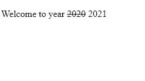
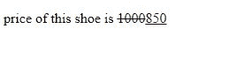
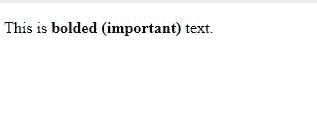
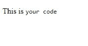
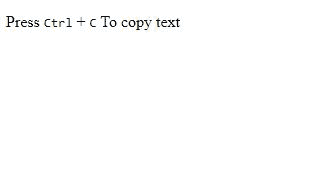
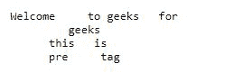
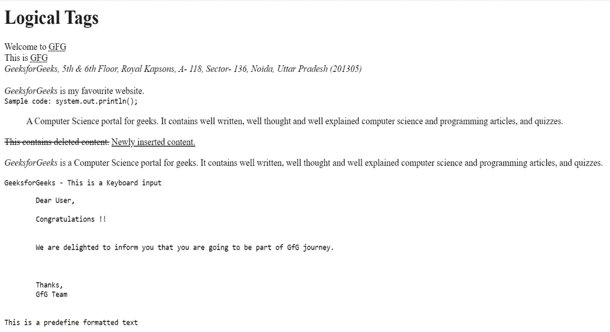

# HTML 中的逻辑标签是什么？

> 原文:[https://www . geesforgeks . org/什么是 html 中的逻辑标签/](https://www.geeksforgeeks.org/what-are-logical-tags-in-html/)

逻辑标签用来告诉浏览器标签里面写的是什么类型的文本。它们不同于物理标签，因为物理标签用于决定文本的外观，并且不提供任何关于文本的信息。

逻辑标签用于向视力受损的人表明文本中有更重要的东西或强调文本。

我们可以使用逻辑标签的一些情况是:

*   当我们想在网站上写代码的时候。
*   当我们想要强调某些文本时。
*   当我们想在网页上显示缩写时。
*   当我们想在网页上显示一些著名的引文时。
*   当我们想用变量来写一些数学公式的时候。

逻辑文本有很多种，下面是其中一些的列表:

<figure class="table">

| 标签 | 描述 |
| --- | --- |
| 缩写> | 定义文本的缩写。 |
| [<首字母缩略词>](https://www.geeksforgeeks.org/html-acronym-tag/) | 定义缩略词。 |
| [<地址>](https://www.geeksforgeeks.org/html-address-tag/) | 个人或组织的联系信息。 |
| [<引用>](https://www.geeksforgeeks.org/html-cite-tag/) | 定义引用。它以斜体格式显示文本。 |
| [<代号>](https://www.geeksforgeeks.org/html-code-tag/) | 定义一段计算机代码。 |
| [<封锁>](https://www.geeksforgeeks.org/html-blockquote-tag/) | 定义长引号。 |
| >的< del >的 | 定义已删除的文本，用于标记已从文档中删除的部分文本。 |
| [<【dfn】>](https://www.geeksforgeeks.org/html-dfn-tag/) | 定义定义元素，用于在 HTML 中表示定义实例。 |
| [T2 ins>T1】](https://www.geeksforgeeks.org/html-ins-tag/) | 定义插入的文本。 |
| [<【kbd】>](https://www.geeksforgeeks.org/html-kbd-tag/) | 定义键盘输入文本。 |
| [< pre >](https://www.geeksforgeeks.org/html-pre-tag/) | 定义预格式化文本块，该文本块保留网页浏览器忽略的文本空格、换行符、制表符和其他格式字符。 |
| [<问>](https://www.geeksforgeeks.org/html-q-tag/) | 定义短引号。 |
| [<桑普>](https://www.geeksforgeeks.org/html-samp-tag/) | 定义计算机程序的示例输出文本。 |
| [<强>](https://www.geeksforgeeks.org/html-strong-tag/) | 定义强文本，即显示文本的重要性。 |
| [<是 T3](https://www.geeksforgeeks.org/html-var-tag/) | 定义数学方程或计算机程序中的变量。 |

</figure>

现在让我们通过例子来实现上面列出的一些标签

[**1。< bdo >标签:**](https://www.geeksforgeeks.org/html-bdo-tag/)**<bdo>标签代表双向覆盖。此标签用于更改文本的方向。它有一个决定文本方向的“dir”属性。**

****语法:****

```html
<bdo> Statements... </bdo>
```

## **超文本标记语言**

```html
<!DOCTYPE html>
<html>

<body>
    <p>This text will go right-to-left</p>

    <bdo dir="rtl">GeeksforGeeks</bdo>

    <p>This text will go left-to-right</p>

    <bdo dir="ltr">GeeksforGeeks</bdo>
</body>

</html>
```

****输出:****

```html
This text will go right-to-left
skeeGfofskeeG
This text will go left-to-right
GeeksforGeeks
```

**[**2。< del >标签:**](https://www.geeksforgeeks.org/html-del-tag/)**<del>标签在文本上画一条线，表示文本有误或被删除。****

******语法:******

```html
**<del>Statements... </del>**
```

## ****超文本标记语言****

```html
**<!DOCTYPE html>
<html>

<body>
    <p>Welcome to year <del>2020</del> 2021</p>
</body>

</html>**
```

******输出:******

********

****[**3。< ins >标签:**T3<ins>标签用于显示文档中插入了一些文字。浏览器通常会显示带下划线的插入标签。](https://www.geeksforgeeks.org/html-ins-tag/)****

******语法:******

```html
**<ins>Statements... </ins>**
```

## ****超文本标记语言****

```html
**<!DOCTYPE html>
<html>

<body>
    <p>price of this shoe is 
        <del>1000</del><ins>850</ins>
    </p>
</body>

</html>**
```

******输出:******

********

****[**4。< strong >标签**](https://www.geeksforgeeks.org/html-strong-tag/) **:** 这个< strong >标签是用来告诉浏览器这个标签里面的文字非常重要和有意义。浏览器以粗体显示此文本。****

******语法:******

```html
 **<strong>Statements...  </strong>**
```

## ****超文本标记语言****

```html
**<!DOCTYPE html>
<html>

<body>
    <p>This is
        <strong>bolded (important)</strong> text.
    </p>
</body>

</html>**
```

******输出:******

********

****[**5。< code > Tag:**](https://www.geeksforgeeks.org/html-code-tag/) Code tag 是用来告诉用户这个 Tag 里面写的文字是某种编程语言的代码。该标签内的内容以等间距字体显示。****

******语法:******

```html
**<code>Statements... </code>**
```

## ****超文本标记语言****

```html
**<!DOCTYPE html>
<html>

<body>
    <p>This is <code>your code</code></p>
</body>

</html>**
```

******输出:******

********

****[**6。< kbd >标签:**T3<kbd>标签用于表示显示的文本是从键盘输入的。里面的内容以等间距字体显示。](https://www.geeksforgeeks.org/html-kbd-tag/)****

******语法:******

```html
**<KBD>Statements... </KBD>**
```

## ****超文本标记语言****

```html
**<!DOCTYPE html>
<html>

<body>
    <p>
        Press <kbd>Ctrl</kbd> + 
        <kbd>C</kbd> To copy text
    </p>
</body>

</html>**
```

******输出:******

********

*   ****[**7\. <pre> Tag**](https://www.geeksforgeeks.org/html-pre-tag/)**: **Text in a pre tag is displayed in fixed width-font, and preserves all the spaces and break lines i.e. the text is shown exactly as it was written in HTML source code.

    **语法:**

    ```html
    <pre>Statements...  </pre>
    ```

    ## 超文本标记语言

    ```html
    <!DOCTYPE html>
    <html>

    <body>
        <pre> Welcome     to geeks   for
              geeks
           this   is
           pre     tag
      </pre>
    </body>

    </html>
    ```

    **输出:**

    

    **使用逻辑标签的示例代码:**此示例包含所有逻辑标签。

    ## 超文本标记语言

    ```html
    <!DOCTYPE html>
    <html>

    <body>
        <h1>Logical Tags</h1>

        <!-- abbr tag -->
        Welcome to <abbr title="GeeksforGeeks">
            GFG
        </abbr>
        <br />

        <!-- acronym tag -->
        This is <acronym title="GeeksforGeeks">
            GFG
        </acronym>
        <br />

        <!-- address tag -->
        <address>
            GeeksforGeeks, 5th & 6th Floor,
            Royal Kapsons, A- 118, Sector- 136, 
            Noida, Uttar Pradesh (201305)
        </address>
        <br />

        <!-- cite tag -->
        <cite> GeeksforGeeks </cite> is 
            my favourite website.
        <br />

        <!-- code tag -->
        <code> 
            Sample code: system.out.println();
        </code>

        <!-- blockquote tag -->
        <blockquote cite=
            "https://www.geeksforgeeks.org/">
            A Computer Science portal for geeks. 
            It contains well written, well 
            thought and well explained computer 
            science and programming articles, 
            and quizzes.
        </blockquote>

        <!-- del tag -->
        <del> This contains deleted content.</del>

        <!-- ins tag -->
        <ins> Newly inserted content.</ins>

        <!-- dfn tag -->
        <p>
            <dfn> GeeksforGeeks </dfn> is a 
            Computer Science portal for geeks. 
            It contains well written, well 
            thought and well explained computer 
            science and programming articles, 
            and quizzes.
        </p>

        <!-- kbd tag -->
        <kbd> 
            GeeksforGeeks - This is 
            a Keyboard input 
        </kbd>

        <!-- pre tag -->
        <pre>
        Dear User,

        Congratulations !!

        We are delighted to inform you that 
        you are going to be part of GfG journey.

        Thanks,
        GfG Team

    This is a predefine formatted text
        </pre>
    </body>

    </html>
    ```

    **输出:**

    ****