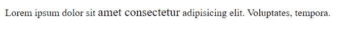
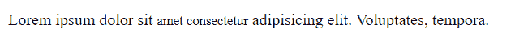
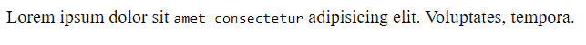

# HTML 中的物理标签是什么？

> 原文:[https://www . geesforgeks . org/什么是 html 中的物理标签/](https://www.geeksforgeeks.org/what-are-physical-tags-in-html/)

**物理标签**用于指示如何使用 HTML 标签格式化或指示特定字符。任何物理样式标签都可以包含文本中允许的任何项目，包括常规文本、图像、换行符等。虽然每个物理标签都有定义的样式，但是您可以通过为每个标签定义自己的外观来覆盖该样式。所有物理标签都需要结束标签。

**语法:**

```html
<tag_name> formatting character or para </tag_name>
```

**物理标签的特征:**

*   他们非常直白。
*   他们习惯于突出重要的句子。
*   物理文本样式表示部分的特定外观类型，例如粗体、斜体等。
*   所有浏览器都以相同的方式呈现物理样式。

**物理标签示例:**

<figure class="table">

| 

**标签**

 | 

**表示**

 | 

**目的**

 |
| --- | --- | --- |
| [T2【b】T3](https://www.geeksforgeeks.org/html-b-tag/) | 大胆的 | 粗体增加了文本的重要性，因为粗体标签将文本转换为粗体。 |
| [< i >](https://www.geeksforgeeks.org/html-i-tag/) | 意大利语族的 | 斜体标签用于定义具有特殊含义的文本。 |
| [< u >](https://www.geeksforgeeks.org/html-u-tag/) | 强调 | 它用于给文本加下划线。 |
| [<大>](https://www.geeksforgeeks.org/html-big-tag/) | 大的 | 大标签将字体大小增加 1(注意:在 HTML 5 中不能使用大标签) |
| [<小>](https://www.geeksforgeeks.org/html-small-tag/)

 | 小的 | 一个小标签定义了小文本，在写版权的时候使用。 |
| [<子>](https://www.geeksforgeeks.org/html-sub-tag/) | 下标 | 下标用于替代基线。 |
| [<【sup】>](https://www.geeksforgeeks.org/html-sup-tag/) | 上标 | 上标通常用于显示基线以上的元素 |
| <[打击](https://www.geeksforgeeks.org/html-strike-tag/)T2】 | 穿透 | 这是一个编辑标记，告诉读者忽略文本段落。 |
| [<【TT】>](https://www.geeksforgeeks.org/html-tt-tag/) | 电传文本 | 电传文本给出了默认的等间距字体系列。 |

</figure>

**物理标签示例:**

**1。< b > :** HTML < b >标签充当演示标签，用于将书写文本标记为粗体格式。如果我们想要以粗体格式显示纯文本，您可以在< b >句子< /b >标签之间使用文本。

## 超文本标记语言

```html
<!DOCTYPE html>
<html lang="en">
<head>
    <meta charset="UTF-8">
    <meta http-equiv="X-UA-Compatible" content="IE=edge">
    <meta name="viewport" 
          content="width=device-width, initial-scale=1.0">
</head>

<body>
    <p>
        Lorem ipsum dolor sit <b>amet consectetur</b> 
        adipisicing elit. Voluptates, tempora.
    </p>

</body>
</html>
```

**输出:**

```html
Lorem ipsum dolor sit amet consectetur
adipisicing elit. 
```

**2。< i > :** HTML < i >标签充当用于将书写文本标记为斜体格式的呈现标签。如果我们想要以斜体格式显示纯文本，您可以在< i > < /i >标签之间使用文本。

## 超文本标记语言

```html
<!DOCTYPE html>
<html lang="en">
<head>
    <meta charset="UTF-8">
    <meta http-equiv="X-UA-Compatible" content="IE=edge">
    <meta name="viewport" 
          content="width=device-width, initial-scale=1.0">
</head>

<body>
    <p>
        Lorem ipsum dolor sit <i>amet consectetur</i> 
        adipisicing elit. Voluptates, tempora.
    </p>

</body>
</html>
```

**输出:**

```html
Lorem ipsum dolor sit *amet consectetur* adipisicing elit.
Voluptates, tempora.
```

**3。< u > :** HTML < u >标签充当一个演示标签，用于将书写文本标记为下划线格式。如果我们想要以下划线格式显示纯文本，您可以在< u > < /u >标签之间使用文本。

## 超文本标记语言

```html
<!DOCTYPE html>
<html lang="en">
<head>
    <meta charset="UTF-8">
    <meta http-equiv="X-UA-Compatible" content="IE=edge">
    <meta name="viewport" 
          content="width=device-width, initial-scale=1.0">
</head>

<body>
    <p>
        Lorem ipsum dolor sit <u>amet consectetur</u>
        adipisicing elit. Voluptates, tempora.
    </p>

</body>
</html>
```

**输出:**

```html
Lorem ipsum dolor sit amet consectetur adipisicing elit.
Voluptates, tempora.
```

**4。<大>:**<大>标签用于使文本变大一号，即小到中、中到大、大到 x-大，但是<大>标签不会使字体大小大于浏览器的最大字体大小。

## 超文本标记语言

```html
<!DOCTYPE html>
<html lang="en">
<head>
    <meta charset="UTF-8">
    <meta http-equiv="X-UA-Compatible" content="IE=edge">
    <meta name="viewport" 
          content="width=device-width, initial-scale=1.0">
    <title>Document</title>
</head>
<body>
    <p>
        Lorem ipsum dolor sit <big>amet consectetur</big> 
        adipisicing elit. Voluptates, tempora.
    </p>

</body>
</html>
```

**输出:**



**5。<小>:**<小>标签用于使文本小一号，即 x 大到大。小但是<小>标签不会使字体大小小于浏览器的最小字体大小。

## 超文本标记语言

```html
<!DOCTYPE html>
<html lang="en">
<head>
    <meta charset="UTF-8">
    <meta http-equiv="X-UA-Compatible" content="IE=edge">
    <meta name="viewport" 
          content="width=device-width, initial-scale=1.0">
</head>

<body>
    <p>
        Lorem ipsum dolor sit <small>amet consectetur</small> 
        adipisicing elit. Voluptates, tempora.
    </p>

</body>
</html>
```

**输出:**



**6。<子> :** 子标签定义下标。下标出现在正常线的一半以下，字体较小。这些标签大多在写化学式时使用。

## 超文本标记语言

```html
<!DOCTYPE html>
<html lang="en">
<head>
    <meta charset="UTF-8">
    <meta http-equiv="X-UA-Compatible" content="IE=edge">
    <meta name="viewport" 
          content="width=device-width, initial-scale=1.0">
</head>

<body>
    <p>
        Lorem ipsum dolor <sub>sit amet </sub> 
        consectetur adipisicing elit. Voluptates, tempora.
    </p>
    <p>
        Acetylene C<sub>2</sub> H<sub>2</sub>
    </p>

</body>
</html>
```

**输出:**

```html
Lorem ipsum dolor sit amet consectetur adipisicing elit. Voluptates, tempora.
Acetylene C2H2
```

**7。< sup > :** Sup 标签定义上标。下标以小字体显示在正常线的一半以上。这些标签主要用于编写数学推导。

## 超文本标记语言

```html
<!DOCTYPE html>
<html lang="en">
<head>
    <meta charset="UTF-8">
    <meta http-equiv="X-UA-Compatible" content="IE=edge">
    <meta name="viewport" 
          content="width=device-width, initial-scale=1.0">
</head>

<body>
    <p>
        Lorem ipsum dolor sit <sup>amet consectetur</sup> 
        adipisicing elit. Voluptates, tempora.
    </p>
    <p>
        (a+b)<sup>2</sup> = a<sup>2</sup>+b<sup>2</sup>+2ab
    </p>

</body>
</html>
```

**输出:**

```html
Lorem ipsum dolor sit amet consectetur 
adipisicing elit. Voluptates, tempora.

(a+b)2 = a2+b2+2ab
```

**8。< strike > :** strike 标签定义了 Strike 穿透句子。strike 标记使文本上方的水平线表示该给定文本不适合阅读，忽略它。

## 超文本标记语言

```html
<!DOCTYPE html>
<html lang="en">
<head>
    <meta charset="UTF-8">
    <meta http-equiv="X-UA-Compatible" content="IE=edge">
    <meta name="viewport" 
          content="width=device-width, initial-scale=1.0">
</head>

<body>
    <p>
        Lorem ipsum dolor sit <strike>amet consectetur</strike> 
        adipisicing elit. Voluptates, tempora.
    </p>

</body>
</html>
```

**输出:**

```html
Lorem ipsum dolor sit amet consectetur 
adipisicing elit. Voluptates, tempora.
```

**9。< tt > :** tt 标签定义电传文本。这个标签将给定的句子改变为默认的字体系列，即单声道空间。

## 超文本标记语言

```html
<!DOCTYPE html>
<html lang="en">
<head>
    <meta charset="UTF-8">
    <meta http-equiv="X-UA-Compatible" content="IE=edge">
    <meta name="viewport" 
          content="width=device-width, initial-scale=1.0">
</head>

<body>
    <p>
        Lorem ipsum dolor sit <tt>amet consectetur</tt> 
        adipisicing elit. Voluptates, tempora.
    </p>

</body>
</html>
```

**输出:**

