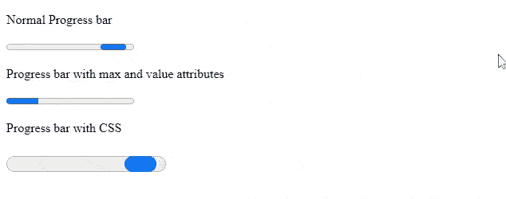
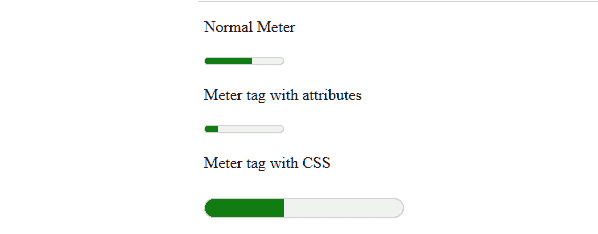

# html 5 中的<progress>和<meter>标签是什么？</meter></progress>

> 原文:[https://www . geeksforgeeks . org/什么是进度条标签 html5/](https://www.geeksforgeeks.org/what-are-progress-and-meter-tags-in-html5/)

HTML 5 引入了两个新标签，即 [<进度>](https://www.geeksforgeeks.org/html-5-progress-tag/) 标签和< [仪表>](https://www.geeksforgeeks.org/html5-meter-tag/) 标签。在本文中，我们将讨论这两个标签。

[**进度标签**](https://www.geeksforgeeks.org/html-5-progress-tag/) **:** 该标签用于表示网页上的进度条，以显示任务的进度。进度条的一些用途包括在网站上显示文件上传/下载进度。进度条使用以下语法创建。

**语法:**

```html
<progress>....</progress>
```

**属性:**这个标签接受两个属性，如下所述。

*   **max:** 表示完成一项任务需要完成的总工作量。
*   **值:**表示已经完成的工作量。

**示例:**进度标签也可以使用 CSS 进行样式化。让我们用一个例子来看看所有这些属性和进度条样式。

## 超文本标记语言

```html
<!DOCTYPE html>
<html lang="en">
    <head>
        <title>Progress tag</title>
    </head>
    <body>
        <p>Normal Progress bar</p>
        <progress></progress>
        <p>Progress bar with max and value attributes</p>
        <progress value="50" max="200"></progress>
        <p>Progress bar with CSS</p>
        <progress style="width:200px; height:40px;" ></progress>
    </body>
</html>
```

**输出:**



[**仪表标签:**](https://www.geeksforgeeks.org/html5-meter-tag/) 仪表标签也称为仪表，基本上定义了在指定范围内测量数据的刻度。仪表标签的用途可能包括油箱中剩余的燃油、物体的温度等。仪表标签如下所示。

**语法:**

```html
<meter>....</meter>
```

**属性:**该标签接受下面列出的许多属性。

*   **表单:**定义仪表标签所属的一个或多个表单。
*   **max:** 用于指定一个范围的最大值。
*   **min:** 用于指定一个范围的最小值。
*   **高:**用于指定被认为是高值的范围。
*   **低:**用于指定被认为低于的范围值。
*   **最佳**:用于指定范围的最佳值。
*   **值:**用于指定范围的要求值或实际值。

**示例:**

## 超文本标记语言

```html
<!DOCTYPE html>
<html lang="en">
    <head>
        <title>Meter tag</title>
    </head>
    <body>
        <p>Normal Meter</p>
        <meter value="0.6"></meter>
        <p>Meter tag with attributes</p>
        <meter value="50" max="200" min="20"></meter>
        <p>Meter tag with CSS</p>
        <meter value="0.4" style="width:200px; height:40px;"></meter>
    </body>
</html>
```

**输出:**



仪表标签

**注意:**如果我们没有指定<仪表>标签的值属性，那么它将显示一个空仪表。

**支持的浏览器:**

*   谷歌 Chrome
*   微软边缘
*   Mozilla Firefox
*   旅行队
*   歌剧
*   微软公司出品的 web 浏览器