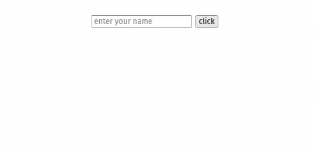
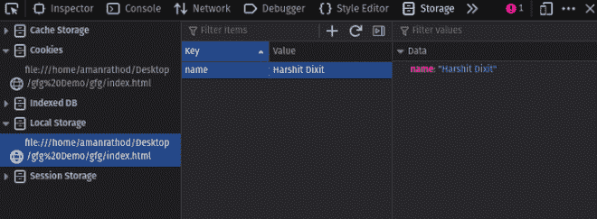
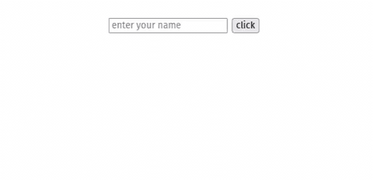
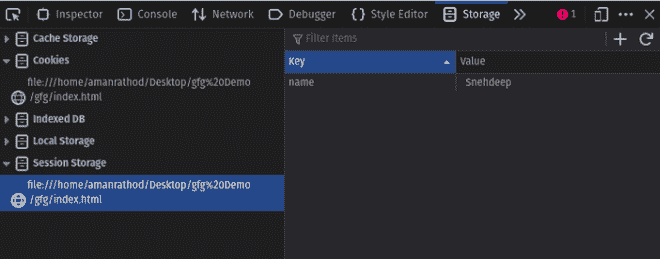

# html 5 中有哪些不同类型的存储？

> 原文:[https://www . geeksforgeeks . org/html 5 中有哪些不同类型的存储/](https://www.geeksforgeeks.org/what-are-the-different-types-of-storage-in-html5/)

在本文中，您将了解 HTML5 中不同类型的网络存储。网络存储更加安全，大量数据可以本地存储在客户端网络浏览器上。所有数据都存储在键值对中。

在 HTML5 中，有两种类型的网络存储应用编程接口。

1.  localStorage
2.  会话存储

[**【本地存储:**](https://www.geeksforgeeks.org/html-dom-window-localstorage-properties/) 用于在客户端存储数据。它没有到期时间，所以本地存储中的数据一直存在，直到用户手动删除它。

**语法:**

*   **用于在网络存储中存储数据:**键和值都应该是字符串或数字；

    ```html
    LocalStorage.setItem("key", "value"); 
    ```

*   **从网络存储获取数据:**我们将传递密钥，它将返回值。

    ```html
    LocalStorage.getItem("key"); 
    ```

**示例:**

## 超文本标记语言

```html
<!DOCTYPE html>
<html>
  <head>
    <style>
      body {
        color: green;
        text-align: center;
        font-size: 30px;
        margin-top: 30px;
        font-style: italic;
      }
      #data {
        text-align: center;
      }
    </style>
  </head>
  <body>
    <input id="name" type="name" placeholder="enter your name" />
    <button type="submit" onClick="handleClick()">click</button>
    <br />
    <div id="data"></div>

    <script>
      function handleClick() {
        if (typeof Storage !== "undefined") {
          let name = document.getElementById("name").value;
          localStorage.setItem("name", name);

          document.getElementById("data").innerHTML =
            "Welcome To GeeksforGeeks" + " " + localStorage.name;
        } else {
          alert("Sorry! your browser doesn't support Web Storage");
        }
      }
    </script>
  </body>
</html>

```

**输出:**



**本地存储器上存储的数据:**



我们可以清楚地看到，本地存储项是以键/值对的形式存储的，您可以通过检查网页上的元素来检查，然后转到*应用程序*选项，您将在那里找到本地存储。

由于 *localStorage* 对象存储的数据没有截止日期，您可以通过关闭当前选项卡来交叉检查这一点，并再次访问同一页面，您会发现该选项卡或窗口的 localStorage 中存在相同的数据。

[**【会话存储】**](https://www.geeksforgeeks.org/html-window-sessionstorage-property/) **:用于客户端存储数据。会话存储中的数据在当前选项卡打开之前一直存在，如果我们关闭当前选项卡，那么我们的数据也会自动从会话存储中删除。**

**语法:**

*   **用于在网络存储中存储数据:**

    ```html
    SessionStorage.setItem("key", "value");
    ```

*   **从网络存储获取数据:**

    ```html
    SessionStorage.getItem("key");
    ```

**示例:**

## 超文本标记语言

```html
<!DOCTYPE html>  
<html>  
<head> 
  <style>  
      body {  
        color: green;  
        text-align: center;  
        font-size: 30px;  
        margin-top: 30px;  
        font-style: italic;  
      }  
      #data {
        text-align: center;
      }
  </style>  
</head>  
<body>  
    <input id="name" type="name" placeholder="enter your name" >
    <button type="submit" onClick="handleClick()">click</button>
    <br>
    <div id="data"></div>

    <script>  
      function handleClick() {
        if(typeof(Storage)!=="undefined") {  
          let name = document.getElementById("name").value;
            sessionStorage.setItem("name", name);

            document.getElementById("data").innerHTML = 
              ("Welcome To GeeksforGeeks"+" "+sessionStorage.name);  
          }  
          else{  
            alert("Sorry! your browser is not supporting the browser")  
          }  
       }
    </script> 
</body>  
</html>
```

**输出:**



**会话存储器中存储的数据:**



由于 *sessionStorage* 对象存储的是有截止日期的数据，你可以通过关闭当前标签页，再次访问同一个页面进行交叉检查，你会发现该标签页或窗口的 sessionStorage 中的数据是空的。