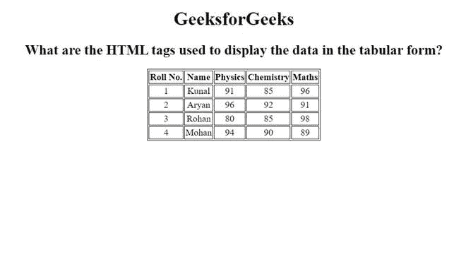
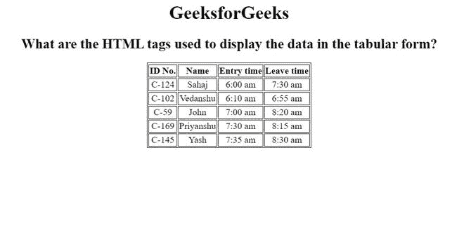

# 使用表格形式显示数据的 HTML 标签有哪些？

> 原文:[https://www . geesforgeks . org/什么是 html 标记-用于以表格形式显示数据/](https://www.geeksforgeeks.org/what-are-the-html-tags-used-to-display-the-data-in-the-tabular-form/)

在本文中，我们将了解可以用来以表格形式显示数据的 HTML 标记。表是以行和列表示的数据，有助于组织复杂的结构化数据。表格广泛应用于通信、研究和数据分析。例如，如果我们需要从没有适当组织的信息集中找到数据，那么我们就不能一眼就找到特定的数据。类似地，我们可以使用网页中的 [HTML Table 标签](https://www.geeksforgeeks.org/html-tables/)来使用表格格式。

我们可以使用表格显示数据的可能区域:

*   复杂或大量的数据可以很容易地转换成更好的形式，使其更加方便。
*   由于表格表示，它使数据比较变得更加容易。
*   它为统计分析创造了基础。

一个 HTML 表格用“表格”标签定义。每个表行都用“tr”标记定义。表格标题用“th”标记定义。默认情况下，表格标题是粗体和居中的。表格数据/单元格用“td”标记定义。

**语法:**

```html
<table>
    <tr><th>Table Header</th></tr>
    <tr><td>Table Data</td></tr>
 </table>
```

我们将通过示例了解所有 3 个标签及其各自的特点/用途。

[**HTML < tr >标签:**](https://www.geeksforgeeks.org/html-tr-tag/) 用来定义 HTML 表格中的一行。它主要由多个< th >或< td >元素组成。

**语法:**

```html
<tr>
    <td>Data</td>
</tr>
```

[**HTML<th>Tag**](https://www.geeksforgeeks.org/html-th-tag/)**:**用于定义表格的表头。在第<>标签中，默认情况下，文本被标记为粗体并居中对齐。

**语法:**

```html
<th>Table Heading</th>
```

[**HTML < td >标签**](https://www.geeksforgeeks.org/html-td-align-attribute/) **:** 用于在每个单元格中插入或添加数据。在< td >中，标签文本是常规的，默认情况下是左对齐的。

**语法:**

```html
<td>Table data</td>
```

**方法:**首先，我们将使用<表格>标签创建一个表格，然后我们将使用 [<标签和>](https://www.geeksforgeeks.org/html-thead-tag/) 标签以及 [<标签将表格分成两部分:表格的头部和主体。在<标签和>标签下，我们将添加表格的所有标题，在<标签下>标签下，我们将使用](https://www.geeksforgeeks.org/html-tbody-tag/#:~:text=The%20tag%20in%20HTML,%3E%20and%20tags.) [< tr >标签](https://www.geeksforgeeks.org/html-tr-tag/)来定义表格行。在<标签和>标签下，我们将添加 [<和>标签](https://www.geeksforgeeks.org/html-th-tag/)，为表格提供标题。最后，在< tbody >标签下，我们将使用 [< td >标签](https://www.geeksforgeeks.org/html-td-tag/)来定义每个单元格。

我们将通过例子理解上述概念。

**示例 1:** 在本例中，我们创建了一个 HTML Table，以表格形式存储每个学生的分数。

## 超文本标记语言

```html
<!DOCTYPE html>
<html>

<head>
    <title>
        What are the HTML tags used 
        to display the data in the 
        tabular form?
    </title>
    <style>
    table,
    th,
    td {
        border: 1px solid black;
        text-align: center;
    }
    </style>
</head>

<body>
    <center>
        <h1>GeeksforGeeks</h1>
        <h2>
            What are the HTML tags used 
            to display the data in the 
            tabular form?
        </h2>
        <table>
            <thead>
                <tr>
                    <th>Roll No.</th>
                    <th>Name</th>
                    <th>Physics</th>
                    <th>Chemistry</th>
                    <th>Maths</th>
                </tr>
            </thead>
            <tbody>
                <tr>
                    <td>1</td>
                    <td>Kunal</td>
                    <td>91</td>
                    <td>85</td>
                    <td>96</td>
                </tr>
                <tr>
                    <td>2</td>
                    <td>Aryan</td>
                    <td>96</td>
                    <td>92</td>
                    <td>91</td>
                </tr>
                <tr>
                    <td>3</td>
                    <td>Rohan</td>
                    <td>80</td>
                    <td>85</td>
                    <td>98</td>
                </tr>
                <tr>
                    <td>4</td>
                    <td>Mohan</td>
                    <td>94</td>
                    <td>90</td>
                    <td>89</td>
                </tr>
            </tbody>
        </table>
    </center>
</body>

</html>
```

**输出:**



**示例 2:** 这个示例描述了 HTML 表的使用。

## 超文本标记语言

```html
<!DOCTYPE html>
<html>

<head>
    <title>
        What are the HTML tags used 
        to display the data in the 
        tabular form?
    </title>
    <style>
    table,
    th,
    td {
        border: 1px solid black;
        text-align: center;
    }
    </style>
</head>

<body>
    <center>
        <h1>GeeksforGeeks</h1>
        <h2> 
            What are the HTML tags used 
            to display the data in the 
            tabular form?
        </h2>
        <table>
            <thead>
                <tr>
                    <th>ID No.</th>
                    <th>Name</th>
                    <th>Entry time</th>
                    <th>Leave time</th>
                </tr>
            </thead>
            <tbody>
                <tr>
                    <td>C-124</td>
                    <td>Sahaj</td>
                    <td>6:00 am</td>
                    <td>7:30 am</td>
                </tr>
                <tr>
                    <td>C-102</td>
                    <td>Vedanshu</td>
                    <td>6:10 am</td>
                    <td>6:55 am</td>
                </tr>
                <tr>
                    <td>C-59</td>
                    <td>John</td>
                    <td>7:00 am</td>
                    <td>8:20 am</td>
                </tr>
                <tr>
                    <td>C-169</td>
                    <td>Priyanshu</td>
                    <td>7:30 am</td>
                    <td>8:15 am</td>
                </tr>
                <tr>
                    <td>C-145</td>
                    <td>Yash</td>
                    <td>7:35</td>
                    <td>8:30</td>
                </tr>
            </tbody>
        </table>
    </center>
</body>

</html>
```

**输出:**

