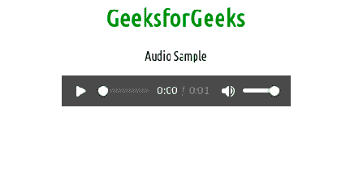
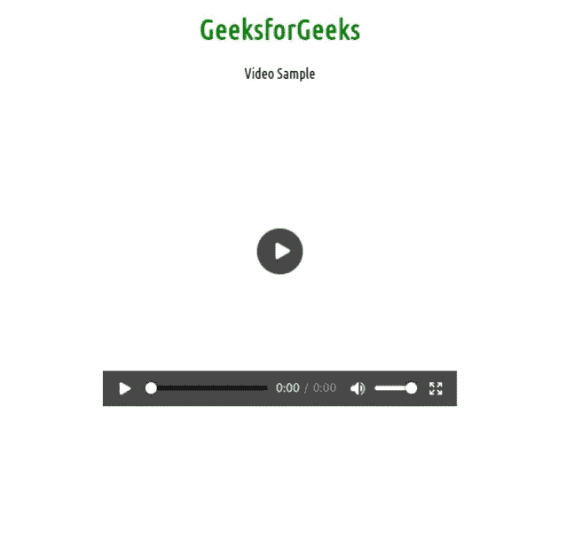

# html 5 引入的媒体元素标签有哪些？

> 原文:[https://www . geesforgeks . org/什么是媒体元素标签-由 html5 引入/](https://www.geeksforgeeks.org/what-are-the-media-element-tags-introduced-by-html5/)

HTML5 引入了 5 个最受欢迎的媒体元素标签，即 **<音频><视频><来源><嵌入><曲目>。**这个媒体元素标签用 HTML 改变了整个开发。

在本文中，您将简要了解这五个媒体元素标签。

**媒体标签:**

*   [**<音频>**](https://www.geeksforgeeks.org/html5-audio/) **:** 它是一个内嵌元素，用于将声音文件嵌入到网页中。
*   [**<视频>**](https://www.geeksforgeeks.org/html5-video/) **:用于将视频文件嵌入网页。**
*   [**<来源>**](https://www.geeksforgeeks.org/html-source-tag/) :用于附加音频、视频、图片等多媒体文件。
*   **<** [**【嵌入】**](https://www.geeksforgeeks.org/html-embed-tag/) **> :** 用于将一般为音频或视频等多媒体内容的外部应用嵌入到 HTML 文档中。
*   [**<轨道>**](https://www.geeksforgeeks.org/html-track-tag/) **:** 为媒体组件音视频指定文字轨道。

**媒体标签优势:**

*   不再需要插件
*   速度–任何自然集成到浏览器中的内容都将以比导入的第三方更快的方式呈现和执行
*   本机(内置)控件由浏览器提供。
*   可访问性(键盘、鼠标)是自动内置的

**<音频>标签:**如果你想在网页中添加歌曲或任何声音文件等音频，这是一个很有用的标签。

**语法:**

```html
<audio>
 <source src="sample.mp3" type="audio/mpeg">
</audio>
```

**示例:**

## 超文本标记语言

```html
<!DOCTYPE html>
<html>

<head>
    <style>
        h1 {
            color: green;
        }
    </style>
</head>

<body>
    <center>
        <h1>GeeksforGeeks</h1>

        <p>Audio Sample</p>

        <!--- Autoplay ensure to run audio automatically
              after running the program -->
        <audio controls autoplay>
            <source src=
"https://media.geeksforgeeks.org/wp-content/uploads/20190531165842/Recording1514.ogg"
                type="audio/ogg">

            <source src=
"https://media.geeksforgeeks.org/wp-content/uploads/20190531165842/Recording1514.mp3"
                type="audio/mpeg">
        </audio>
    </center>
</body>

</html>
```

**输出:**



**<视频> :** 将视频嵌入网页是一种标准方式。

**语法:**

```html
 <video src="" controls>   </video>
```

**示例:**

## 超文本标记语言

```html
<!DOCTYPE html>
<html>

<head>
    <style>
        h1 {
            color: green;
        }
    </style>
</head>

<body>
    <center>
        <h1>GeeksforGeeks</h1>

        <p>Video Sample</p>

        <video width="400" height="350" controls preload>
            <source src="myvid.mp4" type="video/mp4">
            <source src="myvid.ogg" type="video/ogg">
        </video>
    </center>
</body>

</html>
```

**输出:**



**<嵌入> :** 用作嵌入 flash 动画等插件的容器。

**语法:**

```html
<embed attributes>
```

## 超文本标记语言

```html
<!DOCTYPE html>
<html>

<head>
    <style>
        h1 {
            color: green;
        }
    </style>
</head>

<body>
    <center>
        <h1>GeeksforGeeks</h1>

        <p>Embed Sample</p>

        <embed
            src=
"https://media.geeksforgeeks.org/wp-content/uploads/20210723103530/simplescreesdfdsrecorder2021071.gif"
            width="300px" height="300px">
    </center>
</body>

</html>
```