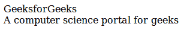
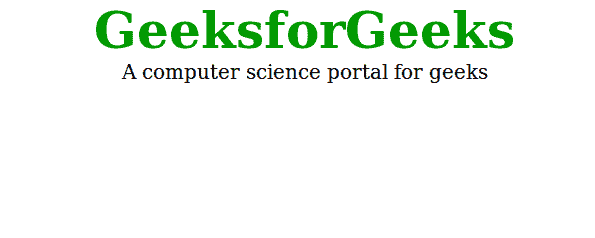

# HTML 中的 id 属性有哪些有效值？

> 原文:[https://www . geesforgeks . org/html 中 id 属性的有效值是什么/](https://www.geeksforgeeks.org/what-are-valid-values-for-the-id-attribute-in-html/)

**id 属性**是用于指定文档的唯一标识符。id 属性使用`#`(散列)符号后跟 id。该值在元素主子树的所有标识中必须是唯一的。

**语法:**

```html
  <tag id = #Values>

```

**ID 属性的允许值:**
从 HTML5 开始，ID 必须满足这三个条件:

*   在文档中必须唯一。
*   不得包含任何空格字符。
*   必须包含至少一个字符。

因此，该值可以是所有数字，只有一个数字，包括特殊字符等。只是没有空白。

在 HTML 5 中，这些 id 值是有效的:

```html
  <tag id = "#999" > .... </tag > 
  <tag id = "#%LV-||" > .... </tag > 
  <tag id = " ____V" > .... </tag > 
  <tag id = "{}" > .... </tag > 
  <tag id = " ©" > .... </tag > 

```

**注意:**在 ID 的值中使用数字或特殊字符可能会在其他上下文中引起麻烦(CSS、JavaScript)。
T3】例:

```html
 <tag id = ".\1gfg" > .... <\tag >

```

这个标识在 HTML 5 中有效，但是在 **CSS 中，javaScript** 标识符(包括元素名称、类和选择器中的标识)只能包含字符[a-zA-Z0-9]。

现在我们将在 **HTML** 和 **CSS** 中看到有效和无效 id 值的例子。

**例 1:**id 的值为 **1gfg** 和 **1geeks** ，在 **HTML 5** 中有效，在 **CSS** 中无效。所以我们只是得到简单的输出，而不是风格化的输出，因为在 CSS 中 ID 的**值是无效的。**

```html
<!DOCTYPE html>
<html>

<head>
    <title>Id Attributes</title>
    <style>
        #1gfg {
            color: #009900;
            font-size: 50px;
            font-weight: bold;
            text-align: center;
        }

        #1geeks {
            text-align: center;
            font-size: 20px;
        }
    </style>
</head>

<body>
    <div id="1gfg">GeeksforGeeks</div>
    <div id="1geeks">
      A computer science portal for geeks
  </div>
</body>

</html>
```

**输出:**


**示例 2:** 现在我们将更改 od IDs 的值，但代码保持不变。id 的值为 **gfg** 和**极客**，在 **HTML 5** 中有效，在 **CSS** 中也有效。所以这次我们会得到样式输出，因为 ID 的**值在 CSS** 中是有效的。

```html
<!DOCTYPE html>
<html>

<head>
    <title>Id Attributes</title>
    <style>
        #gfg {
            color: #009900;
            font-size: 50px;
            font-weight: bold;
            text-align: center;
        }

        #geeks {
            text-align: center;
            font-size: 20px;
        }
    </style>
</head>

<body>
    <div id="gfg">GeeksforGeeks</div>
    <div id="geeks">
      A computer science portal for geeks
  </div>
</body>

</html>
```

**输出:**


我们刚刚在 **HTML** 和 **CSS** 中看到了一个有效 id 值的例子。
现在我们在 **HTML** 和 **javaScript** 中看到另一个有效和无效 id 值的例子。

**例 3:** 我们取 ID 值**。\1gfg** 在 HTML 5 中有效，但在 **javaScript** 中无效。所以点击更改文本按钮后，不会发生任何事情，因为对于 javaScript 来说的标识值无效。

```html
<html>

<body>

    <h1 id=".\1gfg">Hello Geeks!</h1>
    <button onclick="displayResult()">
      Change text
  </button>

    <style>
        #.\1gfg {
            color: green;
        }
    </style>

    <script>
        function displayResult() {
            document.getElementById(
              ".\1gfg").innerHTML = "GeeksForGeeks!";
        }
    </script>

</body>

</html>
```

**输出:**


现在我们将看到另一个例子，其中我们将从**更改 ID 的值。\1gfg** 到 **gfg** 和更改按钮将起作用*你好极客们！*将替换为绿色的 *GeeksForGeeks* ，因为 ID 的**值对 JavaScript** 有效。

**例 4:**

```html
<html>

<body>

    <h1 id="gfg">Hello Geeks!</h1>
    <button onclick="displayResult()">
      Change text
  </button>
    <style>
        #gfg {
            color: green;
        }
    </style>
    <script>
        function displayResult() {
            document.getElementById(
              "gfg").innerHTML = "GeeksForGeeks!";
        }
    </script>

</body>

</html>
```

**输出:**
