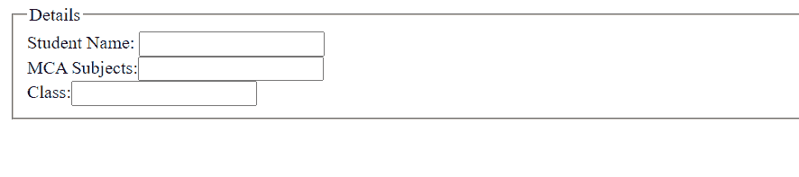
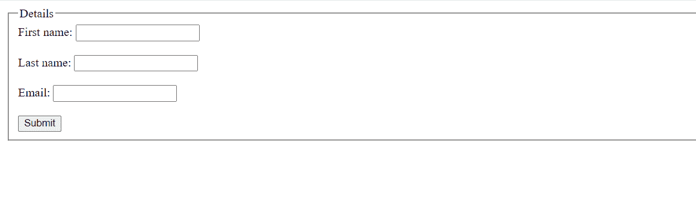

# 什么是 HTML 中的字段集？

> 原文:[https://www.geeksforgeeks.org/what-is-a-fieldset-in-html/](https://www.geeksforgeeks.org/what-is-a-fieldset-in-html/)

[<字段集>](https://www.geeksforgeeks.org/html5-fieldset-tag/) 用于将表单的所有控件组合在一起，使其看起来有结构。它在表单周围添加了一个边框，使其看起来与网页的其他部分不同。我们也可以使用 [<图例>](https://www.geeksforgeeks.org/html-legend-tag/) 标签为包含在<字段集>中的表单提供标题。

**语法:**

```html
<fieldset>....</fieldset>
```

**属性:**

*   [禁用:](https://www.geeksforgeeks.org/html-disabled-attribute/)指定相关表单元素组应禁用。
*   [表单](https://www.geeksforgeeks.org/html-form-attribute/):指定字段集所属的一个或多个表单。
*   [名称](https://www.geeksforgeeks.org/html-name-attribute/):指定字段集的名称。

**例 1:**

## 超文本标记语言

```html
<!DOCTYPE html>
<html>

<body>
    <form>
        <fieldset>
            <legend>Details</legend> 
            Student Name: <input type="text">
            <br /> MCA Subjects: <input type="text">
            <br /> Class: <input type="text">
        </fieldset>
    </form>
</body>

</html>
```

**输出:**



**例 2:**

## 超文本标记语言

```html
<!DOCTYPE html>
<html>

<body>
    <form>
        <fieldset>
            <legend>Details</legend>
            <label for="fname">First name:</label>
            <input type="text" id="fname" name="fname">
            <br>
            <br>
            <label for="lname">Last name:</label>
            <input type="text" id="lname" name="lname">
            <br>
            <br>
            <label for="email">Email:</label>
            <input type="email" id="email" name="email">
            <br>
            <br>
            <input type="submit" value="Submit">
        </fieldset>
    </form>
</body>

</html>
```

**输出:**

