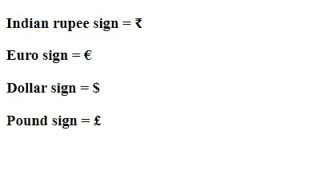

# 什么是 HTML 中的字符实体？

> 原文:[https://www . geesforgeks . org/什么是 html 中的字符实体/](https://www.geeksforgeeks.org/what-is-character-entities-in-html/)

在本文中，我们将了解 HTML 字符实体以及如何使用它们。HTML 字符实体基本上是一组字符(实体)，用于表示 HTML 保留的少数字符，尤其是不可见的字符或难以使用常规键盘键入的字符。HTML 提供了一些实体名称和实体编号来使用这些符号。关于字符的更多细节请参考 [HTML 实体](https://www.geeksforgeeks.org/html-entities/)。

**示例:**“<”已经在 HTML 语言中保留。有时，这个字符需要显示在网页上，这会在代码中产生歧义。与这些字符一起的是基本键盘中通常不存在的字符(，，€等)。随着文章的深入，我们将详细探讨 HTML 实体。

**语法:**

```html
&entity_name; or &#entity_number;
```

下面讨论一些有用的符号及其实体名称和实体编号:

<figure class="table">

| 

#### mark

 | 

#### Entity name

 | 

#### Entity number

 | 

#### Details

 |
| --- | --- | --- | --- |
|  | `&` | `&#160;` | 不间断空间 |
| `<` | `&lt;` | `&#60;` | 不到 |
| `>` | `&gt;` | `&#62;` | 大于 |
| `®` | `&reg;` | `&#174;` | 注册商标 |
| `©` | `&copy;` | `&#169;` | 版权 |
| `₹` |  | `&#8377;` | 印度卢比符号 |
| `€` | `&euro;` | `&#8364;` | 欧元 |
| `¥` | `&yen;` | `&#165;` | 日元 |
| $ | `&dollar;` | `&#36;` | 美元 |
| `£` |  | `&#163;` | 英镑 |
| `¢` | `&cent;` | `&#162;` | 分 |
| `‘` | `&apos;` | `&#39;` | 单引号(撇号) |
| `“` | `&quot;` | `&#34;` | 双引号 |
| `&` | `&amp;` | `&#38;` | &的记号名称 |

</figure>

**保留字符:**保留字符是为 HTML 保留的字符或基本键盘中不存在的字符。

**举例:**因为实体数很容易学。在这里，对其中的几个保留字符进行讨论:

<figure class="table">

| Reserved character | Entity name |
| --- | --- |
| `&` | `&amp;` |
| `<` |  |
| `>` |  |
| `“` |

</figure>

**其他字符:**一些在我们的键盘上不能直接使用的字符，因此这样的实体可以用它们的实体号来表示。

**示例:**这些关键字是直接不可用的类型，我们需要指定它们的实体编号。这里数字前的#x 代表十六进制表示。

<figure class="table">

| figure | entity |
| --- | --- |
| `≥` | `&#8805; &#x2265; &GreaterEqual;` |
| `©` |  |
|  | `&euro;  &#8364;` |
|  |  |

</figure>

**示例:**

## 超文本标记语言

```html
<!DOCTYPE html>
<html>
  <head>
    <title>HTML Character entities</title>
  </head>
  <body>
    <h3>Indian rupee sign = ₹</h3>
    <h3>Euro sign = €</h3>
    <h3>Dollar sign = {content}lt;/h3>
    <h3>Pound sign = £</h3>
  </body>
</html>
```

**输出:**

