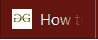

# 什么是 favicon，它在 HTML 中的大小是多少？

> 原文:[https://www . geeksforgeeks . org/什么是 favicon 和什么是 html 中的大小/](https://www.geeksforgeeks.org/what-is-favicon-and-what-is-the-size-of-it-in-html/)

favicon 是我们所有人在浏览网页时每天都会看到的东西，但我们中的许多人并没有观察到它，也没有为它支付任何费用。favicon 还有许多其他的名字，其中一些是最喜欢的图标(因此缩写为 favicon)、快捷图标、标签图标、网站图标或书签图标。这是我们在标签上看到的小图片，或者在制作页面书签时看到的小图片。


选项卡中显示的小 GeeksforGeeks 图像就是我们正在讨论的 favicon。

**fav icons 的类型:** Favicons 可以有 16×16、32×32、48×48 或 64×64 像素等不同尺寸。此外，它们可以具有 8 位、24 位或 32 位色深。

**如何使用收藏夹图标？**
有两种方法可以实现收藏夹图标:

*   **如果图标在。ico 格式:**
    1.  将格式正确的 favicon.ico 文件复制到网站文件所在服务器的主机目录中。通常这是 **public_html** ，但可能会根据配置或主机提供商而变化。
    2.  浏览器会自动检测并显示图标。
*   **如果收藏夹图标是其他格式(例如 jpg、BMP、gif、png):**
    1.  将文件复制到网站文件所在服务器的主机目录。通常这是 **public_html** ，但可能会根据配置或主机提供商而变化。
    2.  Now we need to specify the image we would like to use as a favicon for our website. To do so, we need to add the following line inside the tags below the <taitle> in our website code:

        ```html
        <link rel="shortcut icon" type="image/png" href="/favicon.png"/>
        ```

        对于非 png 格式，用文件的格式替换“image/png”，用文件的名称和扩展名替换“favicon.png”。

**示例:**

```html
<!DOCTYPE html> 
<html> 
    <head> 
        <meta charset = "utf-8" /> 

        <title> 
            GeeksforGeeks icon 
        </title> 

        <!-- add icon link -->
        <link rel = "icon" href = 
"https://media.geeksforgeeks.org/wp-content/cdn-uploads/gfg_200X200.png"
        type = "image/x-icon"> 

    </head> 

    <body> 
        <h1 style = "color:green;"> 
            GeeksforGeeks 
        </h1> 

        <p> 
            GeeksforGeeks icon added in the title bar 
        </p> 
    </body> 
</html>                     
```

**输出:**


**图标尺寸:**

| **尺寸** | **名称** | **目的** |
| 32×32 | favicon-32.png | 大多数桌面浏览器的标准。 |
| 57×57 | favicon-57.png | 标准的 iOS 主屏幕。 |
| 76×76 | favicon-76.png | iPad 主屏幕图标。 |
| 96×96 | favicon-96.png | GoogleTV 图标。 |
| 120×120 | favicon-120.png | iPhone 视网膜触摸图标。 |
| 128×128 | favicon-128.png | Chrome 网络商店图标&小窗口 8 星屏幕图标*。 |
| 144×144 | favicon-144.png | 用于固定站点的 Internet Explorer 10 地铁磁贴* |
| 152×152 | favicon-152.png | iPad 触摸图标。 |
| 167×167 | favicon-167.png | iPad Retina 触摸图标(iOS 10 的变化:从 152×152 上升，未在运行。iOS 10 将使用 152×152) |
| 180×180 | favicon-180.png | iPhone 6 plus |
| 192×192 | favicon-192.png | 谷歌开发者网络应用清单推荐 |
| 195×195 | favicon-195.png | Opera 快速拨号图标
(在 Opera 15 及更高版本中不工作) |
| 196×196 | favicon-196.png | 安卓主屏幕图标的 Chrome |
| 228×228 | favicon-228.png | 歌剧海岸图标 |

**注意:**fav icon 的 size 属性不支持主要浏览器。
**漏洞:**许多网络浏览器在地址栏的左侧显示收藏夹图标，因此它们经常被用作 HTTPS 页面上网络钓鱼攻击的一部分。攻击者将网站的图标更改为熟悉的挂锁标志(通知加密连接)以欺骗用户。为了避免这种情况，许多流行和现代的网络浏览器仅在选项卡中显示 favicon，并在 URL 旁边显示用于访问网站的协议的安全状态。