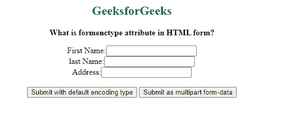

# 什么是 HTML 表单中的 formenctype 属性？

> 原文:[https://www . geesforgeks . org/what-is-formenctype-attribute-in-html-form/](https://www.geeksforgeeks.org/what-is-formenctype-attribute-in-html-form/)

HTML [***表单类型***](https://www.geeksforgeeks.org/html-formenctype-attribute/) 属性用于指定提交表单时使用的编码类型。它定义了表单数据发送到服务器时应该如何编码。

它的工作原理是输入类型[“**提交**”](https://www.geeksforgeeks.org/html-input-typesubmit/)和输入类型**“**[**图像**](https://www.geeksforgeeks.org/html-input-typeimage/) **”。**

当表单内有多个提交按钮时，使用*表单类型* 属性。它用于覆盖[***enctype***](https://www.geeksforgeeks.org/html-enctype-attribute/)**属性的 [<形式>](https://www.geeksforgeeks.org/html-form-tag/) 元素。**

****语法:****

> **<element_name formenctype="”application/x-www-form-urlencoded/multipart/form-data/text/plain”"></element_name>**

**基本上，有几种方法可以用来编码表单数据。**

*   ****application/x-www-form-URL encoded:**为默认值。在发送到服务器之前，它会对所有字符进行编码。它将空格转换为+符号，将特殊字符转换为十六进制值。**
*   ****多部分/表单数据:**用于对文件上传控件进行编码。该值不编码任何字符。如果不使用这种编码类型，我们就无法上传图像和文件。**
*   ****文本/普通**:该值将空格转换为+符号，但不转换特殊字符。**

****示例:****

## **超文本标记语言**

```html
<!DOCTYPE html>
<html>

<body>
    <center>
        <h2 style="color:green">
            GeeksforGeeks
        </h2>

        <p><b>
            What is formenctype attribute in HTML form?
        </b></p>

        <form action="#">
            <label>First Name:<input type="text"></label>
            <br>

            <label>last Name:<input type="text"></label>
            <br>

            <label>Address:<input type="text"></label>
            <br><br>

            <input type="submit" value=
                "Submit with default encoding type">

            <button type="submit" 
                formenctype="multipart/form-data">
                Submit as multipart form-data
            </button>
        </form>
    </center>
</body>

</html>
```

****输出:****

****