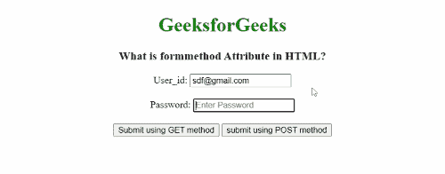

# 什么是 HTML 表单中的 formmethod 属性？

> 原文:[https://www . geesforgeks . org/what-is-form method-attribute-in-html-form/](https://www.geeksforgeeks.org/what-is-formmethod-attribute-in-html-form/)

**什么是 formmethod 属性？**

HTML 中的 formmethod 属性用于定义一种 HTTP 技术，该技术指定如何向后端服务器发送表单数据。该属性适用于<button>、<input type="“submit”">和<input type="”image”">。它覆盖了

<form>元素的方法属性的特征。</form></button> 

**如何发送数据？**

数据可以通过使用 GET 方法使用 URL 变量发送到服务器，通过使用 post 方法作为 HTTP post 发送。

**什么是 GET 和 POST 方法？**

*   **GET 方法:**在 GET 方法中，表单提交后，表单值会在新浏览器选项卡的地址栏中可见。它的大小限制在 3000 个字符左右。它仅适用于非安全数据，不适用于敏感信息。它支持给结果添加书签。它不能用来发送二进制数据。
*   **POST 方法:**在 POST 方法中，表单提交后，表单值在新浏览器选项卡的地址栏中将不会像在 GET 方法中一样可见。它将表单数据追加到 HTTP 请求的正文中。它没有大小限制。此方法不支持结果的书签。

**示例:**

## 超文本标记语言

```html
<!DOCTYPE html>
<html>

<head>
    <title>
        What is formmethod Attribute in HTML?
    </title>

    <style>
        h3 h2 {
            font-family: impact;
        }
    </style>
</head>

<body style="text-align: center;">
    <h1 style="color: green;">
        GeeksforGeeks
    </h1>

    <h3>What is formmethod Attribute in HTML?</h3>

    <form action="#" id="users" action="#" 
        method="GET" target="_blank">

        User_id:
        <input type="email" name="email" 
            placeholder="Emter Email Id" />
        <br /><br />

        Password:
        <input type="password" name="pword" 
            placeholder="Enter Password" />
        <br /><br />

        <input type="submit" 
            value="Submit using GET method" 
            formmethod="get" />

        <input type="submit" formaction="#" 
            value="submit using POST method" 
            formmethod="post" />
    </form>
</body>

</html>
```

**输出:**

**采用 POST 方式提交表格:**



**使用 GET 方法提交表单:**

