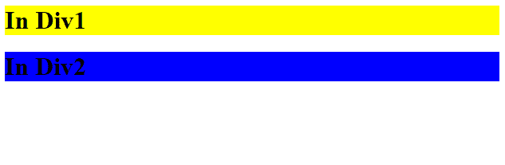
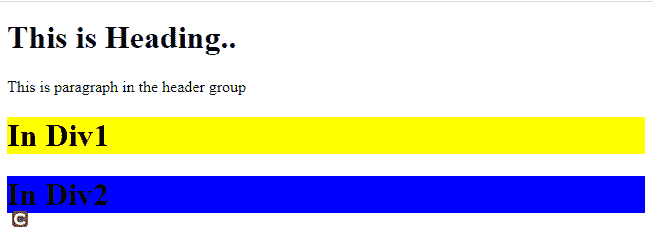
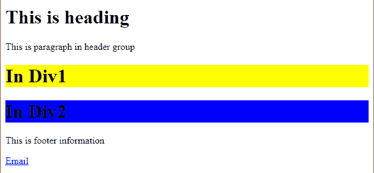
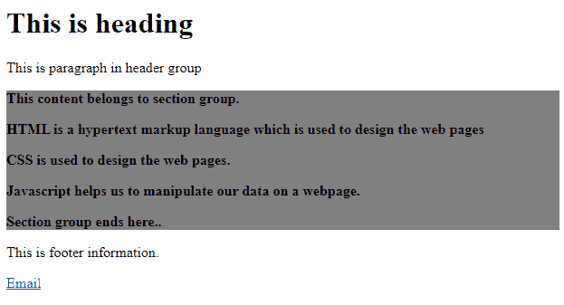

# 什么是 HTML 中的分组？

> 原文:[https://www.geeksforgeeks.org/what-is-grouping-in-html/](https://www.geeksforgeeks.org/what-is-grouping-in-html/)

分组在我们的网页中起着至关重要的作用，因为它帮助开发人员定位特定的类和 id，这使得在 [HTML](https://www.geeksforgeeks.org/html-tutorials/) 、 [CSS](https://www.geeksforgeeks.org/css-tutorials/) 或 [JavaScript](https://www.geeksforgeeks.org/javascript-tutorial/) 的帮助下定位、设计或操作网页变得更加容易。

可以借助各种标签进行分组，如[**<>**](https://www.geeksforgeeks.org/div-tag-html/)**[**<表头>**](https://www.geeksforgeeks.org/html-5-header-tag/)**[**<表尾>**](https://www.geeksforgeeks.org/html5-footer-tag/)**和 [< **节>**](https://www.geeksforgeeks.org/html-section-tag/) 。******

******HTML**[**<div>**](https://www.geeksforgeeks.org/div-tag-html/)**:**它是一个块级标签，将各种 HTML 标签组合成单个块。它是用 CSS 设计的，也可以用 JavaScript 操作。****

******示例:******

## ****超文本标记语言****

```html
**<!DOCTYPE html>
<html>

<head>
    <style>
        .div1 {
            background: yellow;
        }

        .div2 {
            background: blue;
        }
    </style>
</head>

<body>
    <div class="div1">
        <h1>In Div1</h1>
    </div>
    <div class="div2">
        <h1>In Div2</h1>
    </div>
</body>

</html>**
```

******输出:**



**HTML** [**<页眉>**](https://www.geeksforgeeks.org/html-5-header-tag/) **:** 这个标签包含了 tagline 或者我们可以说它包含了我们网页的主标题或者导航链接，放在我们网页的顶部。

**示例:**

## 超文本标记语言

```html
<!DOCTYPE html>
<html>

<head>
    <style>
        .div1 {
            background: yellow;
        }

        .div2 {
            background: blue;
        }
    </style>
</head>

<body>
    <header>
        <h1>This is Heading..</h1>

        <p>This is paragraph in the header group</p>
    </header>

    <div class="div1">
        <h1>In Div1</h1>
    </div>

    <div class="div2">
        <h1>In Div2</h1>
    </div>
</body>

</html>
```

**输出:**



**HTML** [**<页脚>**](https://www.geeksforgeeks.org/html5-footer-tag/) **:** 此标签包含版权信息、联系方式、回顶链接以及其他几个相关文档，并放置在我们网页的底部。

**示例:**

## 超文本标记语言

```html
<!DOCTYPE html>
<html>

<head>
    <style>
        .div1 {
            background: yellow;
        }

        .div2 {
            background: blue;
        }
    </style>
</head>

<body>
    <header>
        <h1>This is heading</h1>

        <p>This is paragraph in header group</p>
    </header>

    <div class="div1">
        <h1>In Div1</h1>
    </div>
    <div class="div2">
        <h1>In Div2</h1>
    </div>

    <footer>
        <p>This is footer information</p>

        <p><a href="mailto:xyz@gmail.com">Email</a></p>
    </footer>
</body>

</html>
```

**输出:**



**HTML** [**<节>**](https://www.geeksforgeeks.org/html-section-tag/) **:** 此标签用于定义文档中的节。

**示例:**

## 超文本标记语言

```html
<!DOCTYPE html>
<html>

<head>
    <style>
        .div1 {
            background: yellow;
        }

        .div2 {
            background: blue;
        }

        #sectionID {
            background: grey;
        }
    </style>
</head>

<body>
    <header>
        <h1>This is heading</h1>

        <p>This is paragraph in header group</p>
    </header>

    <section id="sectionID">
        <b>
            <p>This content belongs to section group.</p>

            <p>
                HTML is a hypertext markup language
                which is used to design the web pages
            </p>

            <p>CSS is used to design the web pages.</p>

            <p>
                Javascript helps us to manipulate our data
                on a webpage.
            </p>

            <p>Section group ends here..</p>
        </b>
    </section>

    <footer>
        <p>This is footer information.</p>

        <p><a href="mailto:xyz@gmail.com">Email</a></p>
    </footer>
</body>

</html>
```

**输出:**

****