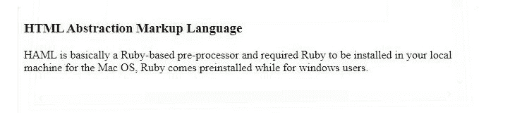

# 什么是 HTML 预处理器？

> 原文:[https://www.geeksforgeeks.org/what-is-html-preprocessor/](https://www.geeksforgeeks.org/what-is-html-preprocessor/)

在本文中，我们将了解 HTML 预处理器&将探索用于 HTML 的预处理器。顾名思义，预处理器是整个编译过程的第一阶段，包括删除注释、扩展宏、包含头文件等。当我们编写 HTML 和 CSS 时，有时需要多次重复特定的任务，从而导致效率低下。预处理器可以克服这些问题。

预处理器是一个程序，它接受一种形式的数据输入，并将其转换为另一种形式的输入数据，通常是 HTML 和 CSS。预处理器的目的是在不影响浏览器兼容性的情况下，在现有功能中加入新功能。添加预处理器的原因如下:

*   它遵循 DRY 规则(不要重复自己)，也就是说，为了重用相同的功能，我们不需要多次重写或重复相同的代码块。
*   维护大尺寸代码会更容易。
*   减少整体开发时间&帮助我们正确组织代码。

HAML 预处理器:Haml 代表 HTML 抽象标记语言，由汉普顿·卡特林创建，创建它的唯一目的是使标记美观。它基本上是一个基于 Ruby 的预处理器，需要安装 Ruby。HTML 预处理器也可以理解为帮助开发人员从预处理器的语法中生成 HTML 语法的程序。它将添加一些纯 HTML 语法中没有的独特功能。因此，Haml 旨在避免为网络文档编写内联代码，这将使 HTML 更加简洁&还提供了在 HTML 中包含一些动态内容的灵活性。由于预处理程序是程序，它们总是用某些语言处理，因此 Haml 是用 HTML 和 Sass 处理的。我们将按照以下步骤安装 HAML:

**安装 HAML:**

```html
gem install haml
```

**用于将 HAML 转换为 HTML:**

```html
haml index.haml index.html
```

**注意:**命令必须在索引文件所在的同一目录下运行。

**示例 1:** 在本例中，我们将简单地使用 HTML 和 HAML 创建一个标题。我们可以注意到，在使用预处理程序从 HTML 转换到 HAML 之后，代码中的冗余将会减少。

**哈默尔预处理器中标题的代码:**

```html
%body
%center
%header
 %h1GeeksforGeeks
%section 
 %bA Computer Science Portal for Geeks
```

**HAML 代码转换成 HTML 代码:**

## 超文本标记语言

```html
<body>
    <center>
        <header>
            <h1>GeeksforGeeks</h1>
        </header>
        <section>
            <b>A Computer Science Portal for Geeks</b>
        </section>
    </center>
</body>
```

**输出:**


**注意:**Haml 代码将降低 HTML 代码的代码可读性，但代码在语法上和行上都有所降低。

**例 2:** 在本例*、*中，我们将学习另一套在< div >中替代类的预处理程序。

**HAML 码:**

```html
!!! 5
%html
 %head
  %title GeeksforGeeks HAML Tutorial
 %body 
  %h3
    .head HTML Abstraction Markup Language
    .container HAML is basically a Ruby-based pre-processor &
    required Ruby to be installed in your local machine for the
    Mac OS, Ruby comes preinstalled while for windows users.
```

**HAML 代码转换成 HTML:**

## 超文本标记语言

```html
<!DOCTYPE html>
<html>

<head>
    <title>GeeksforGeeks HAML Tutorial</title>
</head>

<body>
    <div id="content">
        <h3>HTML Abstraction Markup Language</h3>
        <div class="container">
            HAML is basically a Ruby-based pre-processor
            and required Ruby to be installed in your
            local machine for the Mac OS, Ruby comes
            preinstalled while for windows users.
        </div>
    </div>
</body>

</html>
```

**输出:**



**例 3:** 在本例中；我们将学习如何使用<区块报价>。

**HAML 码:**

```html
%blockquote
%div 
 GeeksforGeeks has best minds
```

**HAML 代码代码转换成 HTML:**T2】

## 超文本标记语言

```html
<html>

<head>

<body>
    <blockquote>
        <div>
            GeeksforGeeks has best minds
        </div>
    </blockquote>
</body>

</html>
```

**输出:**


**优势**

HAML 预处理器被认为对以下几点有用:

*   **更喜欢漂亮的标记:**它以用户友好的体验促进了代码的有组织的标记&也以结构化的方式呈现输出。
*   **DRY(不要重复自己)规则:**它遵循 DRY 方法来丢弃不必要的涉及大量重复的 HTML 代码。

## 超文本标记语言

```html
<body>
2

3
  <!--Heading tags are opened and closed-->
4
<h2>GeeksforGeeks, A Computer Science portal for geeks.</h2>  
5
​
6
  <!--Body is closed-->
7
  </body>
```

HTML 预处理程序通过依赖缩进(而不是文本)来确定元素和代码块的开始和结束位置，从而避免了这一切。它不仅可以在大模板中工作，而且可以生成更小的模板，这使得代码看起来更加清晰。

**输出:**

> %body
> 
> %h2 极客博客，极客的计算机科学门户。

*   **缩进良好的标记应该是首选:**为了改善外观，标记语言应该缩进良好，以便于阅读。它还决定了元素的开始和结束位置。
*   **应该有一个清晰的 HTML 结构:**用一些最小的努力，就有助于保持标记语言有一个清晰的结构&对最终结果的逻辑理解。