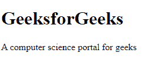

# 什么是 HTML？

> 原文:[https://www.geeksforgeeks.org/what-is-html/](https://www.geeksforgeeks.org/what-is-html/)

在这篇文章中，我们将谈论 **HTML** ，它的特性，为什么要学习 HTML 以及最后的优缺点，所以让我们开始；

**[HTML](https://www.geeksforgeeks.org/html-tutorials/)** 是所有浏览器都支持的网页标准文档格式。他们获取 **HTML** 内容，并将其翻译成你在设备屏幕上看到的内容。 **HTML** 代表超文本标记语言，其中超文本是将一段文本转化为超链接(我们可以简单地称之为“链接”)的能力， **HTML** 使其成为超链接，以便查看者可以访问任何文档。标记语言是一种计算机语言，它有许多容易理解的关键字、名称或标签，有助于表示页面的整体布局及其包含的数据，或者换句话说，它通过向用户提供网页和文档的段落、链接、标题、标题等特征来定义特定部分的结构。 **HTML** 不是编程语言。它不具备像其他编程语言那样创建动态函数的能力。在使用 **HTML** 时，我们只是使用一个包含标签和属性的简单代码结构来构建网页的结构，并且它是由浏览器这样显示的，在浏览器中编程语言具有功能目的。它们可以接受输入并产生输出，有能力调用动态函数来评估表达式等。所以 **HTML** 不能称为编程语言。

**HTML** 是由瑞士 CERN 研究所的物理学家蒂姆·伯纳斯·李于 1990 年发明的。他想到了一个基于互联网的超文本系统。它最初出版于 1993 年。现在，网络超文本应用技术工作组正式致力于应用程序的创建。

**[**标签:**](https://www.geeksforgeeks.org/html-tags-complete-reference/)** 它们是围绕内容并对其应用含义的 **HTML** 文档的基本结构。标签包含在角撑<标签名称>中。大多数标签都有相应的结束标签，只有少数标签例外。< html >有它的结束标记< /html >，它用于包含完整 **HTML** 文档的代码的开始和结束。

**[**属性:**](https://www.geeksforgeeks.org/html-attributes-complete-reference/)** 属性用于定义出现在开始标记内的 **HTML** 元素的特征以及它们在引号内使用的值。可以是<标签属性=“值”>边距</标签>

## 超文本标记语言

```html
<!DOCTYPE html>
<html>

<head>
    <title>Demo Web Page</title>
</head>

<body>
    <h1>GeeksforGeeks</h1>
    <p>A computer science portal for geeks</p>
</body>

</html>
```

**Output:**


**上述示例中使用的标签:**

*   **<！文档类型 html >** 声明不是 **HTML** 标签。这是给浏览器的一个信息，关于预期的文档类型。
*   **< html >** 表示元素是 **HTML** 页面的根元素。
*   **<头>** 它包含关于 **HTML** 页面的元信息。
*   **<标题>** 元素给出了关于 **HTML** 页面标题的信息(显示在浏览器的标题栏或页面的标签中)。
*   **<正文>** 元素描述了文档的正文，它包含了你在网页中看到的所有可见内容，比如网页的标题、段落、图片、超链接、表格、列表等。
*   **< h1 >** 元素定义了一个大标题。
*   **< p >** 元素定义一个段落。

**HTML 的组成部分:**

在 **HTML** 中，一般有头部和身体两大部分。每个部分都有自己的元素和要求。

**标题部分:**标题标签代表网页文档的标题，可以容纳里面的<标题>和<链接>标签。以<头>开始，以</头>结束。里面有标题组件。

**标题:**每个文档至少有一个标题。从上面的例子可以理解为，标题部分以<标题>开始，以</标题>结束，中间将文档标题的名称放入“我的第一篇文章”。在上面的代码中，我们可以看到，每次需要打开角撑和关闭角撑，并在中间放上标题名称。角度的打开和关闭几乎适用于 **HTML** 中的所有标签。

**正文部分:**在正文部分，它代表 web 文档的正文，通常包含标题、文本、段落。标题以<标题>开始，以</标题>结束。在这些标签之间，我们可以写任何内容，比如“什么是 HTML”。段落以< p >开头，以< /p >结尾。这意味着段落的内容应该写在这些角括号内。

**功能**

*   由于 **HTML** 是一种标记语言，它提供了一种灵活的方式来设计网页和文本。
*   你可以很容易地发布带有标题、照片、表格等的在线文档，你可以随时获取。
*   **HTML** 文档可以在 Windows、Linux 等任何平台上显示。
*   可以在网页中创建多个窗口，以在不同的窗口中显示来自多个来源的信息。
*   **HTML** 是一种不区分大小写的语言，这意味着我们可以在小写和大写中使用它的标签。

**为什么要学 HTML？**

*   **HTML** 是用来建立网站的框架，如果你知道它是如何工作的，那么当它涉及到设计、营销和其他几个职业时，就会好得多。
*   对于那些想成为专业网络开发人员的人来说，需要了解 **HTML** ，因为它是任何开发课程中的核心元素。
*   在 **HTML** 的帮助下，你可以很容易地在网上赚钱，只是你必须找到几十份可用的 **HTML** 自由职业。通过在简历中添加其他技能，如 JavaScript、PHP、Photoshop 等，你也可以在学习更多内容的同时获得更多收入。
*   **HTML** 不仅仅是制作网站，它们是一个开放/可接受的来源，数据在所有符合标准的浏览器上正确显示，您的内容可以长时间看到。
*   **HTML** 还帮助文档作者应用排版格式、文档结构和包含图像，而不会给用户造成任何困难，也不依赖文档准备专家来提供标记。

**优势**

*   每个浏览器都支持 **HTML** ，学习、使用、修改都很容易。
*   它支持多种颜色、格式和布局，有助于创建吸引人的网页。
*   由于模板，它使网站设计更容易。
*   FrontPage、Dreamweaver 和多个开发工具支持 **HTML** 。
*   **HTML** 是最友好的搜索引擎。

**缺点**

*   **HTML** 只能用来创建普通或静态页面。如果你想要动态功能页面，那么 **HTML** 就没用了。所以， **HTML** 不能用于动态输出。
*   有时候 **HTML** 的结构化很难理解。
*   要制作一个简单的网站，需要编写多行代码。
*   由于为更简单的事情编写多行代码，这增加了时间复杂性并花费了更多时间。
*   它的错误代价很高，因为一个小小的打字错误就可能导致网页无法运行。