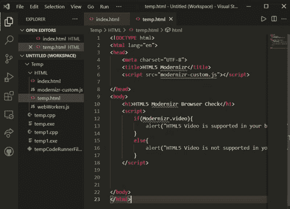

# 什么是 HTML5 Modernizr？

> 原文:[https://www.geeksforgeeks.org/what-is-html5-modernizr/](https://www.geeksforgeeks.org/what-is-html5-modernizr/)

在今天的现代世界中，HTML 和 CSS 中有很多可用的特性，也很少有浏览器支持所有特性。有时很难找到我们的网络浏览器是否支持这些功能。所以，这里 Modernizr 进入画面，它在这些场景中非常有用。在本文中，我们将看到什么是 HTML5 Modernizr，以及如何使用它。

**HTML5 Modernizr:** 它是一个 JavaScript 库，可以检测我们的网页浏览器支持哪些下一代网页技术。HTML 和 CSS 中引入了许多新功能，但是许多浏览器不支持这些新功能。因此，Modernizr 允许开发者测试 HTML & CSS 中的一些新技术，然后为不支持这些技术的浏览器提供回退。例如，如果浏览器不支持 GIF 视频，那么我们希望显示 mp4 视频。我们可以根据功能创建 CSS 规则，如果浏览器不支持新功能，这些规则将自动应用于网页。

**语法:**

[下载 Modernizr 库文件](https://modernizr.com/)，然后将该文件添加到你的 HTML 页面的脚本标签中。

```html
<script src="modernizr-custom.js"></script>
```

**示例:**在本例中，我们将检查我们的浏览器是否支持 HTML5 视频，是否使用了 Modernizr。

## 超文本标记语言

```html
<!DOCTYPE html>
<html lang="en">

<head>
    <meta charset="UTF-8">
    <title>HTML5 Modernizr Browser Check</title>

    <!-- Modernizr script aaded, You can download
        it from modernizr official page-->
    <script src="modernizr-custom.js"></script>
</head>

<body>
    <h1>HTML5 Modernizr Browser Check</h1>

    <!-- Here we are checking video support 
        in our browser using js script with 
        the help of Modernizr -->
    <script>
        if (Modernizr.video) {

            // If you browser supports video 
            // then this code will execute
            alert("HTML5 Video is supported in your browser");
        }
        else {

            // If our browser doesn't supports 
            // video then this code will execute
            alert("HTML5 Video is not supported in your browser");
        }
    </script>
</body>

</html>
```

**输出:**我用的是最新版本的谷歌 Chrome。所以，我的浏览器支持 HTML5 视频。如果您将使用以前的版本，那么您将收到一个警告，您的浏览器不受支持。



输出