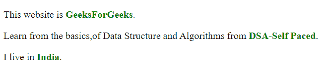

# 什么是 HTML5 中的微数据？

> 原文:[https://www.geeksforgeeks.org/what-is-microdata-in-html5/](https://www.geeksforgeeks.org/what-is-microdata-in-html5/)

微数据允许您定义自己定制的元素，并开始在网页中植入定制的属性。在高层次上，微数据由一组名称-值对组成。微数据语法由一组(*名称-值)*组成，可以使用机器解析工具获取。微数据使用一个词汇来描述一个项目和名称-值对，以分配其财产的价值。微数据试图提供一种用机器可读标签注释 HTML 元素和分析网页的简单方法。这允许搜索引擎突出显示或突出显示更多适用的信息。

这些组称为项，每个名称-值对都是一个属性。项目和属性由常规元素表示。

**定义微数据词汇:**微数据词汇提供项目的语义或含义。网络开发人员可以设计一个自定义词汇表，或者使用网络上可用的词汇表。要定义微数据词汇表，您需要一个指向工作网页的命名空间网址。例如，https://abc-xyz.org/geek(示例站点)可以用作具有以下命名属性的个人微数据词汇的命名空间:

*   **姓名:**简单字符串形式的人名。
*   **国家:**国家名称为简单字符串。
*   **url:** 属于用户的网站。
*   **图片:**用户图片的 URL。

**全局属性:**微数据的一些全局属性描述如下。

<figure class="table">

| Sr 编号 | 属性 | 说明 |
| 1。 | scope of project | Define the scope of microdata items. Itemscope property is a Boolean property that tells us that there is microdata on this page. |
| 2。 | itemtype(项目类型) | A web address that defines the vocabulary used to encode microdata and provides context for attributes. |
| 3。 | itemprop(项目属性) | Define the attribute (name-value) of microdata. |
| 4。 | 料号参考 | Item ref provides a list of element ids with additional attributes. The itemref attribute can only be written with the itemscope attribute. |
| 5。 | itemid | This is the global identifier of a microdata item. |

</figure>

**示例 1:** 在本示例中，要创建一个项目，使用 ***项目范围*** 属性，要向项目添加属性，则在项目的一个后续项目上使用 ***项目属性*** 属性。

## 超文本标记语言

```html
<!DOCTYPE html>
<html>

<body>
    <div itemscope>
        <p>This website is
            <span itemprop="name" 
                style="color:green">
                <b>GeeksForGeeks</b>
            </span>.
        </p>
    </div>

    <div itemscope>
        <p>
            Learn from the basics,of Data 
            Structure and Algorithms from
            <span itemprop="name" 
                style="color:green">
                <b>DSA-Self Paced</b>
            </span>.
        </p>

        <p>I live in
            <span itemprop="country" 
                style="color:green">
                <b>India</b>
            </span>.
        </p>
    </div>
</body>

</html>
```

**输出:**



**示例 2:** 在本例中，我们将属性定义为微数据。当谷歌的网络爬虫解析你的页面并找到符合 https://abc-xyz.org/geek(示例网站)词汇的微数据属性时，它会解析出这些属性，并将其与页面数据的其他部分一起存储。

## 超文本标记语言

```html
<!DOCTYPE html>
<html>

<body>
    <div itemscope>
        <section itemscope 
            itemtype="https://abc-xyz.org/geek">
            <h1 itemprop="name">GeeksForGeeks</h1>
            <p>
                
            </p>

            <a itemprop="url" href=
                "https://www.geeksforgeeks.org/">
                Link to Site
            </a>
        </section>
    </div>
</body>

</html>
```

**输出:**


输出图像