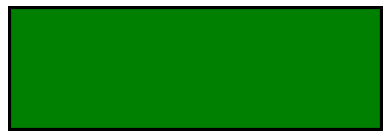
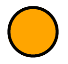
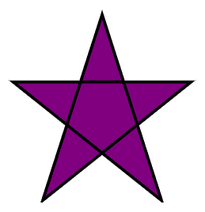

# 什么是 HTML5 中的 SVG 生成器？

> 原文:[https://www . geesforgeks . org/what-is-SVG-generator-in-html 5/](https://www.geeksforgeeks.org/what-is-svg-generator-in-html5/)

**到底什么是 SVG？**

SVG 代表可缩放矢量图形。它用于为网页创建和定义图形。它基本上以 XML 格式定义基于矢量的图形。如果缩放或调整大小，SVG 图形不会失去任何质量。SVG 文件中的每个元素和属性都可以被动画化。

**它在 HTML 中的容器是什么？**

**HTML < svg >** 元素容器用于定义 svg 图形。使用 SVG 生成器创建的矢量图形得到了所有现代网络浏览器的支持，如谷歌 Chrome、Mozilla Firefox、微软 Edge 等。所有这些网络浏览器都可以显示 SVG 图形，而不需要第三方软件，就像 PNG、GIF 等一样。

**注意:** SVG 是 W3C 推荐！(日期:2003 年 1 月 14 日)。

**如何使用 SVG 创建图形？**

下面给出了几个 SVG 图形的例子。这些样品仅用于理解。

**1 .SVG 矩形〔t1〕**

## 超文本标记语言

```html
<!DOCTYPE html>
<html>

<head>
    <title>SVG - Rectangle</title>
</head>

<body>
    <svg width="300" height="100">
        <rect width="300" height="100" 
        style="fill:green;stroke-width:5;stroke:rgb(0,0,0)" />
    </svg>
</body>

</html>
```



svg 矩形

**2 .SVG 圆〔t1〕**

## 超文本标记语言

```html
<!DOCTYPE html>
<html>

<head>
    <title>SVG - Circle</title>
</head>

<body>
    <svg width="300" height="300">
        <circle cx="50" cy="50" r="40" 
            stroke="black" stroke-width="5" 
            fill="orange" />
    </svg>
</body>

</html>
```



svg 循环

**3 .SVG 星〔t1〕**

## 超文本标记语言

```html
<!DOCTYPE html>
<html>

<head>
    <title>SVG - Star</title>
</head>

<body>
    <svg width="300" height="200">
        <polygon points=
            "100,10 40,198 190,78 10,78 160,198" 
            style="fill:purple;
            stroke:black;stroke-width:3;" />
    </svg>
</body>

</html>
```



SVG-star

**SVG 有什么特别的？**

SVG 有一些优点，这使得它比其他图像格式更好，如 **JPEG PNG GIF** 等。

*   可以使用任何文本编辑器创建和编辑 SVG。
*   SVG 可以轻松缩放。
*   SVG 为任何分辨率提供高质量。
*   SVG 纯粹是用 XML 编写脚本的。

**注:** SVG 用于定义 2D 图形。它是一个基于 XML 的工具。

除了 **SVG 生成器**，**画布**也是基于 JavaScript 的 2D 图形生成器工具。SVG 的不同之处在于，每个描述的形状都作为一个对象被记住，也就是说，如果 SVG 图形的属性发生变化，就不需要重新渲染形状。