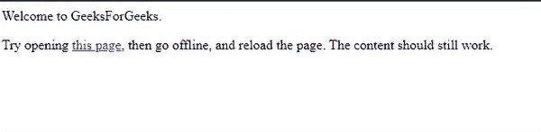

# 什么是应用缓存，为什么在 HTML5 中使用？

> 原文:[https://www . geesforgeks . org/什么是应用程序缓存以及为什么在 html5 中使用它/](https://www.geeksforgeeks.org/what-is-the-application-cache-and-why-it-is-used-in-html5/)

任务是了解 HTML5 中的应用程序缓存。HTML 代表超文本标记语言，它被用来使用标记语言设计网页。HTML5 是最新的，或者我们也可以说它是 HTML 的第五个版本。

**html 5 中的应用缓存:**html 5 的当前版本引入了应用缓存，这意味着一个 web 应用被缓存，无需互联网连接即可访问。现在，我们只需在应用程序中创建一个清单文件，就可以制作一个无需互联网连接即可运行的离线 web 应用程序。

**语法:**

```html
<html manifest="demo.appcache">
```

**HTML 文件的结构:** HTML 只不过是 HTML 结构中 doctype 标签之后的一个元素标签。

## 超文本标记语言

```html
<!DOCTYPE html>
<html>
  <!-- In this element we will add an attribute
       called manifest attribute-->
  <head>
    <title>Page Title</title>
  </head>
  <body>
    <h2>Welcome To GFG</h2>
    <p>It is a paragraph element</p>

  </body>
</html>
```

让我们借助一个例子来理解应用程序缓存的概念。

**进场:**

*   创建一个带有清单属性的 HTML 文件。
*   创建另一个 HTML 文件，然后将其链接到以前创建的 HTML 文件。

**示例:**主文件名称为“index.html”。首先，将执行主文件，当您尝试打开链接页面时，将运行下一个页面。之后，您只需离线并重新加载页面。页面的内容仍然可以正常工作。

## 超文本标记语言

```html
<!DOCTYPE html>
<html manifest="demo.appcache">
  <body>
    Welcome to GeeksForGeeks.
    <p>
      Try opening <a href="index2.html">this page</a>,
      then go offline, and reload the page. The content 
      should still work.
    </p>

  </body>
</html>
```

## 超文本标记语言

```html
<!DOCTYPE html>
<html manifest="demo.appcache">
  <body>
    Welcome to GFG, a computer science portal for geeks.
  </body>
</html>
```

**输出:**



**应用程序缓存的用途是:**

*   **离线浏览:**用户可以在离线时随时使用该应用程序访问网站
*   **速度:**当数据已经存储，那么就很容易以更高的速度访问数据，缓存资源的加载速度比未缓存资源更快。
*   **服务器负载降低:**浏览器只会从服务器下载更新的资源。

**支持的浏览器:**

*   Chrome 4.0 及以上版本
*   Internet 10.0 及以上版本
*   Mozilla Firefox 3.5 及以上版本
*   Opera 11.5 及以上
*   Safari 4.0