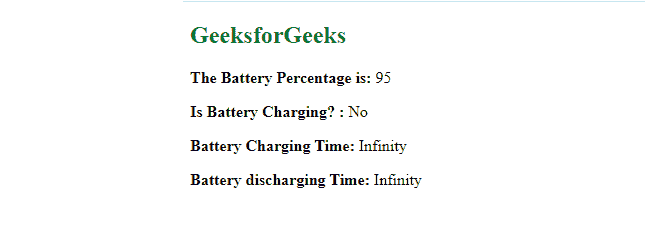

# html 5 中的电池状态 API 是什么？

> 原文:[https://www . geesforgeks . org/什么是电池状态-api-in-html5/](https://www.geeksforgeeks.org/what-is-the-battery-status-api-in-html5/)

**简介:****电池状态 API** 有时也称为电池 API，提供电脑电池的相关信息。它提供电池的剩余电量和充电状态。如果电池正在充电或放电，它还会给出对电池完全充电或放电的剩余时间的估计。

电池状态应用编程接口不是外部应用编程接口。它在内置的 [**窗口内的【导航器】. getBattery()** 方法中可用。导航器对象的【导航器】](https://www.geeksforgeeks.org/html-dom-window-navigator-property/) 属性。

**获取电池对象:**

*   使用 **navigator.getBattery()** 方法获取系统的电池信息。
*   将一个 JavaScript [**然后()**](https://www.geeksforgeeks.org/why-we-use-then-method-in-javascript/) 方法添加到 **navigator.getBattery()** 对象中。之所以需要 **then()** 方法，是因为用作参数的函数只有在我们成功从系统中获取电池信息时才会执行。
*   用作**然后()**方法的参数的函数将电池对象作为参数。该电池对象携带系统电池的所有信息。

现在让我们了解电池状态 API 的不同方法。

**1。** **方法:**该方法用于获取电池的充电状态。

*   **返回值:**如果电池正在充电，则返回布尔值“真”，如果电池没有充电，则返回“假”。
*   **充电状态变化事件:**我们可以通过给电池对象添加[事件监听器](https://www.geeksforgeeks.org/javascript-addeventlistener-with-examples/)来检测电池充电状态的变化。如果发生“**充电变化**事件，将触发事件监听器功能。

**语法:**

## java 描述语言

```html
<script>

    // Event listener for 'chargingchange' event
    battery.addEventListener('chargingchange', function () {

        // Code after the event is triggered
    });

    // battery.charging object
    var isBatteryCharging = battery.charging
</script>
```

**2。电池电量方法:**该方法将电池电量作为一个数字返回，假设满电池电量为 1。我们必须将其乘以 100，才能得到电池电量的百分比。

*   **电平变化事件:**此事件检测电池电平的变化。只要电池电量发生变化，我们就可以通过在“电量变化”事件中添加事件监听器来触发条件。

**语法:**

## java 描述语言

```html
<script>

    // An eventListener to 'levelchange' event
    battery.addEventListener('levelchange', function () {

        // Code after the event is triggered
    });

    // battery.level object
    var batteryPercentage = battery.level * 100
</script>
```

**3。battery.chargingTime 方法:**该方法以秒为单位返回电池完全充电的预计剩余时间。如果电池没有连接充电器，它会返回“无限”。

*   **充电时间变化事件:**该事件检测该估计时间的变化。我们可以给这个事件添加一个监听器并更新它。

**语法:**

## java 描述语言

```html
<script>

    // A listener to chargingtimechange event
    battery.addEventListener('chargingtimechange', 
    function () {

        // Code after the event is triggered
    });

    // Time left for completion of charging
    var chargingTimeLeft = battery.chargingTime
</script>
```

**4。电池。放电时间方法:**该方法以秒为单位返回电池完全放电的预计剩余时间。如果电池连接到充电器，它会返回“无限”。

*   **放电时间变化事件:**该事件检测该估计时间的变化。我们可以给这个事件添加一个监听器并更新它。

**语法:**

## java 描述语言

```html
<script>

    // Listener to 'dischargingtimechange' event.
    battery.addEventListener('dischargingtimechange', 
        function () {

        // Code after the event is triggered
    });

    // battery.dischargingTime method
    var disCharge = battery.dischargingTime
</script>
```

**示例:**在本例中，我们已经使用电池状态 API 获取了电池状态，并在我们的网页上显示了数据。

## 超文本标记语言

```html
<!DOCTYPE html>
<html lang="en">

<body>
    <h2 style="color:green">GeeksforGeeks</h2>
    <div class="battery-info">
        <p>
            <b>The Battery Percentage is:</b>
            <span id="battery-percentage">0</span>
        </p>

        <p>
            <b>Is Battery Charging? :</b>
            <span id="is-battery-charging">No</span>
        </p>

        <p>
            <b>Battery Charging Time:</b>
            <span id="chargingtime"></span>
        </p>

        <p>
            <b>Battery discharging Time:</b>
            <span id="dischargingtime"></span>
        </p>
    </div>

    <script>
        navigator.getBattery().then(function (battery) {
            function showAllBatteryInfo() {
                editChargeInfo();
                editLevelInfo();
                editChargingInfo();
                editDischargingInfo();
            }
            showAllBatteryInfo();

            battery.addEventListener('chargingchange',
                function () {
                    editChargeInfo();
                });
            function editChargeInfo() {

                /* Test with the charger and without 
                charger by unpluging*/
                var isBatteryCharging = (battery.charging ? "Yes" : "No")
                document.getElementById('is-battery-charging')
                    .innerText = isBatteryCharging
            }

            battery.addEventListener('levelchange', function () {
                editLevelInfo();
            });
            function editLevelInfo() {
                /* Shows the battery level*/
                var batteryLevel = battery.level * 100
                document.getElementById('battery-percentage')
                    .innerText = batteryLevel
            }

            battery.addEventListener('chargingtimechange', function () {
                editChargingInfo();
            });
            function editChargingInfo() {

                /* Test with the charger and without charger by unpluging*/
                var charge = battery.chargingTime
                document.getElementById('chargingtime').innerText = charge
            }

            battery.addEventListener('dischargingtimechange', function () {
                editDischargingInfo();
            });
            function editDischargingInfo() {
                var disCharge = battery.dischargingTime
                document.getElementById('dischargingtime')
                    .innerText = disCharge
            }
        });
    </script>
</body>

</html>
```

**输出:**

*   **连接充电器:**


用充电器

*   **不带充电器:**



由于充电器未连接，它显示电池充电时间为**‘无限’**。