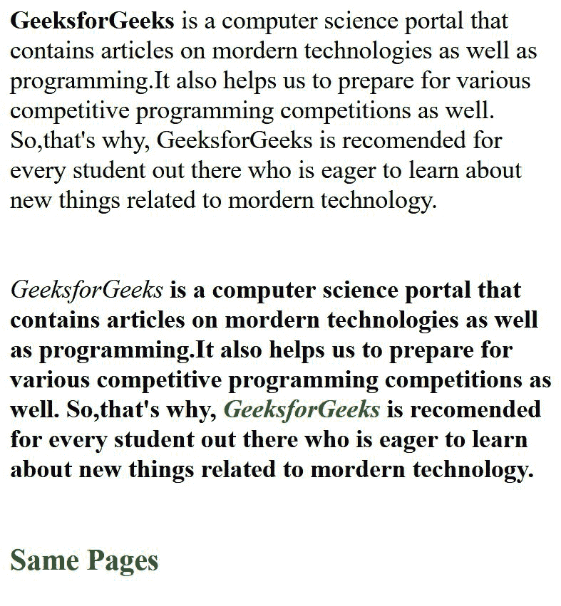
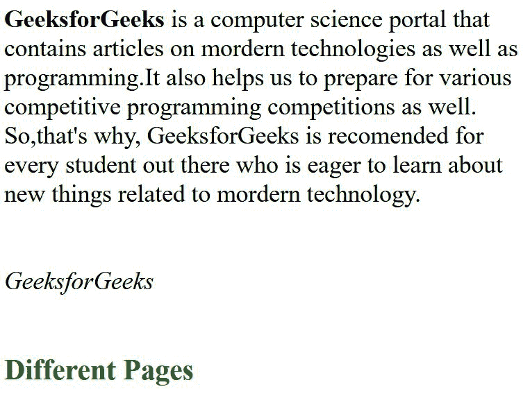

# 比较两个数据相同但标记不同的 HTML 页面，最好的方法是什么？

> 原文:[https://www . geesforgeks . org/什么是比较两个数据相同但标记不同的 html 页面的最佳方式/](https://www.geeksforgeeks.org/what-is-the-best-way-to-compare-two-html-pages-with-same-data-but-different-markup/)

在本文中，我们将学习比较两个数据相同但标记不同的 HTML 页面的最佳方式。首先，我们需要知道如何比较两个 HTML 页面。现在，检查这两个页面的最有效方法是使用这两个页面内容的哈希代码，并比较它们是否相等。

[**JavaScript hashCode():**](https://www.geeksforgeeks.org/how-to-create-hash-from-string-in-javascript/)为了在 JavaScript 中实现 [hashCode()](https://www.geeksforgeeks.org/how-string-hashcode-value-is-calculated/) ，我们需要创建一个生成哈希代码的函数。

现在，哈希代码通常由以下实现形成。

```html
s[0]*31^(n-1) + s[1]*31^(n-2) + ... + s[n-1]
```

**散列函数的 JavaScript 代码:**

## java 描述语言

```html
// Generate a hash code or string
    Object.defineProperty(String.prototype, 'hashCode', {
         value: function()
         {
           var hashValue = 0;
           var i, code;
           for (i = 0; i < this.length; i++)
           {
             // Returns the unicode of first character
             code  = this.charCodeAt(i);
             hashValue  = ((hashValue << 5) - hashValue) + code;
             hashValue |= 0;
           }
           return hashValue;
         }
    });
```

包含*(哈希值< < 5)* 的行与(*哈希值* 31 +字符)相同。*所以*(哈希值< < 5)* 就是*哈希值* 32**((哈希值<<5)-哈希值)*就是*哈希值*31。*用这种格式写只是让它更快，效率更高。

生成函数后，我们需要提取两个页面的内容，并生成以下内容的哈希代码。如果两者都匹配，那么两者是相同的，否则它们是不同的。使用 JavaScript[**innerHTML()**](https://www.geeksforgeeks.org/html-dom-innerhtml-property/)函数的警告消息显示了结果。

**HTML 代码:**

## 超文本标记语言

```html
<!DOCTYPE html>
<html>
  <body>
    <!-- The first page content -->
    <div id="pageID1">
      <strong style="margin: 0px; padding: 0px"> GeeksforGeeks </strong>
      is a computer science portal that contains articles on mordern
      technologies as well as programming.It also helps us to prepare for
      various competitive programming competitions as well. So,that's why,
      GeeksforGeeks is recommended for every student out there who is eager to
      learn about new things related to mordern technology.
    </div>
    <br /><br />
    <!-- The second page content -->
    <div id="pageID2">
      <div class="different markup"></div>
      <i style="margin: 0px; padding: 0px">GeeksforGeeks</i>
      <b
        >is a computer science portal that contains articles on mordern
        technologies as well as programming.It also helps us to prepare for
        various competitive programming competitions as well. So,that's why,
        <em style="color: green">GeeksforGeeks</em> is recommended for every
        student out there who is eager to learn about new things related to
        mordern technology.</b
      >
    </div>
    <br />
    <!--The comparison result is shown here -->
    <h3 id="compareResultID" style="color: green"></h3>
    <script>
      // Generate a hash code or string
      Object.defineProperty(String.prototype, "hashCode", {
        value: function () {
          var hashValue = 0;
          var i, code;

          for (i = 0; i < this.length; i++) {
            // Returns the unicode of first character
            code = this.charCodeAt(i);
            hashValue = hashValue * 32 - hashValue + code;

            hashValue |= 0;
          }
          return hashValue;
        },
      });
      var hashValue1 = document.getElementById("pageID1").innerText.hashCode();
      var hashValue2 = document.getElementById("pageID2").innerText.hashCode();

      if (hashValue1 !== hashValue2) {
        document.getElementById("compareResultID").innerHTML =
          "They are different Pages";
      } else {
        document.getElementById("compareResultID").innerHTML = "Same Pages";
      }
    </script>
  </body>
</html>
```

**输出:**



如果内容不同，将显示不同的输出。在第二个例子中，使用了更快的方法*。*

**例 2:**

## 超文本标记语言

```html
<!DOCTYPE html>
<html>
  <body>
    <!-- The first page content -->
    <div id="pageID1">
      <strong style="margin: 0px; padding: 0px"> GeeksforGeeks </strong>
      is a computer science portal that contains articles on mordern
      technologies as well as programming.It also helps us to prepare for
      various competitive programming competitions as well. So,that's why,
      GeeksforGeeks is recommended for every student out there who is eager to
      learn about new things related to mordern technology.
    </div>
    <br /><br />
    <!-- The second page content -->
    <div id="pageID2">
      <div class="different markup"></div>
      <i style="margin: 0px; padding: 0px">GeeksforGeeks</i>
    </div>
    <br />
    <!--The comparison result is shown here -->
    <h3 id="compareResultID" style="color: green"></h3>
    <script>
      // Generate a hash code or string
      Object.defineProperty(String.prototype, "hashCode", {
        value: function () {
          var hashValue = 0;
          var i, code;
          for (i = 0; i < this.length; i++) {
            // Returns the unicode of first character
            code = this.charCodeAt(i);
            hashValue = (hashValue << 5) - hashValue + code;
            hashValue |= 0;
          }
          return hashValue;
        },
      });
      var hashValue1 = document.getElementById("pageID1").innerText.hashCode();
      var hashValue2 = document.getElementById("pageID2").innerText.hashCode();

      if (hashValue1 !== hashValue2) {
        document.getElementById("compareResultID").innerHTML =
          "Different Pages";
      } else {
        document.getElementById("compareResultID").innerHTML =
          "They are same Pages";
      }
    </script>
  </body>
</html>
```

**输出:**

