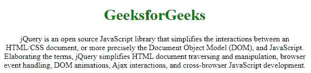

# 和有什么区别？

> 原文:[https://www . geesforgeks . org/html-langen 和-html-langen-us 之间的区别是什么/](https://www.geeksforgeeks.org/what-is-the-difference-between-html-langen-and-html-langen-us/)

**lang** 属性指定使用哪种语言编写网页内容。它用于设置网页整个文本的语言。

**< html lang="en' >** 和**<html lang = " en-US ">**的区别描述如下:

**<html lang = " en '>**
<html lang = " en '>仅指定页面的语言代码，表示页面上的所有文本都使用 en 或英语。

**示例:**

```html
<!DOCTYPE html>
<html lang="en">
<head>
    <meta charset="UTF-8">
    <meta name="viewport" content="width=device-width,
      initial-scale=1.0">
    <title>lang Attribute</title>
    <style>
        body{
            text-align: center;
        }
        h1{
            color: green;
        }
    </style>
</head>
<body>
    <h1>GeeksforGeeks</h1>
    <p>jQuery is an open source JavaScript library that 
simplifies the interactions between an HTML/CSS document,
or more precisely the Document Object Model (DOM), and JavaScript.
Elaborating the terms, jQuery simplifies HTML document 
traversing and manipulation, browser event handling, 
DOM animations, Ajax interactions, and cross-browser 
JavaScript development.</p>
</body>
</html>
```

**输出:**


**<html lang = " en-US ">**
<html lang = " en-US ">指定页面的语言代码，后跟国家代码，表示页面上的所有文本都使用**美式英语**语言。

> **< html lang="en-GB' >** 意为英国风格的英语
> **<html lang = " en-IN '>**意为印度风格的英语

**示例:**

```html
<!DOCTYPE html>
<html lang="en-US">
<head>
    <meta charset="UTF-8">
    <meta name="viewport" content="width=device-width,
     initial-scale=1.0">
    <title>lang Attribute</title>
    <style>
        body{
            text-align: center;
        }
        h1{
            color: green;
        }
    </style>
</head>
<body>
    <h1>GeeksforGeeks</h1>
    <p>jQuery is an open source JavaScript library that
 simplifies the interactions between an HTML/CSS document,
 or more precisely the Document Object Model (DOM), and JavaScript.
Elaborating the terms, jQuery simplifies HTML document 
traversing and manipulation, browser event handling, 
DOM animations, Ajax interactions, and cross-browser
 JavaScript development.</p>
</body>
</html>
```

**输出:**
